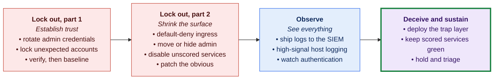
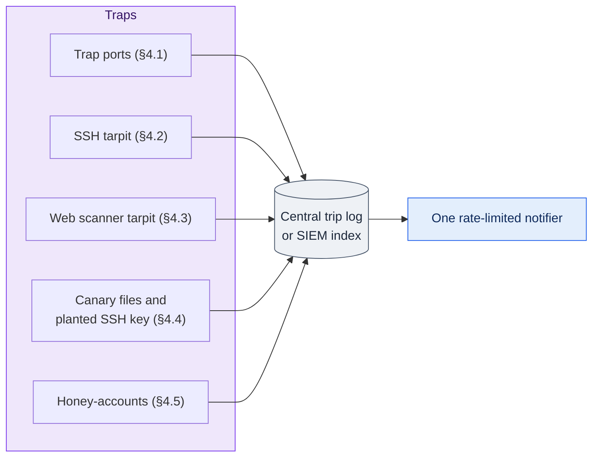

# Labyrinth Implementation Blueprint

**Status:** Draft · reviewed 2026-10-02 · rules-aware

- **Project:** Labyrinth, a rapid, idempotent, multi-OS hardening and deception deployment system.
- **Purpose:** the base documentation for designing and building the automation: the portable doctrine and the transferable technical controls.
- **Reference implementation:** a hardened Debian server run by the author is the worked example of the **Linux server profile**. This document generalizes it to a mixed competition network.
- **Secrets:** none reproduced. This document describes the *shape* of configuration only: no keys, env files, or credentials.
- **Citations:** competition rules are cited by rule number in APA 7 style (author, date, rule).
- **Detailed designs:** each part of the tool has its own spec in [`design/`](design/README.md).
- **New to the project?** The [overview](Overview.md) explains every part in plain language.

> [!IMPORTANT]
> **Rules basis and warning.** Rule numbers follow the web version of the national CCDC (Collegiate Cyber Defense Competition) rules, updated 10 December 2025 (National Collegiate Cyber Defense Competition [NCCDC], 2025). A rule number is the page's section number, then the item's place in it: Rule 4.14 is item 14 of section 4, and Rule 5.6.1 is the first point of item 6 of section 5. The page has no sections 6 or 7, so the sections after Internet Usage are numbered as printed: Rule 10.5 is in Questions, Disputes, and Disclosures, and Rule 11.3 is in Scoring.
>
> The 2027 rules and the Midwest packet are not published yet. Every rule citation must be re-checked when they arrive. Where this document and the rules disagree, the rules win.
>
> Items marked **[RULES]** are limits the competition rules place on a control.

---

## 0. Executive summary

Labyrinth exists to solve one problem: **the opening minutes.** In a CCDC engagement the scoreboard goes live and the Red Team may already know the default credentials. Every host in a heterogeneous network (Ubuntu, Fedora, Oracle Linux, Windows Server, Active Directory (AD), a Windows workstation, a SIEM (Security Information and Event Management system), and edge appliances) has to be wrestled back to a trustworthy state at the same time, *without* dropping the services being graded.

You cannot do that by hand, per host, from memory. Labyrinth is:

- **A core strategy:** four phases (*Lock out → Observe → Deceive → Sustain*) and a set of OS-agnostic invariants, so the same reasoning applies to a Fedora web server and a Windows domain controller.
- **A capability map:** each invariant expressed as a concrete control on Linux, on Windows/AD, and on the network edge, with a priority and a CCDC note.
- **A deception catalog:** traps, canaries, honey-accounts, tarpits, and sinkholes that make an attacker's reconnaissance expensive, noisy, and logged. Deception buys time that patching cannot.
- **An architecture:** native bash and PowerShell modules grouped into *phases*. A team can run a guarded lockout across the reachable hosts from one command, then layer observation and deception on top (§6, design 00).

Because Labyrinth is a team-written tool, the rules require that it:

- is public at least three months before use;
- is declared;
- is frozen;
- is shared with every team;
- uses no outside resources;
- does not deliberately break expected functionality

(NCCDC, 2025, Rules 5.6.1–5.6.5). Those five rules shape every section below.

The transferable technicals come from a real hardened box. What follows is that box's controls, generalized into a system you can point at an empty network.

### How to read this document

| Section | What it covers |
|---|---|
| [§1](#1-operating-doctrine--the-order-of-work) | The doctrine you execute live: the order of work. |
| [§2](#2-the-core-strategy--portable-invariants) | The portable "why": the invariants. |
| [§3](#3-capability-map--transferable-technicals-per-platform) | The "how, per OS": the capability map, the heart of this reference. |
| [§4](#4-deception--trap-catalog) | The trap catalog. |
| [§5](#5-reference-implementation--the-linux-server-profile) | The proven Linux build: the reference implementation. |
| [§6](#6-labyrinth-architecture) | How Labyrinth itself is structured. |
| [§7](#7-priority-scorecard) | The priority scorecard. |
| [§8](#8-verification--rollback) | Verification and rollback. |

---

## 1. Operating doctrine — the order of work

The competition reality: **assume breach from the start.** Credentials are default or already known, implants may be pre-seeded, and you are graded on *service uptime*. So every change must be reversible and must not take a scored service down.

Work the phases in order, and do the cheap, high-impact things first. The timing of each step belongs to the team's own plan, not to this public document.



*Figure: the order of work in this section, from establishing trust through deception and sustainment, with the main steps of each stage. Colors follow the phase key: red is lock out, blue is observe, purple is deceive and green is sustain. The last box covers both deceive and sustain, so it is purple with a green border.*

### Lock out, part 1 — Establish trust

The attacker's power comes from credentials, existing sessions and footholds left before the event. Remove all three, on each host in one step: the first-minute bundle rotates admin passwords, removes unregistered keys and checks the SSH configuration, ends intruder sessions, then applies default-deny inbound and outbound, using only what the host already has (design 01, section 6.1). Packages are installed and persistence is swept behind that lockdown. Scored services are a primary Red Team target, so they are defended, with probes and revert timers, rather than left as found.

- **Rotate administrator-class credentials you were handed or that ship by default:** local admins, appliance web logins, SNMP (Simple Network Management Protocol) strings, and service or database accounts once the dependency map is known. Do it first, everywhere.

  **[RULES]** Administrator-class passwords are not used for scoring and may be changed freely; other user passwords follow the notification process (Midwest Collegiate Cyber Defense Competition [MWCCDC], 2025, Rule 13; *Provisional*, 2025 packet). Automation never rotates user-level or scoring accounts.

- **Inventory and lock unexpected accounts:** an account is expected if it is protected, named in the packet or owns a scored service. Unexpected *local* accounts with admin rights or hidden-admin signs lose those rights and are locked automatically; other unexpected local accounts are locked after approval. Once a checkpoint shows every scored service passing, a person may approve deleting them, with evidence saved first (design 05, section 6). Domain accounts are handled by hand from a checklist (design 11). End intruder sessions after rotation, but never a console session, the operator's own, an admin-source session or an official's (design 01, section 6.2).

  **[RULES]** Never change every shell or end connections indiscriminately; the rules give those as examples of tools that break expected functionality (NCCDC, 2025, Rule 5.6.5). Disabling accounts wholesale is the same kind of blanket action. Officials must be able to get in on request (NCCDC, 2025, Rule 4.1), so a verified break-glass path comes first.

- **Sweep for persistence:** scheduled jobs, services, startup items, SSH and PAM changes, and web shells. Clear attacker footholds are quarantined automatically; anything a scored service might depend on waits for approval. Nothing is deleted (design 17).

- **Verify, then baseline:** users, listening ports, processes, scheduled tasks/cron, startup items, firewall state. Check files against the package database before hashing them, so a compromised state is not recorded as normal (design 04). Once the lockout and sweep are verified, seal the baseline, so later checks compare against the cleaned host (design 04, section 6).

### Lock out, part 2 — Shrink the surface

- **Default-deny ingress** on every host firewall and at the edge. Allow only the scored services and your own admin path.
- **Move or hide admin:** get SSH (Secure Shell) and RDP (Remote Desktop Protocol) off the obvious port. Consider port-knocking on hosts that support it (§3.4, §4.7).
- **Disable services you are not graded on.** Every listener is a vector.

  **[RULES]** Anything that interferes with the scoring engine is the team's responsibility (NCCDC, 2025, Rule 4.11). As a design choice, services are disabled only from a per-profile candidate list, and only after the scored-service list is known (design 15).

- **Patch the obvious:** the known-exploited, internet-facing things only. Do not start a 40-minute `dist-upgrade` mid-round.

### Observe — See everything

- **Ship logs to the SIEM** (Splunk in the reference topology): authentication, firewall, process creation. Centralized logs survive a wiped host. Where hosts sit in different segments, open only the minimum flows needed for log forwarding and the admin path.
- **Turn on high-signal host logging:** `auditd` on Linux, **Sysmon + Windows Security auditing** on Windows.
- **Watch authentication** in real time. A successful login to something you locked earlier is your first catch.

### Deceive and sustain

- **Deploy the trap layer** (§4): scanner tarpits, canary tokens, honey-accounts, port traps, DNS (Domain Name System) sinkholes. Now every attacker action generates a high-confidence alert.

  **[RULES]** No decoy on a scored port, and no decoy that misleads the scoring engine (NCCDC, 2025, Rule 11.3).

- **Keep scored services green:** health-check them (design 13), and use your rollback path the instant a change hurts a service. Read-only checkpoints also run on a schedule and alert once on each new finding.
- **Hold and triage:** work your alert queue by confidence. Canary and honey-account hits come first (near-certain), then anomalies.

> [!TIP]
> **Rule of thumb:** *lock-out before observation, observation before deception, deception before comfort.* A trap is worthless if the attacker still has valid credentials and an open admin port.

---

## 2. The core strategy — portable invariants

These hold on every OS. The capability map (§3) is just these seven, made concrete.

1. **Identity:** no shared, default, or unrotated credentials; least privilege; an explicit admin allowlist; keys or MFA (multi-factor authentication) over passwords wherever the platform allows.
2. **Surface:** default-deny ingress; expose only scored services; move or hide administration.
3. **Segmentation & egress:** enforce trust boundaries. Treat unexpected *outbound* traffic as hostile (the signature of C2, command and control), not just inbound.
4. **Observability:** high-signal logging to a central SIEM; watch authentication, sensitive files, and process starts.
5. **Deception:** anything that is not a real service is a tripwire, and every trip lands in one place.
6. **Recoverability:** baselines, backups, tagged rollback points, and a documented break-glass path.
7. **Change discipline:** idempotent, reversible, timestamped. Never make a change you cannot undo in ten seconds.

---

## 3. Capability map — transferable technicals, per platform

This is the core of the reference. Each capability gives:

- the portable **principle**;
- the concrete implementation on **Linux** (proven on the reference box), **Windows / AD**, and the **network edge**;
- a **priority** (P0 = do in the first minutes);
- a CCDC note.

Linux specifics link back to the §5 table and appendix A.

### 3.1 Credential reset & account control — **P0**

- **Principle:** no attacker keeps access through a credential you have rotated.
- **Linux:** use `passwd` / `chpasswd` for root and administrator-class accounts only. Use `usermod -L` to lock unexpected local accounts outside the protected set. Audit `sudoers` and group membership. Back up, then empty, unexpected `~/.ssh/authorized_keys`. After rotation, end remote sessions with `loginctl terminate-session`, except console, operator, admin-source and protected sessions (design 01, section 6.2). Automation never rotates or locks ordinary user accounts (for example, mailbox users).
- **Windows/AD:** rotate the built-in local Administrator and other local administrator-class accounts, except any that a service or scheduled task logs on with (changing those breaks the service at its next start). Review `Domain Admins`, `Enterprise Admins` and local Administrators membership. By hand only, after confirming with the captain:
  - rotate the domain Administrator, and any admin account a service or task logs on with, updating each dependent service;
  - reset service accounts once their dependencies are known;
  - disable accounts confirmed as unused.
- **KRBTGT:** reset its password twice, with a replication check between, to invalidate golden tickets. This is a Tier 3 item: after approval, Labyrinth carries out both resets (design 11, section 5.1).
- **Applications:** inventory each scored app's own admin accounts (CMS administrator, database root, phpMyAdmin) and the configuration files that store an app password. Rotating one is Tier 3: after approval, Labyrinth sets the new password, updates every listed file and runs the probes; never automatically, because scoring may log in to the app (design 05, section 2.1).
- **Edge:** change the appliance admin, web, SSH and SNMP credentials immediately. Routers and firewalls often ship with well-known defaults.
- **CCDC note:** the number-one foothold is a credential the Red Team already knows. Rotate administrator-class credentials first, everywhere, before anything clever.

  **[RULES]** Domain-wide or user-level resets are manual-only: POP3 scoring in the 2025 qualifier used Active Directory users (MWCCDC, 2025, Functional Services section; *Provisional*), so a mass reset can zero a scored service. As a design choice, the KRBTGT reset is an approval item that Labyrinth carries out: it is one account with a known procedure, and the first reset breaks nothing. Design: 01, 05, 11.

### 3.2 Remote-admin hardening (SSH / RDP / WinRM) — **P0/P1**

- **Principle:** shrink and strengthen the way *you* get in; deny every other way.
- **Linux (reference §5.1):** key-only (`PasswordAuthentication no`), `PermitRootLogin no`, an `AllowUsers` allowlist, `MaxAuthTries 3`, no X11 or agent forwarding, weak ciphers and MACs removed, `LogLevel VERBOSE` (needed for the planted-key canary). All of it in a drop-in file named to load first, with the base config untouched; planted add-on files and `Match` blocks are quarantined, and `sshd -T` confirms the settings in effect (design 05, section 4.1). Where SSH is scored, the scoring accounts keep password login through a `Match User` block, and every other account is key-only (design 05, section 4.2).
- **Windows/AD:** restrict RDP to an admin jump source; enable NLA (Network Level Authentication); disable RDP where it is not needed; restrict WinRM (Windows Remote Management); remove `Everyone` and `Authenticated Users` from remote-logon rights; use LAPS (Local Administrator Password Solution) for the local admin.
- **Edge:** bind the management plane to an inside interface only; no WAN admin.
- **CCDC note:** pair this with §3.4 (move/hide). Hardening the login is worth more once it is not on port 22/3389.

  **[RULES]** Officials must be given access immediately when they ask (NCCDC, 2025, Rule 4.1). Use a drop-in file, test with `sshd -t`, arm a revert timer, and keep the two-session rule (design 01, 05). Prefer per-role ed25519 keys with `from=`, `restrict` and forced commands (design 05).

### 3.3 Host firewall / default-deny — **P0**

- **Principle:** deny inbound by default; permit only scored services, your admin path and any official sources named in the event packet; log denials (that log feeds the honeypot in §4.1).
- **Linux (reference §5.2):** UFW (Uncomplicated Firewall) or nftables, default-deny in, allow out, with explicit allows per service. Use **medium logging** so every drop is logged as `[UFW BLOCK] … DPT=…`. On container hosts, also filter `DOCKER-USER`: Docker's published ports **bypass** the host `INPUT` chain, so bans and egress rules must live there too.
- **Windows:** Windows Defender Firewall, default-deny inbound per profile; allow only graded ports; enable connection logging.
- **Edge:** default-deny WAN; an explicit allow per service; log denies to the SIEM.
- **CCDC note:**

  **[RULES]** The scoring engine allowlist is applied before any deny rule (NCCDC, 2025, Rule 4.11).

  "Docker bypasses the host firewall" is the classic way a "locked-down" web host is still wide open. Verify with the actual ingress path, not just `ufw status`.

  **Drift.** Once sealed, the rule set is compared on a schedule. If it has drifted (for example, flushed by an attacker), the sealed rules are re-applied automatically with probes and a revert timer, and an alert is raised; repeated drift is flagged for a person (design 13, section 4.1).

### 3.4 Move / hide administration — **P1**

- **Principle:** make the admin service invisible to a mass scan, so it is not the first thing hit.
- **Linux:** move SSH off port 22 (the reference box runs a tarpit *on* 22; see §4.2). Optionally add **port-knocking** (`knockd`), so the real port stays filtered until a knock sequence opens it for the knocking source IP.
- **Windows:** put RDP behind the firewall or a jump host rather than on a non-standard port (changing the port is weak on Windows); prefer allowlisting the source.
- **CCDC note:** port-knocking (§4.7) makes SSH appear *closed* to Nmap, which saves real time. The trade-off is one more moving part on a box you also need to log into fast.

  **[RULES]** Officials must be able to get in on request (NCCDC, 2025, Rule 4.1), so knocking is optional and never the only path. The knock sequence is documented only in the team's offline record (design 05, section 2).

### 3.5 Dynamic banning / auto-response — **P2**

- **Principle:** turn repeated hostile touches into automatic, expiring blocks, and make the blocking scale.
- **Linux (reference §5.3):** `fail2ban` backed by an **ipset** (one kernel hash-set and one match rule per chain) instead of one iptables rule per IP, so thousands of bans stay flat. Jails cover SSH where it is not scored, the trap-port honeypot, the planted-key canary, and repeat offenders. Failed logins on a scored service only alert: manual scoring checks and simulated users come from addresses that are not the scoring engine's (design 12). Bans apply on **both** `INPUT` and `DOCKER-USER`.
- **Labyrinth:** a small native watcher in bash feeds the same kernel set. fail2ban is installed after the lockdown where the host's repositories offer it (on RHEL-family hosts it needs EPEL, which Labyrinth does not add), and starts only once the never-ban list is in its `ignoreip` (designs 12, 20).
- **Windows:** there is no fail2ban. Approximate it with a scheduled task or a WinLogbeat → SIEM alert that drives a firewall block, or with an IDS (intrusion detection system) at the edge. This is usually better handled at the perimeter.
- **CCDC note:** ipset matters when a tarpit is feeding you thousands of IPs; a per-IP ruleset will bloat and slow the box.

  **[RULES]** Bans act only on your own host's traffic, inbound and outbound. Dropping traffic to or from a hostile address is not offensive activity; scanning, attacking or contacting it is, and offensive activity outside the team's network is prohibited (NCCDC, 2025, Rule 4.10). Active response such as TCP resets is allowed, but anything that interferes with scoring is the team's responsibility (NCCDC, 2025, Rule 4.11). The scoring engine, officials, operators and the host's outbound dependencies are always on the ignore list. A ban on one address is targeted, not the indiscriminate blocking the rules give as an example (NCCDC, 2025, Rule 5.6.5). Design: 12.

> [!WARNING]
> If traffic from outside reaches the host through NAT (network address translation) on the router, the scoring engine and the Red Team can appear to come from the same last-hop address, and banning that address would block scoring. Confirm what source addresses the host actually sees before enabling automatic bans.

### 3.6 Service minimization & patching — **P1**

- **Principle:** fewer listeners, fewer known-exploited packages.
- **Linux:** disable or mask unneeded units. Patch internet-facing, known-exploited packages surgically, not with a blind full upgrade mid-round. Track fixable CVEs (Common Vulnerabilities and Exposures) narrowed to what is *actually* upgradable today:
  - `debsecan` on Debian;
  - `pro fix` or the Ubuntu security notices on Ubuntu;
  - `dnf updateinfo` on RHEL-family (Red Hat Enterprise Linux) hosts.
- **Windows:** stop unneeded services and features; apply the specific KBs (Microsoft Knowledge Base updates) for known-exploited CVEs; disable SMBv1 (Server Message Block version 1), LLMNR (Link-Local Multicast Name Resolution) and NBT-NS (NetBIOS Name Service).
- **CCDC note:**

  **[RULES]** Do not migrate or containerize scored services (NCCDC, 2025, Rule 4.14).

  A scored service you break costs points immediately; an unpatched, non-exploited CVE probably does not. Prioritize by exploitability plus exposure, not by count. Known-exploited domain controller flaws (for example ZeroLogon, CVE-2020-1472) rank above everything else. Web apps and their plugins are inventoried from the files on disk and ranked the same way; an unused vulnerable plugin can be deactivated after approval. A scored service with a flaw is never turned off to close it: it is mitigated in place (a setting or a web application firewall rule), then patched in place. Each finding is tracked from open to closed and shown at every checkpoint. Matching is done locally, never by sending versions to an outside service (NCCDC, 2025, Rule 5.6.4). Designs: 15, 21.

### 3.7 Application / container least-privilege — **P2** (Linux app hosts)

- **Principle:** if an app is compromised, the blast radius is one unprivileged process with no capabilities.
- **Linux (reference §5.5):** every container drops **ALL** capabilities, runs as a non-root, non-sudo host UID (user ID), sets `no-new-privileges`, and uses a read-only root file system where possible. **Admission control** (`compose-guard`) refuses `privileged`, host namespaces, and bind mounts that are not allowlisted, *before* deploy.
- **Windows:** run app pools and services as least-privileged service accounts (gMSA, group Managed Service Accounts), not `LocalSystem`. Constrain them with Just-Enough-Admin where practical.
- **CCDC note:** WordPress, Gitea and other web apps are prime targets. Once de-privileged, a webshell lands in a box that can barely do anything.

  **[RULES]** Containerizing a scored service is not allowed (NCCDC, 2025, Rule 4.14). The container material here applies only to non-scored workloads or as practice. In the competition, use service accounts, systemd sandboxing and file permissions on the existing installation.

### 3.8 Web edge — **P1** (web hosts)

- **Principle:** terminate and filter at a reverse proxy. Only real clients reach the app; scanners get punished (§4.3).
- **Linux (reference §5.6):** an nginx reverse proxy with:
  - the real client IP restored from the trusted front end, so logs, rate limits and traps see the true IP;
  - TLS (Transport Layer Security) and security headers;
  - per-site logging;
  - a request-time resolver, so one bad upstream returns 502s for one site instead of crashing nginx.

  Where applicable, the origin is locked to the trusted front end.
- **CCDC note:** the scanner tarpit (§4.3) lives here. It is one of the highest-value, lowest-risk traps you can deploy on a graded web host.

### 3.9 Centralized logging & detection — **P1**

- **Principle:** logs on the box die with the box. Get them off-host and make them high-signal.
- **Linux:** `auditd` with rule keys for privileged commands, identity and sudoers, SSH keys, cron, systemd units, `/usr/local`, and **canary reads**; forward to Splunk.
- **Windows/AD:** **Sysmon** (process creation, network, image loads) plus Windows Security auditing (4624/4625/4688/4720/4728…); forward to Splunk through the universal forwarder.
- **SIEM:** Splunk is the aggregation point. A few high-value saved searches (new local admin, canary hit, authentication to a locked account, boot-critical file changes, ZeroLogon and DCSync signs, unusual outbound traffic) beat a hundred noisy dashboards. The SIEM host is itself hardened: its admin password rotated, users and roles audited, its web and management ports open only to the admin source, its inputs only to managed hosts, and unknown apps and scripted inputs quarantined (design 10, section 7).
- **CCDC note:** stand this up in the Observe phase, *before* deception, so the traps have somewhere to report. Design: 10.

### 3.10 Egress control — **P2**

- **Principle:** unexpected *outbound* traffic is the C2 signature. Watch it even if you cannot block it.
- **Linux (reference §5.7):** containers normally reach out only to DNS, HTTP, HTTPS and NTP (Network Time Protocol). A new outbound SYN to any other external port is logged as `[CONTAINER OUT] …`. The rule is rate-limited, scoped to the external interface, placed above Docker's `RETURN`, and re-installed after Docker restarts.
- **Windows:** Windows Firewall outbound logging; alert on beaconing patterns through Sysmon network events.
- **Every host:** a rate-limited, log-only rule for new outbound connections (Tier 2; blocks nothing) feeds an unusual-outbound search, such as NTP or DNS to a server not in the run-time configuration. Outbound default-deny is part of the first-minute bundle, from the services file and the run-time `outbound-allow` list (design 01, section 6.1).
- **CCDC note:** combine with DNS sinkholing (§4.5): see the beacon, then dead-end it without tipping off the attacker.

### 3.11 Backups, rollback & break-glass — **P1**

- **Principle:** every change is reversible, every service is restorable, and there is always a way back in.
- **Linux (reference §5.9):** timestamped config backups before each change (`*.bak-<ts>`), database dumps before patching, previous container images tagged `:pre-update` for instant rollback, and the provider console as break-glass.
- **Windows/AD:** system state and AD backups; VSS (Volume Shadow Copy Service) snapshots; a documented DC (domain controller) recovery path.
- **Off-host copies are required:** an attacker with root or SYSTEM can delete on-host backups, so each restore point is copied to the control node and hash-checked before it counts as complete.
- **Restore:** `labyrinth restore <service>` (with `--database` or `--start`) runs after a person confirms the restore point predates the damage (Tier 3); the damaged state is kept as evidence. Domain controller restores and rescuing an unbootable host (for example, a deleted `/etc/fstab`) are person-run, from printed runbooks (design 14, section 6).
- **CCDC note:** the team that can *revert* a bad change in seconds outscores the team that is afraid to make changes. Design: 14.

---

## 4. Deception & trap catalog

**Design principle (from the reference box and the trap playbook):** *make reconnaissance expensive and noisy for the attacker, while every trip is logged for the defender.*

Route every tripwire to **one** place (a central trip log or SIEM index), so a single rate-limited notifier can watch it. Deception comes after Observe, because it multiplies the value of the logging you set up there.

### 4.1 Trap ports / port-trap honeypot

Trap ports are ports you run **nothing** on, so a single inbound packet is hostile.

- **Reference (log-driven, preferred):** UFW already logs every denied packet. A `fail2ban` filter matches `[UFW BLOCK] … DPT=<trap port>` and bans the source instantly through ipset (all ports, for weeks). There is no extra listener and no daemon to crash. Labyrinth's native watcher does the same job (§3.5, design 12). The trap set excludes real services and allowlists operator, front-end and mesh IPs.
- **Playbook (listener-based):** a `nc -l` loop on, for example, 1433/3389 that logs every hit. It is simpler, but it needs one process per port and it *accepts* connections. Prefer the log-driven approach where you already have firewall logging.
- **Portability:** on Windows, a firewall "block + log" rule on unused ports, feeding a Sysmon or Security alert.

### 4.2 SSH tarpit (endlessh)

A tarpit on the port every bot targets (22). It dribbles an endless SSH banner, so scanners hang for minutes. Real admin access is elsewhere (§3.4). The reference box parses the tarpit output for offenders.

In a competition, only put a tarpit on port 22 if SSH is not scored and the officials have been told the real admin path (NCCDC, 2025, Rule 4.1). The tarpit program must be vendored, not downloaded at the event.

**[RULES]** Offenders are never reported to an outside reputation service: a team tool may not use outside resources apart from DNS (NCCDC, 2025, Rule 5.6.4). Offenders go to the local trip log only.

**Value:** it wastes attacker and bot time for free and turns the noisiest port into a sensor.

### 4.3 Web scanner tarpit

Two implementations of one idea: punish tools like Gobuster, Dirb and Nikto that crawl for `/wp-login`, `.env`, `/phpmyadmin` and similar paths.

- **Reference (slow-drip):** an nginx regex `location` matches attack paths that no real visitor requests. It returns a **rate-limited** decoy (`limit_rate`), capped per real client IP (`limit_conn`, keyed on the binary remote address so a flood cannot exhaust workers), and logs the real IP to a scanner log. It never matches real app routes, APIs or assets. There is no automatic ban wired from host to container (that would be fragile coupling): the tarpit *is* the punishment, and the log drives a manual block.
- **Playbook (recursive loop):** a `trap.php` that returns `200 OK` with a link to a fresh random folder, so recursive crawlers loop forever and bloat memory until they crash.

  **[RULES]** Not recommended: an always-`200` responder can look like a live page to the scoring engine and mislead it (NCCDC, 2025, Rule 11.3), and it risks load on a scored host. Use the slow-drip approach on paths the scoring engine never requests.

- **CCDC note:** this is the highest-value, lowest-risk trap on a graded web host, because real users never hit these paths.

### 4.4 Canary tokens & files

Passive bait that raises an alert the instant it is touched: the highest-confidence signal you can plant.

- **Reference (host-native):** two layers, one for *finding* the bait and one for *using* it.
  - Decoy files (a fake cloud-credentials file, a fake database dump) are watched by `auditd` (`canary_read` key), so a **read** raises an alert. You catch a snooper who merely *finds* the bait.
  - A **planted SSH key** is authorized on no account. Because sshd logs at VERBOSE, any *use* of the key logs its fingerprint, which a `fail2ban` jail matches and bans for a year (in Labyrinth, the native watcher, design 12).
- **Playbook (cross-platform):** `Passwords_2026.docx` on Windows shares and desktops; host-native audited bait files.

  **[RULES]** Hosted tracking URLs and web bugs (CanaryTokens and similar) call an outside service, so they are out (NCCDC, 2025, Rule 5.6.4). Use audited files and honey-accounts only. Names and paths derive from the event seed (design 03).

- **Portability:** on Windows, a decoy file plus a Security "object access" audit ACL (event 4663), host-native only. Place bait wherever an attacker looks for credentials: shares, home directories, repositories, backups, wikis.

### 4.5 Honey-accounts

A decoy admin (`backup_admin`, `svc-sql-backup`, …) that no real person uses and that **cannot log in at all**, wired to alert on **any logon attempt**. False positives are near zero, and an attacker who guesses or cracks its password still gains nothing.

- **Linux:** the account has no usable password and no login shell. The authentication log records every attempt with its source IP; the watcher writes it to the local trip log, and the log forwarder carries it to the SIEM.

  **[RULES]** The hook never posts to an outside service (NCCDC, 2025, Rule 5.6.4).

- **Windows/AD:** a disabled account with a tempting name, whose failed logon events (4625, and 4771 or 4776 on the domain controller) fire a high-priority SIEM alert. Domain honey-accounts are created by hand (design 11). A well-known variant is a Kerberoast-bait service account with an SPN (service principal name).
- **CCDC note:** treat any honey-account hit as a confirmed intrusion. It is the cleanest alert you will get.

### 4.6 DNS sinkholing (C2 dead-ending)

When you identify a C2 domain, **redirect** its resolution to loopback or a capture host instead of blocking it at the firewall. A block *tells* the attacker they are caught; a sinkhole silently strands the implant.

- **Per-host:** append the domain → `127.0.0.1` in `/etc/hosts`.
- **Network-wide:** RPZ (Response Policy Zone) or conditional forwarding on the AD DNS server, or DNS host overrides on the perimeter firewall, to sinkhole across all assets at once.

  **[RULES]** DNS is a scored service, and anything that interferes with scoring is the team's responsibility (NCCDC, 2025, Rule 4.11). The rule does not require changes by hand; keeping changes to the domain controller's DNS manual, tested with a scoring-style query before and after, is a design choice (design 11).

### 4.7 Port knocking (stealth admin) — see §3.4

The firewall drops all inbound traffic to the admin port until a secret knock sequence opens it for the sender's IP. Under an Nmap sweep the port reads **closed/filtered**, which denies the attacker an easy vector. The trade-off is noted in §3.4.

### Trip-log pattern

Every trap above writes one line to a **central trip log** (on the reference box, `/var/log/security-trip.log`, with tight permissions and rotation) or to a dedicated SIEM index. With one place to tail, one rate-limited notifier can cover every trap without spamming you.



*Figure: every trap writes to one central trip log, so a single rate-limited notifier can watch all of them. Purple is the deception layer, gray the trip log and blue the alerting that watches it.*

---

## 5. Reference implementation — the Linux server profile

This is the proven source for Labyrinth's Linux roles. Each control below is production-verified, and the capability map (§3) shows how it generalizes. It is the "known-good" state the automation reproduces.

| # | Control | What it is | Labyrinth role |
|---|---|---|---|
| 5.1 | Identity/SSH | Key-only on a moved port, `AllowUsers` allowlist, no root login, VERBOSE logging, weak crypto removed (drop-in file) | `ssh` |
| 5.2 | Host firewall | UFW default-deny + medium logging; `DOCKER-USER` filtering for container ingress/egress | `firewall` |
| 5.3 | Dynamic bans | fail2ban backed by **ipset** (flat ruleset at scale), jails on both `INPUT` and `DOCKER-USER` | `fail2ban` |
| 5.4 | Deception | endlessh tarpit, trap-port honeypot, canary key + decoy files, central trip log | `deception` |
| 5.5 | Containers | `compose-guard` admission control; cap-drop-ALL, non-root UIDs, `no-new-privileges` (**[RULES]** reference only; not for scored services, Rule 4.14) | `containers` (practice only) |
| 5.6 | Web edge | Reverse proxy, real client IP, TLS + headers, per-site logs, scanner tarpit | `nginx_edge` |
| 5.7 | Egress logging | systemd-managed `DOCKER-USER` LOG rules for anomalous container egress | `egress_log` |
| 5.8 | Audit + review | auditd rule keys, including `canary_read`; a cached **MOTD (message of the day) security dashboard**; toolbox aliases | `audit_motd` |
| 5.9 | Patch/backup | Monthly container patching with `:pre-update` rollback tags; timestamped config backups | `patching` |

> [!TIP]
> The MOTD dashboard (5.8) is worth copying to every profile. It is a cached, at-a-glance security panel shown at login: triage summary, canary banner, fail2ban/tarpit scoreboard, and watched-file changes. An operator spots an anomaly the second they log in. See appendix A for the file inventory.

---

## 6. Labyrinth architecture

### 6.1 Tooling

**Native scripts, run locally or remotely.**

**[RULES]** The 2025 Midwest packet describes a web proxy that includes the team's declared repository (MWCCDC, 2025; *Provisional*). Team tools may not use outside resources such as cloud services or cloud processing (NCCDC, 2025, Rule 5.6.4), while public software sources are allowed (NCCDC, 2025, Rules 5.1, 5.2). So Labyrinth must run with nothing downloaded, and installs packages only after the lockdown, skipping them when no source answers (design 20).

Labyrinth is therefore bash on Linux and PowerShell on Windows, self-contained in one repository with vendored third-party code. It runs on each host directly (local mode), or from a control node that sends the same command over SSH or PowerShell remoting (remote mode). In remote mode, the control node keeps a host's run only when it can still log in over the admin path and every scored probe passes; otherwise the host's revert timer undoes it. Ansible was considered and not adopted. Network appliances use templated configuration and a manual runbook. See design 00.

### 6.2 Layout

The repository layout is defined in design 00 (`core/`, `phases/<phase>/modules/`, `profiles/`, `platform/`, `config/`). The role names below (`ssh`, `firewall`, `nginx_edge` …) are the module names.

### 6.3 Profiles

Classify each host and apply only the roles that fit:

| Profile | Example host | Roles |
|---|---|---|
| `linux-server` | Any Linux server without a web role | identity, ssh, firewall, bans, deception, egress_log, audit_motd, patching |
| `linux-web` | Linux web or webmail server | + nginx_edge (the scanner tarpit is P1 here). No `containers` role: scored services may not be containerized (NCCDC, 2025, Rule 4.14). |
| `windows-member` | Windows member servers and workstations | win_base, win_firewall, win_audit, honey-account, canary (design 11) |
| `windows-dc` | Domain controller with DNS | + AD hardening checklist (design 11); the KRBTGT reset is an approval item and the DNS sinkhole is manual-only (§3.1, §4.6) |
| `linux-siem` | SIEM server | identity, ssh, firewall + ingest config (the destination, hardened but light) |
| `appliance` | Router or firewall appliance | Templated config + manual runbook (credentials, default-deny, management-plane lockdown; design 16) |

Every host profile also runs the persistence sweep (design 17) and the service packs that match its scored services (design 18).


### 6.4 Phase playbooks = the doctrine, executable

The lockout phase is the panic button.

**[RULES]** A single pass that resets every credential, locks every account and default-denies every host would break expected functionality, which the rules prohibit (NCCDC, 2025, Rule 5.6.5).

The design keeps the speed and adds guard rails:

- a protected set;
- plan-before-apply;
- rings with a canary host per platform;
- a confirmed break-glass path;
- dead-man revert timers;
- scoring-style probes after each module.

Tier 3 actions wait for a person's approval; Labyrinth then carries them out, except a short person-run list (Group Policy, DNS changes on a domain controller, domain controller restores, rescuing an unbootable host, Windows patching and appliances). Items the team decided on before the event, such as security updates for named scored packages, can be pre-approved, so a first-minute run applies them without a prompt (Conventions, section 3.1). Nothing is deleted without approval: files are quarantined, and accounts are deleted only after approval once services pass. See designs 01 and 17. After the lockout, seal the baseline and layer `observe → deceive → sustain`.


### 6.5 Secret handling

Ship **placeholder templates** only (`.env.example`, cert paths, token *names*). Real values are supplied at run time from the event packet and the event seed, which is kept offline (design 03).

**[RULES]** The code is public (NCCDC, 2025, Rule 5.6.1), so decoy values are derived from a secret event seed kept offline (design 03) rather than stored in an encrypted repository file.

Labyrinth provisions the *shape*; the operator supplies the values. **No real credential, key, or env file ever enters the repo.**

### 6.6 Speed & safety discipline

- **Idempotent, and plan mode first:** every module runs in `plan` mode (a dry run) before `apply`, especially near scored services (design 00).
- **Reversible:** every role backs up what it changes (timestamped) and documents its rollback.
- **Tested on throwaway VMs** (or the CCDC practice image) before you trust it live.
- **Fail-safe ordering:** never lock your own admin path before the new one is proven, and keep the break-glass path.

  **[RULES]** A dead-man revert timer is armed before any firewall or SSH change (design 01).

---

## 7. Priority scorecard

Triage under a clock. Do P0 everywhere before P1 anywhere. The **When** column is color-coded from 🔴 P0 (first) through 🟠 P1 and 🟡 P2 to ⚪ P3 (last).

| Control | Impact | Effort | When |
|---|---|---|---|
| Rotate admin-class creds / lock unexpected local accounts (§3.1) | ★★★★★ | Low | 🔴 P0 |
| End intruder sessions + persistence sweep (§1, design 17) | ★★★★★ | Med | 🔴 P0 |
| Default-deny firewall (§3.3) | ★★★★★ | Low | 🔴 P0 |
| Remote-admin hardening (§3.2) | ★★★★ | Low | 🔴 P0/P1 |
| Move/hide admin (§3.4) | ★★★ | Med | 🟠 P1 |
| Central logging + auditd/Sysmon (§3.9) | ★★★★ | Med | 🟠 P1 |
| Service minimization + targeted patch (§3.6) | ★★★ | Med | 🟠 P1 |
| Service packs for scored apps (design 18) | ★★★★ | Med | 🟠 P1 |

| Web edge + scanner tarpit (§3.8, §4.3) | ★★★★ | Low | 🟠 P1 |
| Backups / rollback / break-glass (§3.11) | ★★★★ | Low | 🟠 P1 |
| Canary tokens & honey-accounts (§4.4–4.5) | ★★★★★ | Low | 🟡 P2 |
| Dynamic banning / ipset (§3.5) | ★★★ | Med | 🟡 P2 |
| Container least-privilege (§3.7) | ★★★ | Med | 🟡 P2 |
| Egress logging + DNS sinkhole (§3.10, §4.6) | ★★★ | Med | 🟡 P2 |
| Port knocking (§4.7) | ★★ | Med | ⚪ P3 |

*The Rule 5.6 items (public, declared, frozen, no outside resources, no breakage) apply to every row.*

*Canaries and honey-accounts are P2 by sequence, because they need §3.9's logging first. They are still the highest-confidence detections you will deploy, so get to them.*

---

## 8. Verification & rollback

A portable runbook: confirm that each control actually took, and know how to undo it.

| Control | Verify (Linux reference) | Rollback |
|---|---|---|
| SSH posture | `sudo sshd -T \| grep -Ei 'port\|permitroot\|password\|allowusers\|loglevel'` | Remove the drop-in, `sshd -t`, reload |
| Firewall | `ufw status verbose`; **test the real ingress path**, including `DOCKER-USER` | Disable the rule / restore the ruleset backup |
| Dynamic bans | `fail2ban-client status`; `ipset list -n`; `iptables -S DOCKER-USER \| grep match-set` | Stop the jail; flush the set |
| Trap ports | Fire a packet at a trap port from a non-allowlisted IP → expect a ban | Remove the filter/jail |
| Canary (files+key) | Read a decoy → expect an audit event; offer the planted key → expect a fingerprint match + ban | Remove the audit rule / jail |
| Scanner tarpit | `curl -m5 https://host/.env` → should hang and log the IP | Remove the `location` block, validate, reload |
| Egress logging | Make an odd outbound connection from a container → expect `[CONTAINER OUT]` | Remove the LOG rules / disable the unit |
| Central logging | Confirm events are arriving in Splunk from each host | n/a |
| Service health | curl/health-check every scored service after each change | Revert the change; restore the `:pre-update` image / config backup |

*Always validate config that fronts a scored service before reloading (for example, `nginx -t` before `nginx -s reload`), and keep a break-glass path open until the new access path is proven.*

---

## Appendix A — Linux reference file inventory (the proven source)

A non-secret map of where each control lives on the reference box, for porting into Labyrinth modules:

```
/etc/ssh/sshd_config.d/10-hardening.conf          SSH hardening drop-in
/etc/ufw/ (user.rules, after.rules)                host firewall + medium logging
/etc/fail2ban/jail.local                           jails + ignoreip (operator/front-end/mesh)
/etc/fail2ban/action.d/ipset-allports-2chain.conf  ipset ban action (INPUT + DOCKER-USER)
/etc/fail2ban/filter.d/{honeypot,canary-key}.conf  trap-port + planted-key filters
/etc/audit/rules.d/hardening.rules                 auditd watches (incl. canary_read)
/usr/local/sbin/compose-guard                      container admission control
/usr/local/sbin/trip-log.sh                        central tripwire logger
/usr/local/sbin/container-egress-log.sh            container egress LOG rules
/etc/systemd/system/container-egress-log.service   re-install egress rules after docker
/usr/local/bin/motd-collector.sh                   cached MOTD security snapshot (root cron)
/etc/profile.d/motd.sh                             MOTD dashboard renderer (login-time)
/var/www/nginx/{nginx.conf,default.conf}           reverse proxy, real-IP, scanner tarpit
/var/log/security-trip.log                         central trip log (tight perms, rotated)
```

## Appendix B — trap playbook → Labyrinth mapping

The "trap playbook" is an earlier brainstorming list of deception techniques. Its original source is not recorded, so it is not cited.

| Playbook technique | Labyrinth home |
|---|---|
| Directory-busting loop (`trap.php`) | `nginx_edge` scanner tarpit (§4.3). The slow-drip version is used; the always-200 loop is not (Rule 11.3). |
| Canary files / `Passwords_2026.docx` | `deception` canaries (§4.4), host-native audited files only. Hosted tracking tokens are out (Rule 5.6.4). |
| Honey-account login hook + port trap | `deception` honey-accounts (§4.5), alerting to the local trip log only, and trap ports (§4.1, log-driven preferred) |
| DNS sinkholing (`/etc/hosts`, RPZ, firewall DNS overrides) | `deceive` sinkhole module (§4.6); DC DNS changes are manual-only |
| Port knocking (`knockd`) | `ssh`/`firewall` optional stealth admin (§3.4, §4.7) |

## Appendix C — CCDC notes & glossary

**Rule numbers used in this document** (web rules, 10 December 2025). Verify against the 2027 text.

| Rule | Subject |
|---|---|
| 4.1 | Official access |
| 4.10 | Offensive activity |
| 4.11 | Active response and scoring interference |
| 4.14 | No migrating or containerizing scored services |
| 5.1 | Free public internet resources only, nothing behind a fee or membership |
| 5.6.1–5.6.5 | Team-written tools |
| 11.3 | Misleading the scoring engine; incident reports are 11.4 |

**Notes and terms**

- **Assume breach from the start:** known default credentials may already be in use, so §1 "Establish trust" is non-negotiable.
- **Scored services are sacred:** a change that drops a graded service costs points now. Reversibility (§2.7, §3.11) is a scoring strategy, not just hygiene.
- **Confidence-ranked alerts:** canary and honey-account hits are near-certain; work them before anomaly noise.
- **Deception ≠ blocking:** a sinkhole or tarpit *wastes the attacker's time and watches*; blocking *warns* them. Prefer the quiet option when you want intelligence.
- **KRBTGT:** the AD account whose hash signs Kerberos tickets; rotate it twice to kill golden tickets.
- **ipset:** a kernel hash-set that lets one firewall rule match thousands of IPs; it keeps a tarpit-fed banlist flat.
- **RPZ:** DNS Response Policy Zone; server-side sinkholing across every client at once.

---
## References

Midwest Collegiate Cyber Defense Competition. (2025). *2025 Midwest Collegiate Cyber Defense Competition qualifier team packet* [PDF]. https://brazil.minnesota.edu/ccdc/ccdc-2025/2025MWCCDCQTeamPack.pdf (*Provisional*; re-check against the 2027 packet.)

National Collegiate Cyber Defense Competition. (2025, December 10). *Rules and requirements*. Retrieved October 2, 2026, from https://www.nationalccdc.org/rules.html

---
*Base documentation for Labyrinth. No secrets, environment values, or private keys are reproduced.*
