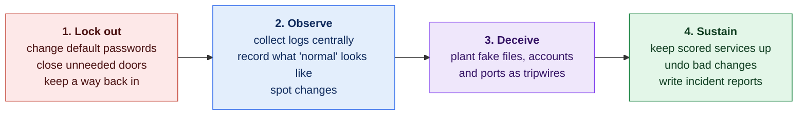
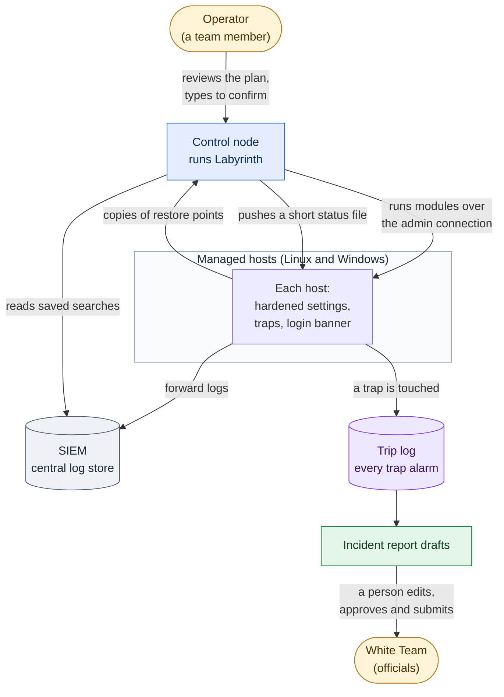

# How Labyrinth Works

**Status:** Draft · reviewed 2026-10-02

This is the plain-language tour of Labyrinth. It explains what each part of the system is for and how the parts fit together, without assuming you already know networking or security tooling. The [implementation blueprint](Blueprint.md) and the [design specs](design/README.md) hold the precise details. Each section below links to the one that goes deeper.

**Who this is for:** someone who knows what a server, an operating system and a network are, and can read a script, but who has not memorized commands or security terms. Every term is explained the first time it appears, and the [glossary](#glossary) at the end collects them.

> [!NOTE]
> Labyrinth is being built: the core and the main program exist, and the modules do not yet. This page describes how the system is *intended* to work.

**Color key.** The same four colors mark the four phases everywhere in the Labyrinth docs:

| Color | Phase | In one line |
|---|---|---|
| 🟥 | **Lock out** | Take control back from the attacker. |
| 🟦 | **Observe** | See what is happening on every machine. |
| 🟪 | **Deceive** | Plant traps that give the attacker away. |
| 🟩 | **Sustain** | Keep everything running and be able to undo mistakes. |

---

## 1. The problem Labyrinth solves

Labyrinth is built for the **Collegiate Cyber Defense Competition (CCDC)**. In CCDC, a team of students is handed a small company network that it has never seen before. The network has several **hosts** (individual computers or servers), usually a mix of Linux and Windows machines plus network devices such as a router and firewalls.

Three groups matter during the event:

- **The scoring engine** is an automated checker. Throughout the event it tests the network's **scored services**, the things the company needs working, such as a website, email or DNS (the Domain Name System, which turns names into addresses). A working service earns points; a broken one loses them.
- **The Red Team** is a group of attackers. They try to break in, stay in and cause damage. They may already know the default passwords before the event starts.
- **The White Team and the Operations Team** are the officials. They run the event and must always be able to get into the machines when they ask.

The hardest moment is **the opening minutes**. When the event starts, every host needs to be secured at once, but any mistake that breaks a scored service costs points. Doing hundreds of careful steps by hand, per machine, from memory, under time pressure, does not work.

Labyrinth is the answer: **one strategy that applies to every machine, and one tool that carries it out quickly, safely and reversibly.**

---

## 2. The big picture

### 2.1 The strategy: four phases, in order

Labyrinth works in four phases. Each one depends on the one before it.

*Figure: the four phases in the order they run, with the main jobs of each. Colors follow the phase key.*

Why this order? A trap is worthless if the attacker still has a valid password and an open way in, so locking out comes first. Traps are only useful if their alarms land somewhere you are watching, so observing comes before deceiving. The blueprint sums it up as *lock-out before observation, observation before deception, deception before comfort* ([Blueprint §1](Blueprint.md#1-operating-doctrine--the-order-of-work)).

### 2.2 The seven rules of thumb behind every phase

The blueprint calls these the **invariants**: ideas that hold on every operating system, so the team reasons about them once and applies them everywhere ([Blueprint §2](Blueprint.md#2-the-core-strategy--portable-invariants)).

1. **Identity:** no shared, default or unchanged passwords; give each account only the access it needs.
2. **Surface:** block all incoming connections by default and allow only what is scored, plus the team's own admin access.
3. **Segmentation and egress:** keep parts of the network separated, and treat unexpected *outgoing* traffic as a sign that an attacker's program is calling home.
4. **Observability:** send important logs to one central place and watch logins, sensitive files and new programs starting.
5. **Deception:** anything that is not a real service is a tripwire, and every trip is recorded in one place.
6. **Recoverability:** keep backups, known-good snapshots and an emergency way back in.
7. **Change discipline:** every change can be run twice safely, can be undone, and is timestamped. Never make a change you cannot undo in ten seconds.

### 2.3 The system at a glance

*Figure: the operator drives Labyrinth from one control node, which changes the hosts over the team's existing admin connection; hosts send logs to the SIEM and trap alarms to the trip log, and reports go to officials only after a person approves them. Amber marks people and gray the log store.*

- The **control node** is the one machine the team runs Labyrinth from. It sends every change to the other hosts over the team's admin connection.
- The **SIEM** (Security Information and Event Management system; Splunk in the reference setup) collects logs from every host, so the evidence survives even if a host is wiped.
- Nothing in the diagram talks to the internet. The competition rules forbid team tools from using outside resources other than DNS lookups (see [section 5](#5-the-competition-rules-that-shape-everything)).

---

## 3. How one Labyrinth run works

### 3.1 Profiles, phases and modules

Labyrinth is organized so that new abilities can be added without rewriting the core ([design 00](design/00-Module-Contract-and-Layout.md)).

- A **module** is one small, single-purpose piece of automation, for example "set up the firewall" or "change the admin passwords". Each module is a folder.
- A **phase** is a group of modules that belong together: 🟥 lockout, 🟦 observe, 🟪 deceive or 🟩 sustain.
- A **profile** describes a kind of host, such as a Linux web server, a Windows domain controller or a network appliance, and lists which modules apply to it. A profile is a list, not code.

When you point Labyrinth at a group of hosts, it looks up each host's profile, works out the modules to run, and runs them phase by phase.

It is written in **bash** for Linux and **PowerShell** for Windows, because both are already installed on those systems. Nothing extra has to be downloaded for Labyrinth itself to run. Once the hosts are locked down, it installs the extra tools the team chose, from public sources only, and carries on without them if no source answers ([design 20](design/20-Packages-and-Third-Party-Tools.md)). Labyrinth can run directly on the host it changes, or from a control node that sends the same commands to many hosts and collects the results; the first way still works if the second is cut off. Network appliances (routers and firewall boxes) are handled with prepared configuration templates and a written checklist for a person to follow, not by remote automation.

### 3.2 The life of one module

Every module offers the same six actions, so every module behaves the same way:

| Action | Plain meaning | Changes anything? |
|---|---|---|
| `check` | "Is a change needed here?" | No |
| `plan` | "Show me exactly what you would change." This is the default. | No |
| `apply` | Make the change. Back up first, and record what changed. | Yes |
| `verify` | "Did it work, and is every scored service still up?" | No |
| `rollback` | Undo the change, using the record `apply` wrote. | Yes, restores the old state |
| `cleanup` | Remove temporary files the module created. | Removes only its own files |

*Figure: a simplified module run; design 00 has the full version with exit codes and cleanup. Green is a clean finish, amber a person's decision or an undo, and the dashed red outline a stop.*

Two words you will see often:

- **Idempotent** means running something twice gives the same result as running it once. If `apply` has already been done, running it again changes nothing. This makes it safe to re-run Labyrinth under pressure.
- The **run manifest** is the record of every change a run made. `rollback` uses it to undo changes, and `cleanup` uses it to know exactly what to remove.

### 3.3 Where things live on each host

Every host uses the same folder layout, so the team always knows where to look: the Labyrinth code (read-only), its run-time settings, its state (baselines and records), its logs (one folder per category, such as `auth`, `integrity` or `deception`) and its timestamped backups. All of it sits under one top-level folder that only administrators can use. That location can be changed, so it is not a fixed, publicly known path ([design 00, section 7](design/00-Module-Contract-and-Layout.md#7-standard-paths-on-every-host)).

---

## 4. Each part of the system

Each subsection answers four questions: what the part does, why it exists, how it works, and what it will never do.

### 4.1 🟥 The panic button (lockout)

**What it does.** One command carries out the first-minutes lockout across the reachable hosts ([design 01](design/01-Lockout-Panic-Button.md)).

**Why it exists.** Assume the attacker is already inside when the event starts. Their power comes from passwords they already know, sessions they already have open, and ways back in they left behind. Removing all of these, fast, removes most of their ways in. The scored services are among the Red Team's main targets, so Labyrinth defends them carefully rather than leaving them as found.

**The first minute.** Each host gets one bundle of steps, in this order, using only what is already on it: change the admin passwords; remove unapproved SSH keys and check the SSH settings for anything planted; end the intruder's open remote sessions (never the console, the operator's own, the team's admin machine or an official's); then block all incoming traffic except the scoring engine, the scored services and the team's admin path, and all outgoing traffic except what the host and its scored services need. One revert timer covers the whole bundle.

**Behind the lockdown.** With the network closed around each host, Labyrinth installs the team's extra tools, takes a backup of every scored service, sets aside the attacker's footholds and applies the rest of the hardening, then reopens outgoing traffic to the host's normal list. Anything the attacker planted early is still on disk while this happens, but it cannot be reached or call home.

**First-minute runs.** The team reviews the plan before the event. At the start, one command per host, started on every host at once, gives all the answers up front, so nobody types a confirmation while the Red Team is moving. The revert timer, the checks before and after, and the protected set still apply.

**How it works.** The obvious version, "reset everything, lock everything, block everything, everywhere, at once", is exactly what the rules forbid, because it breaks things the scoring engine checks. So the panic button keeps the speed but adds guard rails:

- **The protected set.** Before anything else, the operator loads a list of accounts that must never be touched: the officials' accounts, the accounts the scoring engine logs in with, the team's own accounts, the emergency accounts and system accounts. If the list is missing or empty, the run stops.
- **Safety gates.** Six checks must all pass before any change: the protected set is loaded, the scoring engine is allowed through every firewall plan, the operator has confirmed that the emergency login works at the host's own console, backups exist, the operator has reviewed the plan and confirmed the target group's name (typed, or given in the command for a first-minute run), and a revert timer is ready for risky changes.
- **Risk tiers.** Every action is sorted by how much damage it could do, and riskier tiers get more caution:

| Tier | What it covers | Who carries it out |
|---|---|---|
| 0. Observe only | Read-only inventory: users, groups, open ports, running programs, open sessions, scheduled tasks | Runs automatically |
| 1. Safe and reversible | Change admin-class passwords; remove SSH keys that are not on the approved list; end intruder sessions | Runs automatically after the plan is reviewed |
| 2. Service-affecting | Check and harden SSH; set aside obvious attacker footholds; block incoming and outgoing traffic except what is needed; install the team's chosen tools; back up the scored services; take admin rights from unexpected local accounts and lock them; safe settings for scored apps and Windows; turn off unneeded services | Runs host group by host group, with a check and a revert timer |
| 3. Approve, then act | Unexplained footholds; deleting locked accounts; riskier app settings; app admin passwords; restoring a service from a backup; Linux security updates; lifting the outgoing block on one host; ending a stubborn process that runs as SYSTEM on Windows. A short list stays with a person: ordinary users' passwords, domain accounts and policy, KRBTGT, DNS on the domain controller, restoring the domain controller, rescuing a host that will not boot, Windows patching and network appliances | A person approves, then Labyrinth does it; the short list is a printed checklist |

- **Rings.** Changes go first to one low-impact host of each kind of system (the "canaries", for example one Linux host and one Windows workstation), then to the next group, and so on. If a check fails, the run stops before the problem spreads. A host that is the only one of its kind, such as the domain controller, has no canary to go first; it comes last and relies on the revert timer and the tests.
- **Revert timer (dead-man).** Before a change that could lock the team out, such as a firewall or SSH change, Labyrinth sets a timer that will undo the run automatically unless someone keeps it after confirming everything still works. If the change locks the team out, the timer puts things back.
- **Checking like the scoring engine.** After each module, Labyrinth tests each scored service the way the scoring engine would (for example, fetching the web page and looking for the expected text) and compares the result with a test taken before the change. If a service got worse, that module is rolled back and the run stops.

**What it will never do.** Disable accounts wholesale, change login shells, cut all connections, end a console or official's session, delete a file (it sets files aside instead), delete an account without a person's approval, stop services that are not on its candidate list, reboot, move a service into a container, change scoring accounts, or act on a host that has no emergency way in.

> [!TIP]
> **Break-glass** means a sealed emergency login, one per critical host, kept by the team captain in the team's **offline record**: on paper or in a local file on a team member's own machine, never in the repository or on the competition hosts. It exists so that the team, and the officials, can always get back in.

### 4.2 🟥 Passwords and SSH keys

**What it does.** Changes passwords and manages SSH keys without locking the team out ([design 05](design/05-Credentials-and-SSH-Keys.md)).

**Background.** **SSH** (Secure Shell) is the standard way to log in to a Linux machine remotely. Instead of a password, SSH can use a **key pair**: a private key that stays with you and a public key placed on the server. A server's list of accepted public keys lives in a file called `authorized_keys`.

**How it works.**

- **Only admin-class passwords are changed automatically** (root, Administrator and similar). The rules say these are not used for scoring. Ordinary users' passwords may be used by the scoring engine, so they are changed only by hand, following the official notification process. An admin password is also left to a person when a Windows service or scheduled task logs on with that account, because changing it would break that service the next time it starts.
- **New passwords are shown once**, on the operator's screen, to be copied into the offline record. Labyrinth never saves them to disk or logs, and teammates share them only through the official team chat.
- **The safe order.** Set the new password, test it from a fresh login, confirm it is written down, and only then close the old session. SSH keys follow the same pattern: add the new key next to the old one, test it, then remove the old one.
- **One SSH key per role** (for example, one for Linux admin work and one for monitoring), not one per person and not one shared key. Each key only works from the control node.
- **An approved-key list** (the registry) is kept for every host. Any key found that is not on the list is backed up and then removed.
- **Planted SSH settings.** An attacker may have added their own SSH settings file, which can quietly override the team's. Labyrinth sets aside unknown settings files and planted lines, makes sure its own settings load first, and asks SSH which settings it will actually use.
- **Key-only, aware of scoring.** Where SSH is scored, the scoring engine's accounts keep their passwords and everyone else must use a key. Where it is not scored, everyone uses keys and only the team's admin machine can reach it.
- **Unexpected accounts.** An account is expected if it is protected, named in the event packet or runs a scored service. Labyrinth also looks for hidden admins, such as a second root account or a user in an admin group by a side door. Unexpected local accounts with admin rights lose them and are locked at once; others are locked after a person approves. Once every scored service is confirmed working, a person can approve deleting them, so they cannot be switched back on. Their details are saved first, for the incident report.

- **App admin passwords.** Apps have their own admin logins too (a website's admin page, the database's root account), and default ones are a favorite way in. Labyrinth lists them. After a person approves, it changes one, updates every settings file that stores it, and tests the app. It never does this on its own, because the scoring engine may log in to the app.

**What it will never do.** Change scoring accounts, reset domain-wide passwords automatically, or copy private keys onto managed hosts.

### 4.3 🟦 Baseline and integrity: "what changed, who, when, from where?"

**What it does.** Records what a healthy host looks like, then spots changes and works out who made them ([design 04](design/04-Baseline-and-Integrity.md)).

**Background.** A **hash** is a short fingerprint of a file. If even one byte of the file changes, the hash changes. A **baseline** is a saved set of hashes and settings that describes "normal".

**The trap it avoids.** If the Red Team is already inside when you take the baseline, you record their changes as normal. So Labyrinth first checks files against the operating system's own records of what the installed software should look like (the package database on Linux, digital signatures on Windows). Anything that does not match is reported to a person as a finding, and is never added to the baseline.

**How it works.**

1. Check files against the operating system's records.
2. Baseline the rest: hashes of critical files, plus accounts, keys, open ports, services and scheduled tasks. **Boot-critical files** (such as `/etc/fstab`, which tells Linux which disks to mount) are watched most closely, because deleting one and rebooting can leave a host unable to start. A copy, or at least its hash, is kept off the host, because an attacker with full control of a host could edit a baseline stored there.
3. Compare against the baseline on a schedule, after first checking the host's baseline against that copy.
4. When something changes, look up the audit logs to see which account made the change, when, and from which network address.

> [!IMPORTANT]
> The address a host sees is the **last hop**: the last device the connection passed through. If traffic goes through a router that rewrites addresses (NAT, network address translation) or a proxy, that address may not be the attacker's real one. Reports say "last hop observed" for this reason.

Changes made by Labyrinth itself are in the run manifest, so they do not raise false alarms.

**The sealed baseline.** The first baseline shows the host as it was found, which may include the attacker's changes. So once the lockout is finished and checked, the team **seals** a new baseline of the cleaned host, and every later check compares against that. If the team changes something on purpose later, it reseals with a written reason, and every seal is logged.

### 4.4 🟦 Status feed and login banner

**What it does.** When a team member logs in to a host, a short message shows that host's current alerts and recent changes ([design 06](design/06-Status-Feed-and-MOTD.md)). On Linux this is the **MOTD** (message of the day), the text printed at login.

**How it works.**

1. The control node asks the SIEM a small, fixed set of saved questions (for example, "how many alerts per host?").
2. It writes one short text file per host, about 15 lines at most.
3. It copies each file to its host over the admin connection it already uses.
4. The host prints the file at login.

**Why it is built this way.** The SIEM is never given access to the hosts. Giving it that access would create a new way in for an attacker who took over the SIEM. The control node already has admin access, so reusing it adds no new trust path, meaning no new way for one machine to get into another.

**Safety details.** Text taken from logs is cleaned before it is shown, because an attacker could write special control characters into a log to mess with an operator's terminal. If an update fails, the host shows the last good status marked as out of date, and logging in is never blocked. Windows has no MOTD, so the Windows version is optional.

### 4.5 🟪 The event seed: public code, secret traps

**The problem.** The rules require Labyrinth's code to be public and shared with every team, so the Red Team can read it. If trap names and port numbers were written in the code, the Red Team would simply avoid them ([design 03](design/03-Event-Seed-and-Deception-Config.md)).

**The idea.** Think of a public recipe with a secret ingredient. The **method** for creating trap names, ports and markers is public. The **event seed**, a short random value chosen by the team just before the event, is secret. The same seed always produces the same values, so every team member and every host gets matching results without sharing a secrets file.

**How it works.**

- The seed is kept by the team captain in the offline record and typed in when Labyrinth asks for it. Labyrinth never saves it to disk, logs or command history.
- Labyrinth combines the seed with a label such as "decoy port number 3" using a **keyed hash** (HMAC-SHA256). The result looks random, cannot be reversed to reveal the seed, and is always the same for the same seed and label.
- Every result is checked. A port that clashes with a scored service, or a name that clashes with a real or protected account, is skipped and reported.
- If the seed leaks, the team picks a new one and redeploys the traps. That is designed to be a cheap, routine run.

**Why not just encrypt a secrets file?** The password for that file would itself need to be shared and typed on every host, and the encrypted file would sit in a public repository where anyone could attack it at leisure. A seed kept offline removes the stored secret entirely.

### 4.6 🟪 The deception maze: traps and decoys

**What it does.** Makes the Red Team's work noisy, slow and visible, without ever putting scoring at risk ([design 09](design/09-Deception-Maze-and-CVE-Decoys.md), [Blueprint §4](Blueprint.md#4-deception--trap-catalog)).

**The key insight.** A trap is something no legitimate user ever touches. So when it *is* touched, you can be nearly certain it is an attacker. That makes trap alarms the most trustworthy alerts the team will get.

| Trap | What it is | How good is the signal? |
|---|---|---|
| Canary files | Tempting files, such as a fake password file, whose opening is recorded | High: nobody has a reason to open them |
| Honey-accounts | Fake admin accounts that cannot log in at all; any attempt raises an alarm | High |
| Trap ports | Network ports with no real service; any connection is recorded | High, if nothing else uses the port |
| Tarpits | Trap ports that answer extremely slowly, so scanning tools get stuck | Medium; mostly wastes the attacker's time |
| Banner decoys | Changed version text on *unscored* services only | Low; only slows the attacker's identification of software |
| CVE-mimic decoys | A fake service that *looks* like known vulnerable software (a **CVE** is a publicly listed security flaw) | High, with limits |

**How it works.**

- All trap names, ports and paths come from the event seed.
- Before a trap is installed, five safety checks must pass: its port is not scored or in use; its account name does not exist and is not protected; it runs with minimal permissions; if it crashes, no real service is affected; and the firewall lets connections reach it but lets nothing leave it.
- Every decoy writes to **one central trip log**: the time, which trap, the source address and what was attempted. The trip log feeds the incident reports and the status feed.
- At the end of the event, `cleanup` removes every trap, because the run manifest lists them all.

**What it will never do.** Put a trap on a scored port, fake a response from a scored service, attack or scan back, or contact anything outside the team's network. A CVE-mimic decoy contains no real vulnerable code; it only imitates the visible signs. It adds noise and costs the attacker time, but it never replaces actually patching the real service.

### 4.7 🟩 Incident reports

**What it does.** Gathers the facts about an attack automatically, so a person only has to add judgment and the final wording ([design 02](design/02-Incident-Reporting-Automation.md)).

**Why it matters.** Under the rules, a thorough report that correctly identifies a successful Red Team attack may reduce the Red Team penalty for that attack. Incomplete or vague reports earn nothing.

**How it works.**

1. **Detect:** something raises an event, such as a trap being touched, a file changing, a suspicious login, a SIEM alert, or a team member typing "log this".
2. **Collect:** gather the facts already on the host: time, host, account, source address, program, file and the relevant log lines.
3. **Correlate:** group related events (same address, account or host, close in time) into one incident with a timeline.
4. **Draft:** fill in the report template, which follows what the rules ask a report to contain: what happened, with addresses and a timeline, passwords cracked, access obtained and damage done; what was affected; and a plan to fix it. Any field without evidence says `UNKNOWN`, never a guess, and the draft lists every field still missing so the team sees it before submitting.
5. **Review:** the incident lead edits the draft. The captain also approves any report about an action that affected a scored service.
6. **Submit:** a person submits it through the channel the officials specify. Labyrinth never submits anything itself.
7. **Track:** the record shows whether each report is a draft, submitted or accepted, so nothing is filed twice or forgotten.

Passwords, keys and tokens are stripped from log excerpts before they go into a report.

### 4.8 🟩 Cleanup and tool integrity

**What it does.** Leaves nothing behind at the end, and proves that the Labyrinth code on each host is exactly the code that was released ([design 07](design/07-Cleanup-and-Tool-Integrity.md)).

**Cleanup.** Every module declares the files it creates, and every change goes into the run manifest. `cleanup` removes temporary files, timers, scheduled tasks and temporary accounts, but keeps logs and reports until they are collected. It never deletes evidence or anything the manifest does not list, and it only touches Labyrinth's own folders. The only accounts it ever deletes are ones Labyrinth created itself, such as fake trap accounts. `rollback` (undoing changes) is kept separate, so the team can tidy up without reverting its work.

**Tool integrity.** The real risk to the team's own tools is someone *changing* them, not someone *reading* them (the code is public anyway). So:

- each release is tagged in git, and its commit ID is kept in the offline record;
- a **manifest** lists every file with its hash;
- the manifest is **signed** with a team key, which proves who made it and that it has not been altered;
- before every run, the control node checks the signature, and each host checks the manifest's hash against the one in the offline record and every file's hash against the manifest. If anything does not match, the run is refused. (Older hosts cannot check this kind of signature themselves, which is why that step happens on the control node.)

### 4.9 Learning from other teams' tools

Some outside repositories are kept as **reference only** ([design 08](design/08-Reference-Mining.md)). The team reads them for ideas and then writes its own original code from a specification. This avoids software-license obligations (some licenses require anything built from the code to use the same license, and code with no license grants no permission at all) and avoids running code nobody has checked. Ideas and techniques are not covered by copyright; copied code is.

### 4.10 🟦 Getting the logs to the SIEM

**What it does.** Sends the most useful logs from every host to the one SIEM, and runs a handful of saved searches over them ([design 10](design/10-Log-Forwarding-and-Detection.md)).

**Why it exists.** A log that stays on a host disappears if an attacker wipes that host. Once a log line has reached the SIEM, deleting it locally changes nothing. The status feed, the incident reports and the traps all rely on the SIEM already holding the right events.

**How it works.**

- **Linux** hosts forward their login records, the audit log (who ran which privileged command, who touched which watched file) and firewall "blocked" messages, using the logging program that is already installed.
- **Windows** hosts forward a short, fixed list of event IDs, the numbers Windows gives each kind of event: logons, failed logons, new accounts, new admin-group members, new services and scheduled tasks, and "the audit log was cleared". The domain controller also forwards its sign-in ticket events, which show password guessing and attempts to steal service passwords.
- The SIEM accepts logs only from the team's own hosts, so an attacker cannot flood it or plant false entries.
- **Appliances** send their logs by **syslog**, the standard way network devices send log lines to a collector.
- A few **saved searches** turn those logs into alerts. The ones that almost never fire by accident come first: a trap was touched, someone tried a fake account, a bait file was opened, a log was wiped.

**Protecting the SIEM itself.** An attacker who controls the SIEM can blind the team. Labyrinth changes its admin password, checks its users, lets only the team's admin machine reach its web page and only the team's hosts send it logs, and sets aside add-ons that could run commands.

**Watching outgoing traffic.** Blocking incoming traffic does not stop a program already inside from calling out. So each host blocks outgoing traffic it does not need from the first minute, and also logs new outgoing connections, and a search flags unusual ones, such as time or name lookups sent to an unknown server.

**Domain takeover signs.** Searches also look for the signs of two well-known attacks that hand over every domain password: ZeroLogon and DCSync. Either one puts the KRBTGT reset at the top of the domain checklist.

**Watching, not blocking, risky tools.** Some ordinary tools are favorites for attackers (for example, ones that open network connections or download files). Blocking them everywhere could break real work, so Labyrinth raises an alert when they run instead.

**What it will never do.** Send logs anywhere outside the competition network, or let logging fill a disk.

### 4.11 🟥 Windows and the domain controller

**What it does.** Hardens Windows machines and the **domain controller** with the same guard rails as the panic button ([design 11](design/11-Windows-and-AD-Hardening.md)).

**Why it is careful.** The domain controller answers logons and DNS for the whole network. One mistake there breaks everything at once. So the rule is **blast radius**: a change that affects one machine can be automated; a change that affects the whole domain is a printed checklist.

**How it works.** Ordinary Windows machines go first, one group at a time. Labyrinth changes their admin passwords, turns on the firewall, limits remote desktop to the team's admin machine (and the scoring engine, if remote desktop is scored), and turns off old or risky features that attackers use to steal or relay passwords, such as old password formats and a setting that keeps plain-text passwords in memory. The domain controller goes last. Anything domain-wide, such as **Group Policy** (settings the domain pushes to every machine at once), domain accounts including the domain Administrator, DNS or the special KRBTGT account, is done by a person following the checklist.

**Stubborn processes.** An administrator cannot always end a process that runs as SYSTEM, the most powerful Windows account, and attackers use this to keep their tools running. After a person approves, Labyrinth ends that one process through a one-time scheduled task that runs as SYSTEM, and deletes the task afterwards. Its way of restarting is set aside first, so it does not come straight back.

### 4.12 🟪 Automatic bans

**What it does.** When an address touches a trap, uses the planted key or keeps failing to log in, the host blocks that address for a while ([design 12](design/12-Dynamic-Bans.md)).

**The big safety catch.** If the router in front of a host rewrites every outside address into one address (NAT), the host cannot tell the scoring engine and the attacker apart. Banning that one address would block scoring. So before bans are switched on, Labyrinth checks what addresses the host really sees, and it refuses to ban if they all look the same.

**Other guard rails.** A **never-ban list** (the scoring engine, the officials, the team's own machines, the SIEM) is loaded first; a trigger from one of those raises an alert instead. Bans expire. Ban thresholds are settings the team can adjust during the event without changing the frozen code. Labyrinth uses its own small watcher rather than installing a ban tool such as fail2ban, which would bring a new interpreter onto the host; where fail2ban is already installed, Labyrinth gives it the never-ban list too.

**What it will never do.** Strike back at, scan or report the attacker to anyone. A ban only blocks traffic coming into the team's own host.

### 4.13 🟩 Health monitor and checkpoints

**What it does.** Re-tests every scored service on a schedule, and gives the team one command that summarizes the whole network ([design 13](design/13-Health-Monitor-and-Checkpoints.md)).

**How it works.** The control node runs the same scoring-style tests the panic button uses. When a service goes from working to broken, it records both results, names the most recent Labyrinth change on that host as the likely cause, and raises an alert. It does **not** undo a service change on its own: an hour after a change, the cause could just as easily be the attacker, so a person decides.

**Firewall drift.** The one exception is the firewall. If its rules no longer match the sealed set (for example, because an attacker flushed them), Labyrinth puts the sealed rules back at once, with the usual tests and revert timer, and raises an alert. Rules that keep changing are flagged for a person to investigate.

`labyrinth checkpoint` prints, in one screen: which services are up, new integrity findings, new accounts or open ports, open incident reports, trap hits and bans, and how long since each service was last backed up. It changes nothing.

**Two caveats.** The control node tests from *inside* the network. The scoring engine may test from outside, through the edge firewall. A pass from inside is good evidence, not proof. And the tests check that a service answers, not that a user can log in, because the scoring engine's accounts are never used. A team can close that gap by creating its own test mailbox by hand and checking it at each checkpoint.

### 4.14 🟩 Backups you can restore

**What it does.** Takes **restore points** of each scored service: its settings, its website files, its database and, on the domain controller, the directory itself ([design 14](design/14-Backup-and-Recovery.md)).

**Why it exists.** Rollback only undoes Labyrinth's own changes. If an attacker defaces a website or deletes a database table, the team needs a copy from before the damage.

**How it works.** A restore point is taken before patching, before the first risky change on a host, or on request. Labyrinth first checks there is enough disk space, records a hash of each backup so tampering is caught, and stores it where only an administrator can read it. Every restore point is also copied off the host to the control node, because an attacker with full control of a host can delete backups stored there, and Red Teams are expected to destroy things later in an event.

**Restoring.** `labyrinth restore` puts back a service's settings and files, its database, or a service that was stopped. Restoring overwrites live data, so a person first confirms the restore point is from before the damage; Labyrinth then does the restore, saves the damaged copy as evidence and tests the service. Restoring the domain controller and rescuing a host that will not boot (for example, after an attacker deleted a file it needs to start) stay with a person, following a printed procedure.

### 4.15 🟥 Fewer services, targeted patches

**What it does.** Turns off services the host does not need, and helps the team patch the software most likely to be attacked ([design 15](design/15-Patching-and-Service-Reduction.md)).

**Services.** Each kind of host has a list of services that may be turned off, with the reason and the conditions that keep one on, such as "it is scored". Turning a service off is easy to undo, so Labyrinth does it automatically with the usual checks.

**Patches.** Undoing a software update is often impossible, so each patch needs a person's approval. Labyrinth takes the ranked list of known flaws (section 4.19), and for each approved update takes a restore point, updates that one package and tests the service afterwards. Windows updates stay a checklist for a person. It never runs a full system upgrade in the middle of an event. Known-exploited flaws on the domain controller, such as ZeroLogon, always come first. A team can pre-approve security updates for named scored programs, so a first-minute run applies them without waiting.

**Web apps and plugins.** The system's update tools do not track most web apps, so Labyrinth also lists each scored web app's version and its plugins, read from the files on disk, and ranks them the same way. An unused plugin with a known flaw can be switched off after a person approves.

### 4.16 🟥 Routers and firewall appliances

**What it does.** Provides a **runbook** for each type of router or firewall appliance: a tested, numbered procedure a person follows, filled in with the event's own values ([design 16](design/16-Network-Appliance-Runbooks.md)).

**Why it is manual.** Every vendor has its own commands, and a mistake on the device in front of the network can cut off every host, including the scoring engine's path. Labyrinth prints the steps; it never sends commands to an appliance.

**The steps, in order.** Prepare a way back (second session, configuration backup); change the default passwords; allow management only from inside; allow the scoring engine before blocking anything; block everything else from outside; note how the router rewrites addresses; send the logs to the SIEM; save, test and keep a second backup.

### 4.17 🟥 Sweeping for attacker footholds

**What it does.** Finds the ways back in that an attacker left behind, and removes them without breaking a scored service ([design 17](design/17-Persistence-Sweep.md)).

**Why it exists.** Changing passwords does not remove a scheduled job that reconnects the attacker every minute, a hidden service, or a web page that gives them a command line. Those must be found and removed too.

**How it works.** Labyrinth looks in the usual hiding places: scheduled jobs, services, startup items, login scripts, SSH and admin settings, and web folders. Each thing it finds is sorted:

- **Known good:** belongs to installed software and is unchanged. Left alone.
- **Clearly the attacker's:** does not belong to installed software, nothing scored relies on it, and it shows an unmistakable sign, such as running from a temporary folder or opening a command line to the network. Set aside automatically in the first minute.
- **Unexplained:** anything else. Shown to a person with the reason; once approved, Labyrinth sets it aside.
- **Inside a scored website:** possible attacker web pages are always shown to a person first, because removing a real page would take the site down.

"Set aside" means **quarantined**: switched off and moved to a locked folder, with a record of how to put it back. Nothing is deleted, so a mistake can be undone and the item can be shown as evidence in the incident report.

### 4.18 🟥 Ready-made settings for scored apps

**What it does.** Ships tested settings packs for common scored programs: web servers, mail, DNS, databases and FTP ([design 18](design/18-Service-Packs-and-Config-Library.md)).

**Why it exists.** The scored services are what the Red Team attacks most, so leaving them exactly as found is not safe. But changing them by hand under pressure is how teams break their own services.

**How it works.** Each setting is sorted in advance. Safe ones (such as hiding the software version or turning off file listings nobody uses) are applied automatically, after the program's own syntax check, with a gentle reload, a test like the scoring engine's and a revert timer. Settings that could change what the scoring engine sees wait for a person's approval. Anything too specific to the event's own app is written up as a step-by-step runbook.

### 4.19 🟥 Finding and closing known flaws

**What it does.** Finds the known flaws on the team's machines before the Red Team uses them, closes the dangerous ones first, and keeps each one on a list until it is closed ([design 21](design/21-Vulnerability-Tracker-and-Mitigations.md)).

**Why it exists.** A Red Team's first step is to check which software versions are running and attack the ones with known flaws. Labyrinth does the same check from the inside, first.

**How it works.** Labyrinth reads the system's own update data, the versions of scored web apps and plugins on disk, and on Windows the updates that are missing. It also scans the team's own machines (never anyone else's) for the software versions they show the network, which catches programs installed by hand. All matching happens on the team's machines; nothing is sent out to be looked up. Flaws are ranked: the domain controller first, then scored services, then anything reachable from the network that is known to be exploited.

**Closing a flaw.** An unscored service with a flaw is simply turned off. A scored service is never turned off. Instead, Labyrinth closes the flaw while the service keeps running: first with a tested setting or firewall rule from its catalog where one exists (for example, removing a dangerous permission from a helper program nothing uses), then with the security update once a person approves it. Each flaw is tracked as open, mitigated, patched or accepted, and every checkpoint shows what is still open.

---

## 5. The competition rules that shape everything

Every design choice above traces back to a handful of rules. In plain words, a tool a team writes itself must:

- **be public** at least three months before it is used, **declared** to the officials, and **frozen** (no changes) for each event;
- be **shared** with every competing team;
- use **no outside resources** during the event, other than DNS lookups;
- **never deliberately break** things the network is expected to do. The rules give setting every Linux login shell to `/bin/false` and ending all outbound connections after 30 seconds as examples of what not to do

(National Collegiate Cyber Defense Competition [NCCDC], 2025, Rules 5.6.1–5.6.5).

Other rules also shape the design:

| Rule in plain words | What it means for Labyrinth |
|---|---|
| Officials must be able to get in when they ask (NCCDC, 2025, Rule 4.1). | A tested emergency way in is required before any change. |
| Anything that interferes with the scoring engine is the team's responsibility (NCCDC, 2025, Rule 4.11). | The scoring engine is allowed through firewalls first, and every change is tested like the scoring engine would test it. |
| Do not mislead the scoring engine (NCCDC, 2025, Rule 11.3). | No trap or fake service on anything scored. |
| Scored services may not be moved or put into containers (NCCDC, 2025, Rule 4.14). | No container tricks for scored services. |
| No new devices (NCCDC, 2025, Rule 4.2). | Everything runs on the machines already there. |
| No attacks on systems outside your own network (NCCDC, 2025, Rule 4.10). | Traps observe and record; they never strike back. |

> [!IMPORTANT]
> These rule numbers come from the 2026 national rules. The 2027 rules are not published yet, so every citation must be re-checked when they are.

---

## 6. What Labyrinth is not

- **Not a replacement for people.** Anything high-risk is a printed checklist, and every report is approved by a person.
- **Not a store of secrets.** The repository holds templates and placeholders only. Real addresses, passwords and the event seed are supplied at run time and never committed.
- **Not an attack tool.** It defends, observes and records; it never scans, attacks or contacts outside systems.
- **Not a promise of safety.** Traps and decoys buy time and visibility. They do not replace changing passwords and patching.

---

## 7. What to do first: priorities

Controls are ranked from **P0** (do first) to **P3** (do last): 🔴 P0 · 🟠 P1 · 🟡 P2 · ⚪ P3. The rule is to do every P0 task on every host before starting any P1 task anywhere. Changing admin passwords, ending intruder sessions, sweeping for footholds and turning on the default-deny firewall are P0. Traps (canaries and honey-accounts) are P2, not because they matter less, but because they need the logging from the Observe phase to be in place first. The full table is the [priority scorecard](Blueprint.md#7-priority-scorecard).

---

## Glossary

| Term | Meaning |
|---|---|
| Active Directory (AD) | Microsoft's system for managing users and computers across a Windows network from a central server, the **domain controller**. |
| Admin-class account | An administrator account such as root or Administrator. Not used for scoring, so it may be changed freely. |
| Allowlist | A list of the only things that are permitted; everything else is blocked. |
| Audit log | A log in which the operating system records who did what, such as opening a watched file. |
| Baseline | A saved record of what a healthy host looks like, used to spot changes. |
| Break-glass | A sealed emergency login kept in the offline record, used only when normal access fails. |
| Canary | A bait file whose only purpose is to raise an alarm when someone opens it. |
| Control node | The one machine the team runs Labyrinth from. |
| CVE | Common Vulnerabilities and Exposures: a public ID for a known security flaw. |
| Default-deny | A firewall setting that blocks every incoming connection unless a rule allows it. |
| Event seed | The secret random value, kept offline, from which all trap names and ports are derived. |
| Exit code | The number a command ends with, which says how it went: 0 done or nothing to do, 10 a change is needed, 20 blocked by a safety check, 30 a check after a change failed, 40 an error. |
| Firewall | Software or a device that decides which network connections are allowed. |
| Group Policy | Settings a Windows domain pushes to every machine at once. |
| Hash | A short fingerprint of a file that changes if the file changes. |
| Hidden admin | An account with administrator power that does not look like one, such as a second root account or a member of an admin group by a side door. |
| Persistence | A way back in that an attacker leaves behind, such as a scheduled job or a hidden service. |
| Quarantine | Switching an item off and moving it to a locked folder, with a record of how to put it back, instead of deleting it. |
| Offline record | Where the team keeps passwords, the seed and the release fingerprint: on paper or in a local file on a team member's own machine, never in the repository, a cloud drive or the competition hosts. |
| Honey-account | A fake account that cannot log in; any attempt to use it is an alarm. |
| Host | Any single computer or server on the network. |
| Idempotent | Safe to run more than once: repeating it gives the same result. |
| KRBTGT | The hidden domain account whose password signs every Windows domain login ticket; resetting it cancels forged tickets. |
| Manifest | A list of files with their hashes (for tool integrity), or a record of changes made (the run manifest). |
| Module | One small, single-purpose piece of Labyrinth automation. |
| MOTD | Message of the day: the text a Linux host shows at login. |
| NAT | Network address translation: a router rewriting addresses, which can hide where traffic really came from. |
| Patch | An update that fixes a flaw in a piece of software. |
| Port | A numbered "door" on a host that a network service listens on, such as 22 for SSH. |
| Priority | How early a task runs, from P0 (first, on every host) to P3 (last). |
| Profile | A kind of host (for example, Linux web server) and the list of modules that apply to it. |
| Protected set | Accounts Labyrinth must never touch, supplied by the operator for each event. |
| Red Team | The attackers in the competition. |
| Restore | Putting a service back from a backup (a restore point) after damage. Not the same as a rollback. |
| Restore point | A backup of a service taken so it can be put back after damage. |
| Revert timer (dead-man) | A timer started before a risky change that rolls the whole run back automatically, unless someone keeps the run after confirming things still work. If a change locks the team out, the timer puts things back. |
| Ring | A group of hosts that receives a change together; the first ring is one low-impact host of each kind of system. |
| Rollback | Undoing what a run changed, newest first, using the run manifest. The revert timer starts one automatically; a person can start one too. |
| Runbook | A tested, numbered procedure that a person follows step by step. |
| Run ID | The name of one Labyrinth run, such as `20261002T140301Z-4f2a`: the start time in UTC and four random characters. Commands also accept just the last four characters (`4f2a`). |
| Scored service | A service the scoring engine checks, such as a website, email or DNS. |
| Scoring engine | The automated checker that tests scored services and awards points. |
| Seal | Taking a new baseline of a host once it is cleaned, and using it as the reference for every later check. |
| SIEM | Security Information and Event Management system: a central place that collects and searches logs from every host. |
| SSH | Secure Shell: the standard encrypted way to log in to a Linux host remotely. |
| Syslog | The standard way servers and network devices send log lines to a collector. |
| Tarpit | A trap that answers so slowly that attack tools get stuck. |
| Tier | How risky a change is, from Tier 0 (read-only) to Tier 3 (a person approves first); it decides how carefully the change is made. |
| Trip log | The single log every trap writes its alarms to. |
| White Team | The competition officials who run the event. |

---

## Where to go next

- **The whole system in detail:** the [implementation blueprint](Blueprint.md).
- **One part in detail:** the [design specs](design/README.md), starting with [00, the module contract](design/00-Module-Contract-and-Layout.md).
- **The project summary:** the [README](../README.md).

## References

National Collegiate Cyber Defense Competition. (2025, December 10). *Rules and requirements*. Retrieved October 2, 2026, from https://www.nationalccdc.org/rules.html
