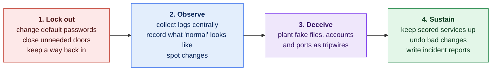
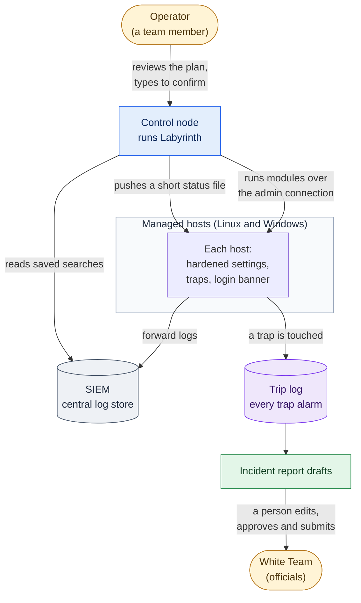
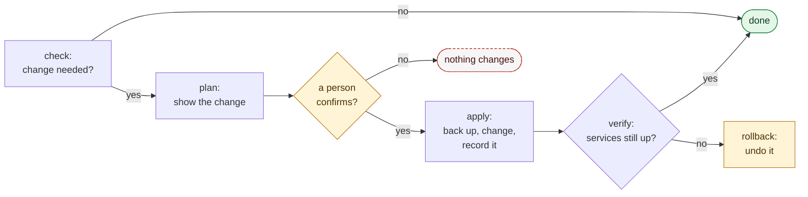

# How Labyrinth Works

**Status:** Draft · reviewed 2026-09-29

This is the plain-language tour of Labyrinth. It explains what each part of the system is for and how the parts fit together, without assuming you already know networking or security tooling. The [implementation blueprint](Blueprint.md) and the [design specs](design/README.md) hold the precise details. Each section below links to the one that goes deeper.

**Who this is for:** someone who knows what a server, an operating system and a network are, and can read a script, but who has not memorized commands or security terms. Every term is explained the first time it appears, and the [glossary](#glossary) at the end collects them.

> [!NOTE]
> Labyrinth is still being designed. No code exists yet. This page describes how the system is *intended* to work.

**Color key.** The same four colors mark the four phases everywhere in the Labyrinth docs:

| Color | Phase | In one line |
|---|---|---|
| 🟥 | **Lock out** | Take control back from the attacker. |
| 🟦 | **Observe** | See what is happening on every machine. |
| 🟪 | **Deceive** | Plant traps that give the attacker away. |
| 🟩 | **Sustain** | Keep everything running and be able to undo mistakes. |

---

## 1. The problem Labyrinth solves

Labyrinth is built for the **Collegiate Cyber Defense Competition (CCDC)**. In CCDC, a team of students is handed a small company network that it has never seen before. The network has several **hosts** (individual computers or servers), usually a mix of Linux and Windows machines plus network devices such as a router and firewalls.

Three groups matter during the event:

- **The scoring engine** is an automated checker. Throughout the event it tests the network's **scored services**, the things the company needs working, such as a website, email or DNS (the Domain Name System, which turns names into addresses). A working service earns points; a broken one loses them.
- **The Red Team** is a group of attackers. They try to break in, stay in and cause damage. They may already know the default passwords before the event starts.
- **The White Team and the Operations Team** are the officials. They run the event and must always be able to get into the machines when they ask.

The hardest moment is **the opening minutes**. When the event starts, every host needs to be secured at once, but any mistake that breaks a scored service costs points. Doing hundreds of careful steps by hand, per machine, from memory, under time pressure, does not work.

Labyrinth is the answer: **one strategy that applies to every machine, and one tool that carries it out quickly, safely and reversibly.**

---

## 2. The big picture

### 2.1 The strategy: four phases, in order

Labyrinth works in four phases. Each one depends on the one before it.

*Figure: the four phases in the order they run, with the main jobs of each. Colors follow the phase key.*

Why this order? A trap is worthless if the attacker still has a valid password and an open way in, so locking out comes first. Traps are only useful if their alarms land somewhere you are watching, so observing comes before deceiving. The blueprint sums it up as *lock-out before observation, observation before deception, deception before comfort* ([Blueprint §1](Blueprint.md#1-operating-doctrine--the-order-of-work)).

### 2.2 The seven rules of thumb behind every phase

The blueprint calls these the **invariants**: ideas that hold on every operating system, so the team reasons about them once and applies them everywhere ([Blueprint §2](Blueprint.md#2-the-core-strategy--portable-invariants)).

1. **Identity:** no shared, default or unchanged passwords; give each account only the access it needs.
2. **Surface:** block all incoming connections by default and allow only what is scored, plus the team's own admin access.
3. **Segmentation and egress:** keep parts of the network separated, and treat unexpected *outgoing* traffic as a sign that an attacker's program is calling home.
4. **Observability:** send important logs to one central place and watch logins, sensitive files and new programs starting.
5. **Deception:** anything that is not a real service is a tripwire, and every trip is recorded in one place.
6. **Recoverability:** keep backups, known-good snapshots and an emergency way back in.
7. **Change discipline:** every change can be run twice safely, can be undone, and is timestamped. Never make a change you cannot undo in ten seconds.

### 2.3 The system at a glance

*Figure: the operator drives Labyrinth from one control node, which changes the hosts over the team's existing admin connection; hosts send logs to the SIEM and trap alarms to the trip log, and reports go to officials only after a person approves them. Amber marks people and gray the log store.*

- The **control node** is the one machine the team runs Labyrinth from. It sends every change to the other hosts over the team's admin connection.
- The **SIEM** (Security Information and Event Management system; Splunk in the reference setup) collects logs from every host, so the evidence survives even if a host is wiped.
- Nothing in the diagram talks to the internet. The competition rules forbid team tools from using outside resources other than DNS lookups (see [section 5](#5-the-competition-rules-that-shape-everything)).

---

## 3. How one Labyrinth run works

### 3.1 Profiles, phases and modules

Labyrinth is organized so that new abilities can be added without rewriting the core ([design 00](design/00-Module-Contract-and-Layout.md)).

- A **module** is one small, single-purpose piece of automation, for example "set up the firewall" or "change the admin passwords". Each module is a folder.
- A **phase** is a group of modules that belong together: 🟥 lockout, 🟦 observe, 🟪 deceive or 🟩 sustain.
- A **profile** describes a kind of host, such as a Linux web server, a Windows domain controller or a network appliance, and lists which modules apply to it. A profile is a list, not code.

When you point Labyrinth at a group of hosts, it looks up each host's profile, works out the modules to run, and runs them phase by phase.

It is written in **bash** for Linux and **PowerShell** for Windows, because both are already installed on those systems. Nothing extra has to be downloaded during the event. Network appliances (routers and firewall boxes) are handled with prepared configuration templates and a written checklist for a person to follow, not by remote automation.

### 3.2 The life of one module

Every module offers the same six actions, so every module behaves the same way:

| Action | Plain meaning | Changes anything? |
|---|---|---|
| `check` | "Is a change needed here?" | No |
| `plan` | "Show me exactly what you would change." This is the default. | No |
| `apply` | Make the change. Back up first, and record what changed. | Yes |
| `verify` | "Did it work, and is every scored service still up?" | No |
| `rollback` | Undo the change, using the record `apply` wrote. | Yes, restores the old state |
| `cleanup` | Remove temporary files the module created. | Removes only its own files |

*Figure: a simplified module run; design 00 has the full version with exit codes and cleanup. Green is a clean finish, amber a person's decision or an undo, and the dashed red outline a stop.*

Two words you will see often:

- **Idempotent** means running something twice gives the same result as running it once. If `apply` has already been done, running it again changes nothing. This makes it safe to re-run Labyrinth under pressure.
- The **run manifest** is the record of every change a run made. `rollback` uses it to undo changes, and `cleanup` uses it to know exactly what to remove.

### 3.3 Where things live on each host

Every host uses the same folder layout, so the team always knows where to look: the Labyrinth code (read-only), its state (baselines and records), its logs (one folder per category, such as `auth`, `integrity` or `deception`) and its timestamped backups. The top-level location can be changed, so it is not a fixed, publicly known path ([design 00, section 7](design/00-Module-Contract-and-Layout.md#7-standard-paths-on-every-host)).

---

## 4. Each part of the system

Each subsection answers four questions: what the part does, why it exists, how it works, and what it will never do.

### 4.1 🟥 The panic button (lockout)

**What it does.** One command carries out the first-minutes lockout across the reachable hosts ([design 01](design/01-Lockout-Panic-Button.md)).

**Why it exists.** The attacker's power comes from passwords they already know and sessions they already have open. Removing both, fast, removes most of their ways in.

**How it works.** The obvious version, "reset everything, lock everything, block everything, everywhere, at once", is exactly what the rules forbid, because it breaks things the scoring engine checks. So the panic button keeps the speed but adds guard rails:

- **The protected set.** Before anything else, the operator loads a list of accounts that must never be touched: the officials' accounts, the accounts the scoring engine logs in with, the team's own accounts, the emergency accounts and system accounts. If the list is missing or empty, the run stops.
- **Safety gates.** Six checks must all pass before any change: the protected set is loaded, the scoring engine is allowed through every firewall plan, the emergency login has been tested, backups exist, the operator has reviewed the plan and typed the target group's name, and a revert timer is ready for risky changes.
- **Risk tiers.** Every action is sorted by how much damage it could do, and riskier tiers get more caution:

| Tier | What it covers | Who carries it out |
|---|---|---|
| 0. Observe only | Read-only inventory: users, open ports, running programs, scheduled tasks | Runs automatically |
| 1. Safe and reversible | Change admin-class passwords; remove SSH keys that are not on the approved list | Runs automatically after the plan is reviewed |
| 2. Service-affecting | Turn on the default-deny firewall; turn off unneeded services; harden SSH; lock (never delete) unexpected local accounts | Runs host group by host group, with a check and a revert timer |
| 3. Manual only | Ordinary users' passwords; domain accounts; network appliances; anything touching a scored service's own settings | Printed as a checklist; a person does it |

- **Rings.** Changes go to one low-impact host first (the "canary", a workstation), then to the next group, and so on. If a check fails, the run stops before the problem spreads.
- **Dead-man revert timer.** Before a firewall or SSH change, Labyrinth sets a timer that will undo the change automatically unless someone cancels it after confirming everything still works. If the change locks the team out, the timer puts things back.
- **Checking like the scoring engine.** After each module, Labyrinth tests each scored service the way the scoring engine would (for example, fetching the web page and looking for the expected text) and compares the result with a test taken before the change. If a service got worse, that module is rolled back and the run stops.

**What it will never do.** Disable accounts wholesale, change login shells, cut all connections, delete accounts or files, stop services that are not on its candidate list, reboot, move a service into a container, change scoring accounts, or act on a host that has no emergency way in.

> [!TIP]
> **Break-glass** means a sealed emergency login, one per critical host, written on paper and kept by the team captain. It exists so that the team, and the officials, can always get back in.

### 4.2 🟥 Passwords and SSH keys

**What it does.** Changes passwords and manages SSH keys without locking the team out ([design 05](design/05-Credentials-and-SSH-Keys.md)).

**Background.** **SSH** (Secure Shell) is the standard way to log in to a Linux machine remotely. Instead of a password, SSH can use a **key pair**: a private key that stays with you and a public key placed on the server. A server's list of accepted public keys lives in a file called `authorized_keys`.

**How it works.**

- **Only admin-class passwords are changed automatically** (root, Administrator and similar). The rules say these are not used for scoring. Ordinary users' passwords may be used by the scoring engine, so they are changed only by hand, following the official notification process.
- **New passwords are shown once**, on the operator's screen, to be written in the paper log. They are never saved to disk, logs or chat.
- **The safe order.** Set the new password, test it from a fresh login, confirm it is written down, and only then close the old session. SSH keys follow the same pattern: add the new key next to the old one, test it, then remove the old one.
- **One SSH key per role** (for example, one for Linux admin work and one for monitoring), not one per person and not one shared key. Each key only works from the control node.
- **An approved-key list** (the registry) is kept for every host. Any key found that is not on the list is backed up and then removed.

**What it will never do.** Change scoring accounts, reset domain-wide passwords automatically, or copy private keys onto managed hosts.

### 4.3 🟦 Baseline and integrity: "what changed, who, when, from where?"

**What it does.** Records what a healthy host looks like, then spots changes and works out who made them ([design 04](design/04-Baseline-and-Integrity.md)).

**Background.** A **hash** is a short fingerprint of a file. If even one byte of the file changes, the hash changes. A **baseline** is a saved set of hashes and settings that describes "normal".

**The trap it avoids.** If the Red Team is already inside when you take the baseline, you record their changes as normal. So Labyrinth first checks files against the operating system's own records of what the installed software should look like (the package database on Linux, digital signatures on Windows). Anything that does not match is reported to a person as a finding, and is never added to the baseline.

**How it works.**

1. Check files against the operating system's records.
2. Baseline the rest: hashes of critical files, plus accounts, keys, open ports, services and scheduled tasks.
3. Compare against the baseline on a schedule.
4. When something changes, look up the audit logs to see which account made the change, when, and from which network address.

> [!IMPORTANT]
> The address a host sees is the **last hop**: the last device the connection passed through. If traffic goes through a router that rewrites addresses (NAT, network address translation) or a proxy, that address may not be the attacker's real one. Reports say "last hop observed" for this reason.

Changes made by Labyrinth itself are in the run manifest, so they do not raise false alarms.

### 4.4 🟦 Status feed and login banner

**What it does.** When a team member logs in to a host, a short message shows that host's current alerts and recent changes ([design 06](design/06-Status-Feed-and-MOTD.md)). On Linux this is the **MOTD** (message of the day), the text printed at login.

**How it works.**

1. The control node asks the SIEM a small, fixed set of saved questions (for example, "how many alerts per host?").
2. It writes one short text file per host, about 15 lines at most.
3. It copies each file to its host over the admin connection it already uses.
4. The host prints the file at login.

**Why it is built this way.** The SIEM is never given access to the hosts. Giving it that access would create a new way in for an attacker who took over the SIEM. The control node already has admin access, so reusing it adds no new trust path, meaning no new way for one machine to get into another.

**Safety details.** Text taken from logs is cleaned before it is shown, because an attacker could write special control characters into a log to mess with an operator's terminal. If an update fails, the host shows the last good status marked as out of date, and logging in is never blocked. Windows has no MOTD, so the Windows version is optional.

### 4.5 🟪 The event seed: public code, secret traps

**The problem.** The rules require Labyrinth's code to be public and shared with every team, so the Red Team can read it. If trap names and port numbers were written in the code, the Red Team would simply avoid them ([design 03](design/03-Event-Seed-and-Deception-Config.md)).

**The idea.** Think of a public recipe with a secret ingredient. The **method** for creating trap names, ports and markers is public. The **event seed**, a short random value chosen by the team just before the event, is secret. The same seed always produces the same values, so every team member and every host gets matching results without sharing a secrets file.

**How it works.**

- The seed is written on paper, kept by the team captain, and typed in when Labyrinth asks for it. It is never saved to disk, logs or command history.
- Labyrinth combines the seed with a label such as "decoy port number 3" using a **keyed hash** (HMAC-SHA256). The result looks random, cannot be reversed to reveal the seed, and is always the same for the same seed and label.
- Every result is checked. A port that clashes with a scored service, or a name that clashes with a real or protected account, is skipped and reported.
- If the seed leaks, the team picks a new one and redeploys the traps. That is designed to be a cheap, routine run.

**Why not just encrypt a secrets file?** The password for that file would itself need to be shared and typed on every host, and the encrypted file would sit in a public repository where anyone could attack it at leisure. A paper seed removes the stored secret entirely.

### 4.6 🟪 The deception maze: traps and decoys

**What it does.** Makes the Red Team's work noisy, slow and visible, without ever putting scoring at risk ([design 09](design/09-Deception-Maze-and-CVE-Decoys.md), [Blueprint §4](Blueprint.md#4-deception--trap-catalog)).

**The key insight.** A trap is something no legitimate user ever touches. So when it *is* touched, you can be nearly certain it is an attacker. That makes trap alarms the most trustworthy alerts the team will get.

| Trap | What it is | How good is the signal? |
|---|---|---|
| Canary files | Tempting files, such as a fake password file, whose opening is recorded | High: nobody has a reason to open them |
| Honey-accounts | Fake admin accounts that nobody really uses; any login raises an alarm | High |
| Trap ports | Network ports with no real service; any connection is recorded | High, if nothing else uses the port |
| Tarpits | Trap ports that answer extremely slowly, so scanning tools get stuck | Medium; mostly wastes the attacker's time |
| Banner decoys | Changed version text on *unscored* services only | Low; only slows the attacker's identification of software |
| CVE-mimic decoys | A fake service that *looks* like known vulnerable software (a **CVE** is a publicly listed security flaw) | High, with limits |

**How it works.**

- All trap names, ports and paths come from the event seed.
- Before a trap is installed, five safety checks must pass: its port is not scored or in use; its account name does not exist and is not protected; it runs with minimal permissions; if it crashes, no real service is affected; and the firewall lets connections reach it but lets nothing leave it.
- Every decoy writes to **one central trip log**: the time, which trap, the source address and what was attempted. The trip log feeds the incident reports and the status feed.
- At the end of the event, `cleanup` removes every trap, because the run manifest lists them all.

**What it will never do.** Put a trap on a scored port, fake a response from a scored service, attack or scan back, or contact anything outside the team's network. A CVE-mimic decoy contains no real vulnerable code; it only imitates the visible signs. It adds noise and costs the attacker time, but it never replaces actually patching the real service.

### 4.7 🟩 Incident reports

**What it does.** Gathers the facts about an attack automatically, so a person only has to add judgment and the final wording ([design 02](design/02-Incident-Reporting-Automation.md)).

**Why it matters.** Under the rules, a thorough report that correctly identifies a successful Red Team attack may reduce the Red Team penalty for that attack. Incomplete or vague reports earn nothing.

**How it works.**

1. **Detect:** something raises an event, such as a trap being touched, a file changing, a suspicious login, a SIEM alert, or a team member typing "log this".
2. **Collect:** gather the facts already on the host: time, host, account, source address, program, file and the relevant log lines.
3. **Correlate:** group related events (same address, account or host, close in time) into one incident with a timeline.
4. **Draft:** fill in the report template. Any field without evidence says `UNKNOWN`, never a guess.
5. **Review:** the incident lead edits the draft. The captain also approves any report about an action that affected a scored service.
6. **Submit:** a person submits it through the channel the officials specify. Labyrinth never submits anything itself.
7. **Track:** the record shows whether each report is a draft, submitted or accepted, so nothing is filed twice or forgotten.

Passwords, keys and tokens are stripped from log excerpts before they go into a report.

### 4.8 🟩 Cleanup and tool integrity

**What it does.** Leaves nothing behind at the end, and proves that the Labyrinth code on each host is exactly the code that was released ([design 07](design/07-Cleanup-and-Tool-Integrity.md)).

**Cleanup.** Every module declares the files it creates, and every change goes into the run manifest. `cleanup` removes temporary files, timers, scheduled tasks and temporary accounts, but keeps logs and reports until they are collected. It never deletes evidence or anything the manifest does not list, and it only touches Labyrinth's own folders. `rollback` (undoing changes) is kept separate, so the team can tidy up without reverting its work.

**Tool integrity.** The real risk to the team's own tools is someone *changing* them, not someone *reading* them (the code is public anyway). So:

- each release is tagged in git, and its commit ID is printed on paper;
- a **manifest** lists every file with its hash;
- the manifest is **signed** with a team key, which proves who made it and that it has not been altered;
- before every run, the control node checks the signature and every file's hash, and refuses to run if anything does not match.

### 4.9 Learning from other teams' tools

Some outside repositories are kept as **reference only** ([design 08](design/08-Reference-Mining.md)). The team reads them for ideas and then writes its own original code from a specification. This avoids software-license obligations (some licenses require anything built from the code to use the same license, and code with no license grants no permission at all) and avoids running code nobody has checked. Ideas and techniques are not covered by copyright; copied code is.

---

## 5. The competition rules that shape everything

Every design choice above traces back to a handful of rules. In plain words, a tool a team writes itself must:

- **be public** at least three months before it is used, **declared** to the officials, and **frozen** (no changes) for each event;
- be **shared** with every competing team;
- use **no outside resources** during the event, other than DNS lookups;
- **never deliberately break** things the network is expected to do. The rules give setting every Linux login shell to `/bin/false` and ending all outbound connections after 30 seconds as examples of what not to do

(National Collegiate Cyber Defense Competition [NCCDC], 2025, Rules 5.6.1–5.6.5).

Other rules also shape the design:

| Rule in plain words | What it means for Labyrinth |
|---|---|
| Officials must be able to get in when they ask (NCCDC, 2025, Rule 4.1). | A tested emergency way in is required before any change. |
| Anything that interferes with the scoring engine is the team's responsibility (NCCDC, 2025, Rule 4.11). | The scoring engine is allowed through firewalls first, and every change is tested like the scoring engine would test it. |
| Do not mislead the scoring engine (NCCDC, 2025, Rule 9.3). | No trap or fake service on anything scored. |
| Scored services may not be moved or put into containers (NCCDC, 2025, Rule 4.14). | No container tricks for scored services. |
| No new devices (NCCDC, 2025, Rule 4.2). | Everything runs on the machines already there. |
| No attacks on systems outside your own network (NCCDC, 2025, Rule 4.10). | Traps observe and record; they never strike back. |

> [!IMPORTANT]
> These rule numbers come from the 2026 national rules. The 2027 rules are not published yet, so every citation must be re-checked when they are.

---

## 6. What Labyrinth is not

- **Not a replacement for people.** Anything high-risk is a printed checklist, and every report is approved by a person.
- **Not a store of secrets.** The repository holds templates and placeholders only. Real addresses, passwords and the event seed are supplied at run time and never committed.
- **Not an attack tool.** It defends, observes and records; it never scans, attacks or contacts outside systems.
- **Not a promise of safety.** Traps and decoys buy time and visibility. They do not replace changing passwords and patching.

---

## 7. What to do first: priorities

Controls are ranked from **P0** (do first) to **P3** (do last): 🔴 P0 · 🟠 P1 · 🟡 P2 · ⚪ P3. The rule is to do every P0 task on every host before starting any P1 task anywhere. Changing admin passwords and turning on the default-deny firewall are P0. Traps (canaries and honey-accounts) are P2, not because they matter less, but because they need the logging from the Observe phase to be in place first. The full table is the [priority scorecard](Blueprint.md#7-priority-scorecard).

---

## Glossary

| Term | Meaning |
|---|---|
| Active Directory (AD) | Microsoft's system for managing users and computers across a Windows network from a central server, the **domain controller**. |
| Admin-class account | An administrator account such as root or Administrator. Not used for scoring, so it may be changed freely. |
| Allowlist | A list of the only things that are permitted; everything else is blocked. |
| Audit log | A log in which the operating system records who did what, such as opening a watched file. |
| Baseline | A saved record of what a healthy host looks like, used to spot changes. |
| Break-glass | A sealed emergency login kept on paper, used only when normal access fails. |
| Canary | A bait file whose only purpose is to raise an alarm when someone opens it. |
| Control node | The one machine the team runs Labyrinth from. |
| CVE | Common Vulnerabilities and Exposures: a public ID for a known security flaw. |
| Dead-man revert timer | A timer that automatically undoes a change unless someone cancels it after confirming things still work. |
| Default-deny | A firewall setting that blocks every incoming connection unless a rule allows it. |
| Event seed | The secret random value, on paper, from which all trap names and ports are derived. |
| Firewall | Software or a device that decides which network connections are allowed. |
| Hash | A short fingerprint of a file that changes if the file changes. |
| Honey-account | A fake account nobody really uses; any login to it is an alarm. |
| Host | Any single computer or server on the network. |
| Idempotent | Safe to run more than once: repeating it gives the same result. |
| Manifest | A list of files with their hashes (for tool integrity), or a record of changes made (the run manifest). |
| Module | One small, single-purpose piece of Labyrinth automation. |
| MOTD | Message of the day: the text a Linux host shows at login. |
| NAT | Network address translation: a router rewriting addresses, which can hide where traffic really came from. |
| Port | A numbered "door" on a host that a network service listens on, such as 22 for SSH. |
| Profile | A kind of host (for example, Linux web server) and the list of modules that apply to it. |
| Protected set | Accounts Labyrinth must never touch, supplied by the operator for each event. |
| Red Team | The attackers in the competition. |
| Ring | A group of hosts that receives a change together; the first ring is a single low-impact host. |
| Rollback | Undoing a change using the saved record of what was changed. |
| Scored service | A service the scoring engine checks, such as a website, email or DNS. |
| Scoring engine | The automated checker that tests scored services and awards points. |
| SIEM | Security Information and Event Management system: a central place that collects and searches logs from every host. |
| SSH | Secure Shell: the standard encrypted way to log in to a Linux host remotely. |
| Tarpit | A trap that answers so slowly that attack tools get stuck. |
| Trip log | The single log every trap writes its alarms to. |
| White Team | The competition officials who run the event. |

---

## Where to go next

- **The whole system in detail:** the [implementation blueprint](Blueprint.md).
- **One part in detail:** the [design specs](design/README.md), starting with [00, the module contract](design/00-Module-Contract-and-Layout.md).
- **The project summary:** the [README](../README.md).

## References

National Collegiate Cyber Defense Competition. (2025, December 10). *Rules and requirements*. Retrieved September 29, 2026, from https://www.nationalccdc.org/rules.html
