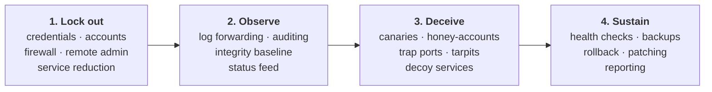
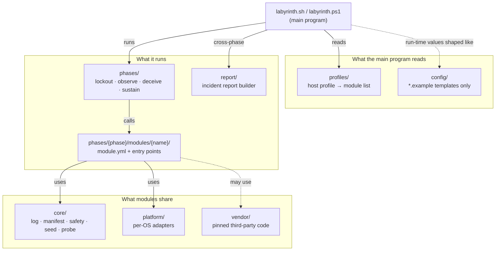
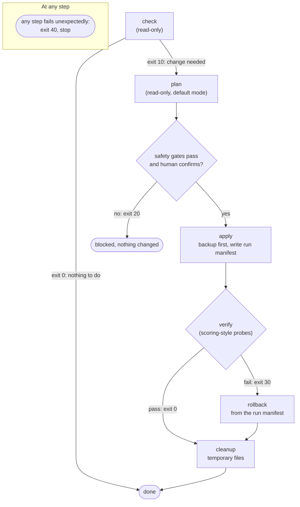

# 00. Module Contract and Repository Layout

**Status:** Draft · reviewed 2026-09-29

## 1. Goal

One main Labyrinth program enables each phase. Each phase is an entry script that calls small, single-purpose modules. Adding a capability means adding a folder, not editing the core, which is how the design stays scalable.

## 2. Naming: phases, not "hardening"

"Hardening" is the umbrella word in the documents, but it covers more than one moment: a credential reset at minute zero is a different job from patching at hour two. Folders are therefore named after the doctrine phases, which are also the order the phases run in:

| Folder | Phase | Contains |
|---|---|---|
| `lockout` | Lock out | Credentials, accounts, firewall, remote-admin hardening, service reduction |
| `observe` | Observe | Log forwarding, auditing, integrity baseline, status feed |
| `deceive` | Deceive | Canaries, honey-accounts, trap ports, tarpits, decoy services |
| `sustain` | Sustain | Health checks, backups, rollback, patching, reporting |



*Figure: the four phases run in order, left to right, and each box lists the kinds of module its folder contains.*

## 3. Repository layout

```
Labyrinth/
├── labyrinth.sh                 # main program for Linux control nodes (bash)
├── labyrinth.ps1                # main program for Windows control nodes (PowerShell)
├── core/                        # shared library used by every module
│   ├── log/                     # structured logging (JSON lines)
│   ├── manifest/                # run manifest: what was changed, for rollback and cleanup
│   ├── safety/                  # protected set, gates, dead-man revert timers
│   ├── seed/                    # event seed derivation (design 03)
│   └── probe/                   # scoring-style health probes
├── phases/
│   ├── lockout/
│   │   ├── run-lockout.sh       # phase entry script
│   │   ├── run-lockout.ps1
│   │   └── modules/
│   │       ├── credentials/     # one folder per module (contract below)
│   │       ├── accounts/
│   │       ├── firewall/
│   │       ├── ssh/
│   │       └── services/
│   ├── observe/  (same shape)
│   ├── deceive/  (same shape)
│   └── sustain/  (same shape)
├── report/                      # incident report builder (design 02); cross-phase
├── profiles/                    # host profile → ordered module list
├── platform/                    # per-OS adapters: ubuntu, rhel-family, windows, appliance runbooks
├── config/                      # templates only: *.example, never values
├── vendor/                      # pinned third-party code, each with LICENSE and NOTICE
├── tests/                       # lab tests and negative tests
└── docs/                        # design specs and the hardening reference
```

Notes:

- **Profiles** map hosts to modules, for example `linux-web`, `linux-siem`, `windows-dc`, `windows-member`, `appliance`. A profile is a list, not code.
- **Appliances** (VyOS, Palo Alto, Cisco FTD (Firepower Threat Defense)) are handled by templated configuration and a manual runbook, not remote-execution modules.
- **Language:** bash on Linux, PowerShell on Windows. No interpreter or package has to be installed at run time. If Ansible later proves usable, each module maps one-to-one to an Ansible role.



*Figure: the main program reads a profile, runs the phase entry scripts, and each phase calls its modules, which share the core library and per-OS adapters; dashed lines are optional or run-time-only links.*

## 4. The module contract

Every module is a folder containing a metadata file and up to six entry points.

`module.yml` fields:

| Field | Meaning |
|---|---|
| `id` | Unique name, for example `lockout.firewall` |
| `phase` | `lockout`, `observe`, `deceive` or `sustain` |
| `priority` | P0 to P3 (P0 runs first, P3 last) |
| `platforms` | `ubuntu`, `rhel-family`, `windows`, `appliance` |
| `risk` | `read-only`, `reversible`, `service-affecting` or `manual-only` |
| `touches_scored` | `true` if it can affect a scored service or account |
| `requires` | Other modules or facts that must exist first |
| `outputs` | Files and state it creates, so cleanup can find them |

Entry points:

| Entry point | Purpose | Must be |
|---|---|---|
| `check` | Is a change needed? | Read-only |
| `plan` | Show exactly what `apply` would do | Read-only. This is the default mode |
| `apply` | Make the change | Idempotent; backs up first; writes to the run manifest |
| `verify` | Confirm the change worked and nothing scored broke | Read-only |
| `rollback` | Undo `apply` from the manifest | Safe to run repeatedly |
| `cleanup` | Remove temporary files this module created | Safe to run repeatedly |

Exit codes:

| Code | Meaning |
|---|---|
| `0` | Nothing to do, or success |
| `10` | Change needed |
| `20` | Blocked by a safety gate |
| `30` | Verify failed |
| `40` | Error |



*Figure: one module run moves from check to plan to a human-confirmed apply, then verify decides between cleanup and rollback; each arrow shows its exit code, and exit 40 can end the run at any step.*

Rules for module authors:

1. `touches_scored: true` modules run only after the scoring allowlist and the protected set are loaded.
2. A `manual-only` module never changes anything. It prints a checklist for a human.
3. No module downloads anything or calls outside services (NCCDC, 2025, Rule 5.6.4).
4. No module deliberately breaks expected functionality (NCCDC, 2025, Rule 5.6.5).

## 5. Execution model

```
labyrinth <phase> --profile <name> --targets <group>   # plan mode by default
   1. load profile → ordered module list
   2. safety gates (protected set loaded, scoring allowlist present, break-glass verified)
   3. plan all modules and print the combined plan
   4. human confirms (typed confirmation) → apply in rings (design 01)
   5. verify each module with scoring-style probes; auto-rollback a module on regression
   6. write run manifest; run cleanup
```

## 6. Code and configuration are separate

The released code is frozen for each event (NCCDC, 2025, Rule 5.6.2). Everything that changes per event is configuration: the scoring engine addresses, the protected accounts, the event seed and the host lists. Configuration is supplied at run time and never committed; the `config/*.example` files show its shape only.

## 7. Standard paths on every host

Every host uses the same relative tree. The root is configurable, so the location is not a fixed, publicly known path.

| Purpose | Linux | Windows |
|---|---|---|
| Code (read-only, owned by root or SYSTEM) | `<root>/bin` | `<root>\bin` |
| State: baselines, manifests, key registry | `/var/lib/labyrinth/` | `<root>\state\` |
| Logs, one folder per category | `/var/log/labyrinth/<category>/` | `<root>\logs\<category>\` |
| Backups, timestamped | `/var/backups/labyrinth/` | `<root>\backup\` |

- **Default root:** `/opt/labyrinth` on Linux, `C:\ProgramData\Labyrinth` on Windows.
- **Log categories:** `run`, `auth`, `integrity`, `network`, `deception`, `report`.

## 8. Adding a capability

1. Create `phases/<phase>/modules/<name>/` with `module.yml` and the entry points.
2. Add the module id to the relevant profile.
3. Add lab tests, including a negative test that shows protected accounts and scored services are untouched.

Nothing else changes.

## 9. Pinned decisions

- **Ansible or native scripts.** Pinned until the team knows what it can run from and what is reachable during the event. Native scripts work in either case, so the design assumes them.
- **Windows log shipping method.** Pinned between the Splunk forwarder installer, a script posting to Splunk's HTTP Event Collector, or another method. See design 08.

## References

National Collegiate Cyber Defense Competition. (2025, December 10). *Rules and requirements*. Retrieved September 29, 2026, from https://www.nationalccdc.org/rules.html
