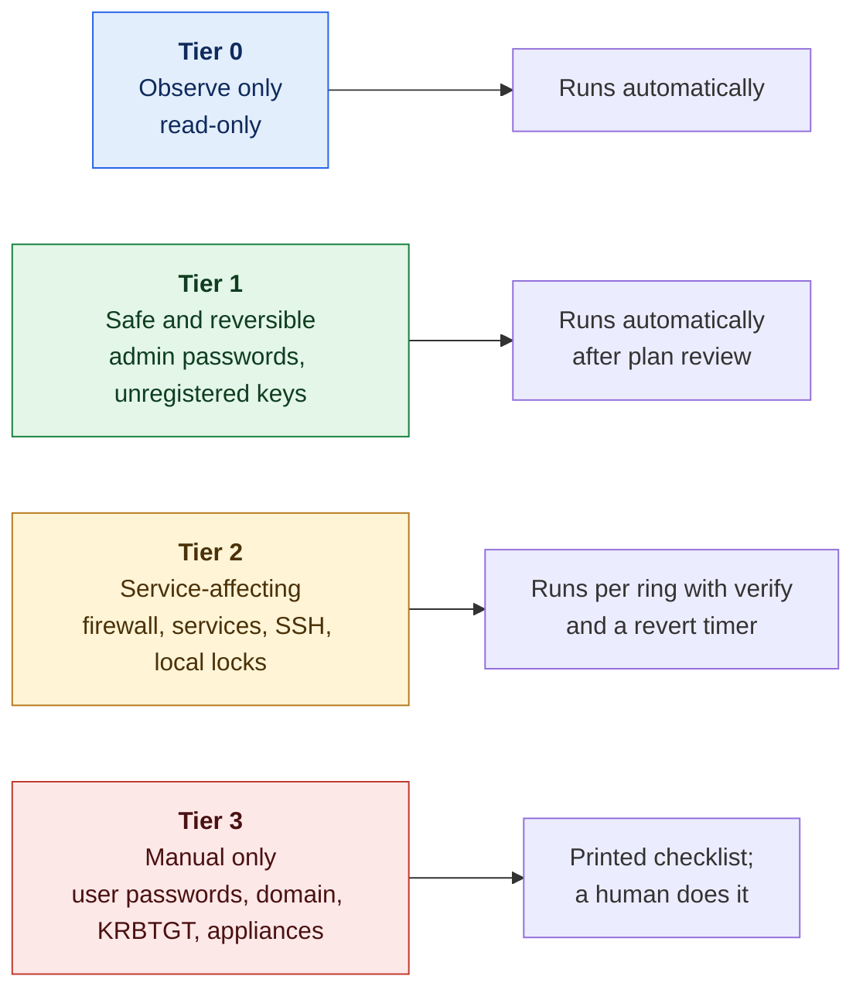
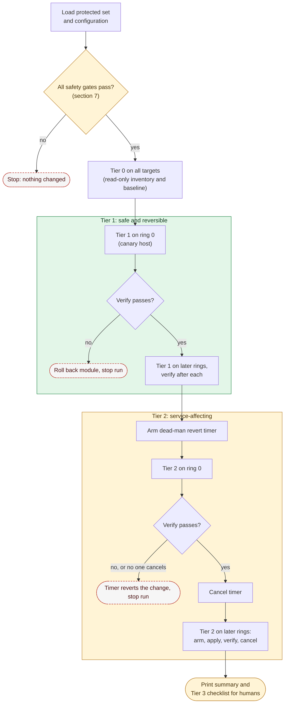

# 01. Lockout ("Panic Button") Design

**Status:** Draft · reviewed 2026-09-29 · Phase: 🟥 Lock out · Priority: P0

## 1. What it is

One command that carries out the first-minutes lockout across the reachable hosts: fast, but only within the limits the rules allow.

The original idea ran against every reachable host in one pass, resetting credentials, locking accounts and applying default-deny in a single sweep. The rules prohibit that "indiscriminate" version, so this design keeps the speed and adds guard rails.

## 2. The rules that shape it

| Rule | Effect on the design |
|---|---|
| Tools must not deliberately break expected functionality. The examples are setting all user shells on Linux to `/bin/false` and indiscriminately terminating all outbound connections after 30 seconds (National Collegiate Cyber Defense Competition [NCCDC], 2025, Rule 5.6.5). | No blanket actions. Every destructive action works from an explicit allowlist and skips the protected set. |
| Operations and White Team must be given access immediately on request (NCCDC, 2025, Rule 4.1). | A verified break-glass path is a precondition. Nothing removes it. |
| Anything that interferes with the scoring engine is the team's responsibility (NCCDC, 2025, Rule 4.11). | The scoring engine allowlist is applied first. Verification uses scoring-style probes. |
| Do not mislead the scoring engine (NCCDC, 2025, Rule 9.3). | The panic button never fakes a service state. |
| Administrator-class passwords are not used for scoring and may be changed freely. Other user passwords follow the notification process (Midwest Collegiate Cyber Defense Competition [MWCCDC], 2025, Rule 13). | Only admin-class credentials are rotated automatically. User-level rotation is manual-only. |
| Scored services may not be migrated or containerized (NCCDC, 2025, Rule 4.14). | The panic button contains no container actions. |
| Team tools may not use outside resources (NCCDC, 2025, Rule 5.6.4). | Everything runs from the vendored repository. |

## 3. Design principles

1. **Protect first.** Load the protected set before doing anything else. If it is missing or empty, stop.
2. **Plan before apply.** Plan mode is the default. Apply needs a typed confirmation naming the target group.
3. **Small blast radius.** Apply in rings, one canary host first.
4. **Reversible.** Every change is backed up and recorded in the run manifest.
5. **Verify like the scoring engine.** After each module, run probes and compare with the probes taken before.
6. **Fail toward access.** On any doubt, abort and leave the host as it was.

## 4. The protected set

The protected set is a list the operator supplies at run time, from the event packet. It is never committed. It contains:

| Class | Examples | Treatment |
|---|---|---|
| Official accounts | Accounts the White or Operations Team use | Never changed without the White Team's permission; logons alerted on (design 05, section 5) |
| Scoring accounts | Mailbox users and other accounts the scoring engine logs in with | Never touched by automation |
| Operator accounts | Named team accounts | Never locked or removed |
| Break-glass account | An existing admin-class account whose rotated password is kept in the team's offline record; no new account or key (design 05, section 5) | Never locked or removed; password rotated only in design 05's order; verified working at the console |
| Service accounts for scored services | Database and application accounts a scored service depends on | Never touched until the dependency map is known |
| Built-in and machine accounts | System, machine and domain-trust accounts | Never touched |

## 5. Actions, by risk tier

| Tier | Nature | Actions | How run |
|---|---|---|---|
| **0. Observe only** | Read-only | Inventory of users, listeners, processes, scheduled tasks, startup items, keys and sudoers; baseline (design 04) | Automatic |
| **1. Safe and reversible** | Cannot stop a scored service | Rotate admin-class passwords (root, Administrator and equivalents); back up, then clear, authorized keys that are not in the key registry, on accounts outside the protected set | Automatic after plan review |
| **2. Service-affecting** | Could interrupt a scored service | Default-deny inbound firewall with the scored ports, the scoring engine and the admin path allowed; disable services from a per-profile candidate list; SSH (Secure Shell) hardening drop-in; lock (never delete) unexpected *local* accounts outside the protected set; end unexpected sessions, never an official's | Applied per ring with verify and a revert timer |
| **3. Manual only** | High consequence | User-level password changes (notification required); locking or disabling domain accounts; KRBTGT reset; domain-wide resets; appliance changes; anything touching a scored service's own configuration | Printed checklist, human executes |

*Figure: each risk tier, from read-only Tier 0 to manual-only Tier 3, and who or what carries out its actions. Colors rise with risk: blue is read-only, green safe, amber service-affecting and red manual-only.*

## 6. Sequence

1. Load protected set and configuration.
2. Safety gates (section 7).
3. Tier 0 on all targets.
4. Tier 1 on the canary ring, verify, then the remaining rings.
5. Tier 2 on the canary ring with revert timers, verify, then the remaining rings.
6. Print the summary and the Tier 3 checklist.

**Rings.** Ring 0 is one low-impact host (a workstation). Ring 1 is the next group. Later rings follow, never more than a set share of hosts at once. A failed verify stops the run.

*Figure: the panic button runs only after every safety gate passes, applies each tier to the canary host first and then ring by ring with a verify after each ring, and a Tier 2 change reverts itself unless verify succeeds and the timer is cancelled. The green box holds the safe Tier 1 steps, the amber box the service-affecting Tier 2 steps, and dashed red outlines mark where the run stops.*

## 7. Safety gates (all must pass)

| Gate | Check |
|---|---|
| Protected set loaded | Non-empty and parsed |
| Scoring allowlist present | In the firewall plan for every host that filters traffic |
| Break-glass verified | The break-glass credential works at the console before any change |
| Backup taken | Config backups exist for every file that will change |
| Plan reviewed | Operator confirmed the plan by typing the group name |
| Revert timer armed | For every Tier 2 change (section 8) |

## 8. Preventing self-lockout

- **Two-session rule.** Keep one session open while testing from a fresh one.
- **Dead-man revert.** Before a firewall or SSH change, arm a timer that undoes it unless cancelled after verify.
  - Linux: a transient systemd timer (`systemd-run --on-active=5m --unit=lab-revert-<id> <rollback command>`), cancelled with `systemctl stop lab-revert-<id>.timer`.
  - Windows: a one-time scheduled task that removes the rule, deleted after verify.
  - VyOS: `commit-confirm <minutes>` followed by `confirm`. Read the VyOS warning below first.
- **Passwords shown once.** New credentials are displayed once, on the operator's screen, for the team's offline record (design 05, section 2). Labyrinth never writes them to disk or logs and never echoes them over an unencrypted channel. Use a cryptographic random source (`/dev/urandom` or .NET `RandomNumberGenerator`), not `Get-Random`.
- **Acknowledge before continuing.** The operator confirms the credential is recorded before the old one is invalidated.

> [!WARNING]
> **VyOS reboots by default.** On VyOS 1.4 the default action when a commit is not confirmed is to *reboot* to the saved configuration, which drops routing for every host behind the router (VyOS, n.d.). First set, commit and save `set system config-management commit-confirm action reload`. If the installed version does not offer that option, do not rely on the timer: make the change by hand with a second session open.

## 9. Verification

After each module, probe as the scoring engine would:

| Service | Probe | Pass condition |
|---|---|---|
| HTTP and HTTPS | Fetch the page | Expected status and expected content string |
| DNS | Query a known record | Expected answer |
| SMTP (Simple Mail Transfer Protocol) | Connect and read the banner; optionally send a test message | Expected response |
| POP3 (Post Office Protocol 3) | Connect and read the banner (no scoring-account logins) | Expected response |
| FTP (File Transfer Protocol) | Connect and read the banner | Expected response |

Take probes before and after. A regression triggers automatic rollback of that module and stops the run. Between runs, the health monitor repeats these probes on a schedule (design 13).

## 10. What the panic button will never do

- Disable accounts wholesale.
- Change shells.
- End all connections.
- Delete accounts or files.
- Stop services outside the candidate list.
- Reboot.
- Move a service into a container.
- Change scoring accounts.
- Act on a host with no break-glass path.

## 11. Acceptance tests (in the lab)

- Protected accounts are unchanged before and after.
- A mailbox user can still authenticate after the run.
- Every scored-service probe passes after the run, on every ring.
- The revert timer restores the firewall when verify is deliberately failed.
- A run with an empty protected set refuses to start.
- A second session stays usable throughout.

## References

Midwest Collegiate Cyber Defense Competition. (2025). *2025 Midwest Collegiate Cyber Defense Competition qualifier team packet* [PDF]. https://brazil.minnesota.edu/ccdc/ccdc-2025/2025MWCCDCQTeamPack.pdf

National Collegiate Cyber Defense Competition. (2025, December 10). *Rules and requirements*. Retrieved September 29, 2026, from https://www.nationalccdc.org/rules.html

VyOS. (n.d.). *Command line interface* [VyOS 1.4.x (sagitta) documentation]. Retrieved September 29, 2026, from https://docs.vyos.io/en/1.4/cli.html
