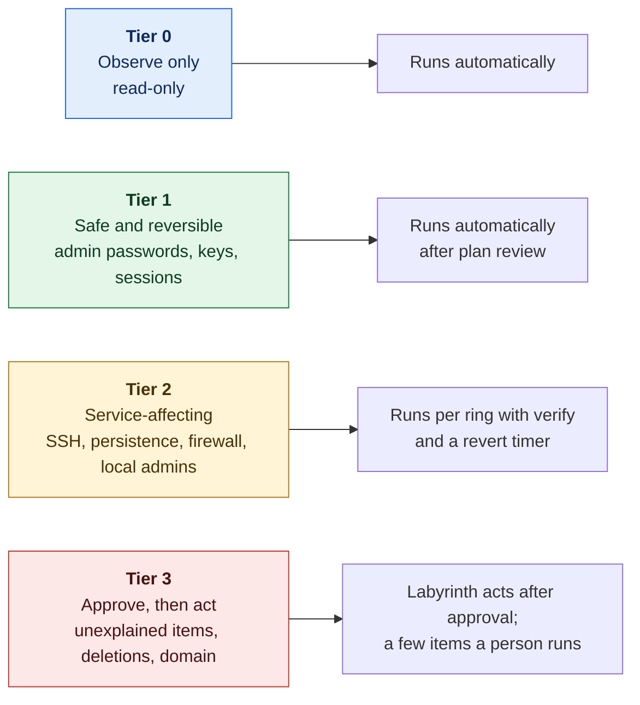
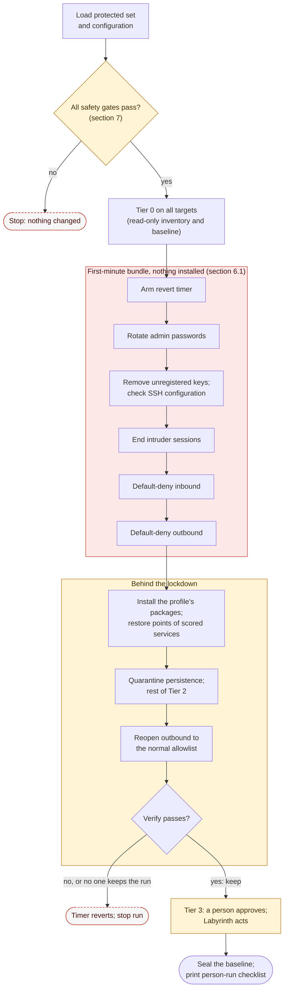

# 01. Lockout ("Panic Button") Design

**Status:** Draft · reviewed 2026-10-05 · Phase: 🟥 Lock out · Priority: P0

## 1. What it is

One command that carries out the first-minutes lockout across the reachable hosts: fast, but only within the limits the rules allow.

The original idea ran against every reachable host in one pass, resetting credentials, locking accounts and applying default-deny in a single sweep. Locking every account and denying every host at once would break expected functionality, which Rule 5.6.5 forbids (National Collegiate Cyber Defense Competition [NCCDC], 2025). The rule does not name this sweep; its examples are setting all user shells to `/bin/false` and indiscriminately ending all outbound connections. So this design keeps the speed and adds guard rails.

## 2. The rules that shape it

| Rule | Effect on the design |
|---|---|
| Tools must not deliberately break expected functionality. The examples are setting all user shells on Linux to `/bin/false` and indiscriminately terminating all outbound connections after 30 seconds (NCCDC, 2025, Rule 5.6.5). | No blanket actions. Every destructive action works from an explicit allowlist and skips the protected set. |
| Operations and White Team must be given access immediately on request (NCCDC, 2025, Rule 4.1). At the 2025 Midwest qualifier every host, including the firewall, runs under a virtual lab system the event manages, so officials can reach each console without crossing the team's network (MWCCDC, 2025, Competition Topology; *Verified* 2026-10-09). | A confirmed break-glass path is a precondition, because access on request means a working login. Nothing removes it. Officials need no standing network path; any official sources the event packet names are still allowed, for events run differently. |
| Anything that interferes with the scoring engine is the team's responsibility (NCCDC, 2025, Rule 4.11). | The scoring engine allowlist is applied first. Verification uses scoring-style probes. |
| Do not mislead the scoring engine (NCCDC, 2025, Rule 11.3). | The panic button never fakes a service state. |
| Administrator-class passwords are not used for scoring and may be changed freely. Other user passwords follow the notification process (Midwest Collegiate Cyber Defense Competition [MWCCDC], 2025, Rule 13). | Only admin-class credentials are rotated automatically. User-level rotation is manual-only. |
| Scored services may not be migrated or containerized (NCCDC, 2025, Rule 4.14). | The panic button contains no container actions. |
| Blue Teams should keep ICMP working on all competition devices (MWCCDC, 2025, Rule 14; *Verified* 2026-10-09). | Default-deny always allows ICMP, inbound and outbound, unless the run-time configuration says the event packet allows otherwise. |
| Points can be lost for failed employee access (Northeast Collegiate Cyber Defense Competition [NECCDC], 2026, Scoring Overview; *Provisional*, another region's packet). | Accounts that simulated employees use are treated like scoring accounts: never locked, rotated or switched to key-only by automation (design 05). |
| Team tools may not use resources outside the competition environment other than simple DNS lookups; the example is cloud services and cloud processing (NCCDC, 2025, Rule 5.6.4). | Labyrinth's own code runs from the release. Packages come only from public sources, after the lockdown, as named in the tool's declaration (design 20). |

## 3. Design principles

1. **Protect first.** Load the protected set before doing anything else. If it is missing or empty, stop.
2. **Plan before apply.** Plan mode is the default. Apply needs a confirmation naming the target group, typed, or given on the command line in a first-minute run (section 6.3).
3. **Small blast radius.** Apply in rings, one canary host first, except in a first-minute run, where speed matters more and each host's revert timer is the safety net (section 6.3).
4. **Reversible.** Every change is backed up and recorded in the run manifest.
5. **Verify like the scoring engine.** After each module, run probes and compare with the probes taken before.
6. **Fail toward access.** On any doubt, abort and leave the host as it was.
7. **Assume breach.** The Red Team may already be inside when the event starts, or get in within seconds, so the first minute removes the ways back in, not just the passwords, and closes the network around the host before anything slower runs (section 6).
8. **Defend scored services, don't avoid them.** Scored services are a primary Red Team target, and successful penetrations cost points (NCCDC, 2025, Scoring section). Leaving them untouched is not safe; changing them carefully, with probes and a revert timer, is.
9. **Confirm, then act.** When a person confirms that something may be changed or removed, Labyrinth carries it out, with the same backups, probes and records. Only the actions on Tier 3's person-run list are left to a person's hands.

## 4. The protected set

The protected set is a list the operator supplies at run time, from the event packet. It is never committed. It contains:

| Class | Examples | Treatment |
|---|---|---|
| Official accounts | Accounts the White or Operations Team use | Never changed without the White Team's permission; logons alerted on (design 05, section 5) |
| Scoring accounts | Mailbox users and other accounts the scoring engine logs in with | Never touched by automation |
| Employee accounts | Accounts that simulated employees (for example the Orange Team) use, as named in the event packet | Never touched by automation; treated like scoring accounts |
| Operator accounts | Named team accounts | Never locked or removed |
| Break-glass account | An existing admin-class account whose rotated password is kept in the team's offline record; no new account or key (design 05, section 5) | Never locked or removed; password rotated only in design 05's order; confirmed at the console by the operator (section 7) |
| Service accounts for scored services | Database and application accounts a scored service depends on | Never touched until the dependency map is known |
| Built-in and machine accounts | System, machine and domain-trust accounts | Never touched |

## 5. Actions, by risk tier

| Tier | Nature | Actions | How run |
|---|---|---|---|
| **0. Observe only** | Read-only | Inventory of users, groups, listeners, processes, sessions, scheduled tasks, startup items, keys and sudoers; baseline (design 04) | Automatic |
| **1. Safe and reversible** | Cannot stop a scored service | Rotate admin-class passwords (root, Administrator and equivalents) that no service or scheduled task logs on with (design 05, section 2); back up, then clear, authorized keys that are not in the key registry, on accounts outside the protected set; end remote sessions after rotation (section 6.2) | Automatic after plan review |
| **2. Service-affecting** | Could interrupt a scored service | SSH (Secure Shell) configuration check and key-only drop-in (design 05, section 4); high-confidence persistence quarantine (design 17); default-deny inbound firewall with the scored ports, the scoring engine, any official sources named in the event packet, ICMP and the admin path allowed; default-deny outbound with the allowlist of section 6.1; installing the profile's packages (design 20); restore points of scored services (design 14); remove admin rights from unexpected *local* accounts and lock them (design 05, section 6); Windows protocol settings (design 11); rules for new passwords (design 05, section 2.2); automatic service-pack settings (design 18); automatic mitigations from the vulnerability catalog (design 21); disable services from a per-profile candidate list (design 15); a log-only outbound firewall rule (design 10, section 5); re-applying the sealed firewall rules when they drift (design 13, section 4.1) | Applied per ring with verify and a revert timer |
| **3. Approve, then act** | High consequence, or not provably safe | **Labyrinth acts after a person approves:** unexplained persistence items (design 17); deleting a locked account once services are confirmed working (design 05, section 6); approval-class service-pack settings (design 18); lockout settings and PAM stack changes (design 05, section 2.2); approval-class Windows and domain controller settings (design 11); rotating an admin-class password that a service or scheduled task logs on with, once its dependents are listed; rotating application admin credentials (design 05, section 2.1); restoring a service from its restore point (design 14); lifting outbound default-deny on one host; applying a Linux security update (designs 15 and 20); banning a single address outbound from an unusual-outbound alert (design 12, section 6.1); blocking one abused tool's outbound traffic on one Windows host (design 10, section 5); a web application firewall blocking rule for one flaw (design 18, section 6.1); ending a SYSTEM process on Windows (design 11); resetting the KRBTGT password twice, with a replication check between the resets (design 11, section 5.1). **A person acts, from a printed checklist:** user-level password changes (notification required); domain account and group changes other than KRBTGT; Group Policy changes; DNS changes on a domain controller; domain controller restores and rescuing an unbootable host (design 14); Windows patching (design 15); appliance changes (design 16)
 | Shown in the plan; approved per item, or per category on one host |



*Figure: each risk tier, from read-only Tier 0 to Tier 3, which waits for a person's approval, and who or what carries out its actions. Colors rise with risk: blue is read-only, green safe, amber service-affecting and red approval-only.*

## 6. Sequence

1. Load protected set and configuration.
2. Safety gates (section 7).
3. Tier 0 on all targets.
4. **Lock down:** the first-minute bundle (section 6.1).
5. **Install** the profile's packages (design 20), and take a restore point of every scored service on the host (design 14).
6. **Sweep and harden:** quarantine high-confidence persistence (design 17), then the rest of Tier 2, including the automatic service-pack settings that protect the scored services themselves (design 18) and the automatic mitigations for known-exploited flaws found on the host (design 21, section 5.2).
7. **Reopen outbound** to the host's normal allowlist (section 6.1).
8. Show the Tier 3 items for approval, carry out what is approved, and print the person-run checklist.
9. Seal the baseline (design 04, section 6).

Steps 4 to 7 run ring by ring in a normal run, and on every host at once in a first-minute run (section 6.3). Each host's steps 4 to 7 run under its own revert timer, re-armed before each module.

**Rings.** Ring 0 holds one low-impact host per platform, for example one Linux host and one Windows workstation, because a change that works on one platform proves little about another. Ring 1 is the next group. Later rings follow, never more than a set share of hosts at once. A failed verify stops the run. The bundle takes seconds on the canary, so the rings delay the rest of the network very little.

**Hosts with no canary.** A host that is the only one of its kind, such as the domain controller or the only mail server, has no canary that tested the change on the same software first. It goes in the last ring, and its Tier 2 changes rely on the revert timer and the before-and-after probes alone.

### 6.1 The first-minute bundle

Red Teams report planting persistence within the first 30 seconds of an event (*Background*). An attacker can come back through a password, a key, an open session, an open port, or a callback from something already planted. Closing only some of these leaves the rest, so each host gets all of them as one step, using only what the host already has (no install):

1. **Rotate** admin-class passwords (Tier 1; design 05, section 2).
2. **Remove** unregistered SSH keys and **check** the SSH configuration for planted settings (Tiers 1 and 2; design 05, section 4).
3. **End** intruder sessions (Tier 1; section 6.2).
4. **Default-deny inbound** (Tier 2), allowing the scoring engine, the scored ports, any official sources named in the event packet, ICMP and the admin path. A scored port stays open to every source, never only to the scoring engine's address, because officials' manual scoring checks and simulated users come from other addresses (MWCCDC, 2025, Competition Rules 6 and 14).
5. **Default-deny outbound** (Tier 2), allowing replies on established connections, loopback, ICMP, the DNS resolvers and NTP servers in the run-time configuration, the SIEM, the admin path, the package mirror or proxy (design 20), and every address a scored service connects out to, from `services` and the run-time `outbound-allow` list. On a Windows domain member, the domain controllers are allowed too.

**Why this order.** Sessions are ended after passwords and keys change, so the attacker cannot simply log back in. The firewall closes before the persistence sweep, not after it: anything planted before the bundle is still on disk, but nobody can reach it from outside and its callbacks fail, so the sweep in step 6 can take the time it needs. A planted job that reopens a port or drops the rules is caught by the drift check (design 13, section 4.1) and by the sweep. One revert timer covers the whole bundle on each host.

**Why outbound.** Scoring checks connect in, and their replies leave on connections the scoring engine opened, so an outbound default deny does not stop them. It does stop beacons, reverse shells and downloads of second-stage tools. This is targeted blocking from an explicit allowlist, not the indiscriminate ending of all outbound connections that the rules give as an example of breakage (NCCDC, 2025, Rule 5.6.5).

**Reopening outbound.** Step 7 widens the outbound allowlist to what the sweep and the dependency map show the host needs, for example a scored app's update check. Outbound stays default-deny; a person can lift it for one host as a Tier 3 item. A probe that fails because of the outbound rules is rolled back with its module, as for any change.

### 6.2 Ending sessions

Changing a password does not end the sessions already logged in with it. So, right after rotation, Labyrinth ends every remote session on the host (SSH, RDP and remote shells) **except**:

- console sessions (`tty1` and other local terminals on Linux; the `console` session on Windows), which is how the virtualization platform's console reaches the host;
- the operator's own session;
- sessions from the admin source;
- sessions of accounts in the protected set.

This is not "terminating all connections" (NCCDC, 2025, Rule 5.6.5). It ends only interactive logins, after a credential change, and never touches service traffic or the excepted sessions. On Linux it uses `loginctl terminate-session`; on Windows, `logoff <session id>`. Each ended session is logged with its user, source and start time for the incident record (design 02).



*Figure: once every safety gate passes, each host gets the first-minute bundle with nothing installed, then the installs, restore points and sweep behind that lockdown, then outbound is reopened to its normal allowlist and the probes decide whether the run is kept. The red box is the first-minute bundle, amber marks the work behind it and a person's approval, and dashed red outlines mark where the run stops.*

### 6.3 First-minute runs

The opening seconds decide whether the Red Team keeps its foothold, and a person answering prompts host by host cannot keep up. A first-minute run applies a profile the team reviewed before the event, with every answer given on the command line, started on every host at once (remote mode, design 00, section 5):

```
labyrinth apply lockout --profile <name> --confirm-group <group> --break-glass <account> [--approve <list>]
```

The options already exist (Conventions, section 3.1). Items the team decided on before the event, such as known default application passwords (design 05, section 2.1), security updates for named scored packages (design 15, section 4) and settings tested on the event's own versions (design 18, section 4), are pre-approval rules in the run-time `pre-approved` file. A rule counts only for a category its module declares safe to pre-approve, and each item is still checked against this run's plan before it is changed. `--approve` cannot carry them, because its entries need a fingerprint from a plan; it adds items copied from a plan, for example in a later remote run. Anything else waits for a person, as usual. In remote mode, standard input is closed, so nothing else is approved, and the control node decides whether to keep each host's run (design 00, section 5).

| Left out of a first-minute run | Kept in every run |
|---|---|
| Typing the confirmation and the break-glass answer: the options answer them, and the manifest records that they were given on the command line | The scoring allowlist goes in before any deny rule |
| A separate `plan` command: `apply` prints the plan and carries it out | A revert timer on every host, re-armed before each module |
| Per-item approval for the items a pre-approval rule covers | Probes before and after each module, with automatic rollback on a regression |
| Rings: every host starts at once, each under its own revert timer | The protected set and the break-glass account are never changed |

The break-glass answer is still the operator's word for each host (section 7). It is given before the event starts, from the team's offline record, and checked at the console straight after the bundle; if the operator cannot log in there, they let the timer roll that host back.

## 7. Safety gates (all must pass)

| Gate | Check |
|---|---|
| Protected set loaded | Non-empty and parsed |
| Scoring allowlist present | In the firewall plan for every host that filters traffic. The runner blocks any module with `touches_scored: true` while the run-time `scoring-allowlist` is missing or empty |
| Break-glass confirmed | The operator has confirmed, by typing, that the break-glass credential worked at this host's console. This is the operator's word, not proof: a script cannot reach the console, so it is asked once per host. The account must be in the protected set with class `breakglass`, the answer is kept in Labyrinth's state for later runs on that host, and every run records it in its manifest. When the answer is given, Labyrinth looks for a session of that account at the console (`loginctl` or `who` on Linux, `query user` on Windows) and records the session it found. If it finds none, or cannot look, it warns and goes on: the gate stays a confirmation, and the manifest says what backed it. |
| Backup taken | Every file is copied before it changes, and the copy is recorded in the run manifest (`docs/Conventions.md`, section 7) |
| Plan reviewed | Operator confirmed the plan by typing the group name, or gave it with `--confirm-group` in a first-minute run (section 6.3) |
| Revert timer armed | Before every change that is not `read-only`, re-armed before each module (section 8) |

## 8. Preventing self-lockout

- **Two-session rule.** Keep one session open while testing from a fresh one.
- **Dead-man revert.** Before any change that is not `read-only`, such as a firewall or SSH change, arm a timer that rolls the whole run back unless the operator keeps it after verify. It runs `labyrinth rollback <run>` (`docs/Conventions.md`, section 3.1).
  - Linux: a transient systemd timer, `lab-revert-<run>-<n>` (`systemd-run --on-active=<minutes>m --unit=lab-revert-<run>-<n> ...`), cancelled with `systemctl stop lab-revert-<run>-<n>.timer`.
  - Windows: a one-time scheduled task, `\Labyrinth\lab-revert-<run>-<n>`, running as SYSTEM, unregistered when the run is kept.
  - `labyrinth runs` shows which runs still have a timer armed, and when each one fires.
  - VyOS: `commit-confirm <minutes>` followed by `confirm`. Read the VyOS warning below first.
- **Passwords shown once.** New credentials are displayed once, on the operator's screen, for the team's offline record (design 05, section 2). Labyrinth never writes them to disk or logs and never echoes them over an unencrypted channel. Use a cryptographic random source (`/dev/urandom` or .NET `RandomNumberGenerator`), not `Get-Random`.
- **Acknowledge before continuing.** The operator confirms the credential is recorded before the old one is invalidated.

> [!WARNING]
> **VyOS reboots by default.** On VyOS 1.4 the default action when a commit is not confirmed is to *reboot* to the saved configuration, which drops routing for every host behind the router (VyOS, n.d.). First set, commit and save `set system config-management commit-confirm action reload`. If the installed version does not offer that option, do not rely on the timer: make the change by hand with a second session open.

## 9. Verification

After each module, probe as the scoring engine would:

| Service | Probe | Pass condition |
|---|---|---|
| HTTP and HTTPS | Fetch the page | Expected status and expected content string |
| DNS | Query a known record | Expected answer |
| SMTP (Simple Mail Transfer Protocol) | Connect and read the banner; optionally send a test message | Expected response |
| POP3 (Post Office Protocol 3) | Connect and read the banner (no scoring-account logins) | Expected response |
| FTP (File Transfer Protocol) | Connect and read the banner | Expected response |

Take probes before and after. A regression triggers automatic rollback of that module and stops the run. Between runs, the health monitor repeats these probes on a schedule (design 13).

## 10. What the panic button will never do

- Disable accounts wholesale.
- Change shells.
- End all connections, or end a console session, the operator's own session, an admin-source session or a protected account's session.
- Delete a file. Persistence items are quarantined (design 17).
- Delete an account without a person's approval, or before a checkpoint shows every scored service passing (design 05, section 6).
- Stop services outside the candidate list.
- Reboot.
- Move a service into a container.
- Change scoring accounts.
- Act on a host with no break-glass path.

## 11. Acceptance tests (in the lab)

- Protected accounts are unchanged before and after.
- A mailbox user can still authenticate after the run.
- An admin-class account that a service or scheduled task logs on with is not rotated automatically and is listed for approval in Tier 3.
- A run on a host with no break-glass confirmation refuses to change it.
- An official source named in the event packet can still connect after default-deny.
- Every scored-service probe passes after the run, on every ring.
- In a first-minute run on every lab host at once, each host finishes the bundle within 30 seconds of its command starting, with no prompt, and every probe still passes.
- After the bundle, a reverse shell planted before the run cannot connect out, while the scoring engine's checks and the package mirror still work.
- A scored service whose outbound dependency is missing from the allowlist fails its probe, and the module is rolled back.
- A first-minute run without `--confirm-group` stops at the confirmation prompt, as a normal run does.
- The revert timer restores the firewall when verify is deliberately failed.
- A run with an empty protected set refuses to start.
- After default-deny, the host still answers ping.
- A second session stays usable throughout.
- After the bundle, an intruder's SSH and RDP sessions are gone, while the console session, the operator's session and an admin-source session remain.
- A planted reverse-shell cron job is quarantined in the bundle, and its connection does not return after the firewall closes.
- A Tier 3 item a person approves is carried out by Labyrinth and recorded in the run manifest; an item not approved is left unchanged.

## References

Midwest Collegiate Cyber Defense Competition. (2025). *2025 Midwest Collegiate Cyber Defense Competition qualifier team packet* [PDF]. https://brazil.minnesota.edu/ccdc/ccdc-2025/2025MWCCDCQTeamPack.pdf

Northeast Collegiate Cyber Defense Competition. (2026). *NECCDC 2026 season regional blue team packet* [PDF]. Retrieved October 2, 2026, from https://neccdl.org/history/2026/resources/Regional-Packet-NECCDC-2026.pdf

National Collegiate Cyber Defense Competition. (2025, December 10). *Rules and requirements*. Retrieved October 2, 2026, from https://www.nationalccdc.org/rules.html

VyOS. (n.d.). *Command line interface* [VyOS 1.4.x (sagitta) documentation]. Retrieved September 29, 2026, from https://docs.vyos.io/en/1.4/cli.html
