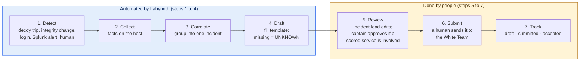

# 02. Incident Reporting Automation

**Status:** Draft · reviewed 2026-10-02 · Phase: 🟩 Sustain (cross-phase `report/`) · Priority: P1

## 1. Why this matters

A thorough incident report that correctly identifies and addresses a successful Red Team attack may reduce the Red Team penalty for that event, and incomplete or vague reports earn no partial points (National Collegiate Cyber Defense Competition [NCCDC], 2025, Rule 9.4).

Hand-written reports are slow and tend to miss required fields. The aim is for the tools to assemble every fact they can observe, so a human only adds judgment and the final sentence.

## 2. Rules that shape it

| Rule | Effect |
|---|---|
| Report content requirements (NCCDC, 2025, Rule 9.4) | The report template is built from the required fields. Re-check the field list against the 2027 rules and packet. |
| Reports are presented to the White Team for collection (NCCDC, 2025, Rule 9.4) | Labyrinth produces a file or text block. A human submits it through the channel the officials specify. Nothing is auto-submitted. |
| No outside resources (NCCDC, 2025, Rule 5.6.4) | No external enrichment such as IP reputation lookups. |
| Only a thorough report that correctly identifies and addresses the attack may reduce the penalty (NCCDC, 2025, Rule 9.4) | Reports state only what evidence shows. Unknown fields say "unknown". |

## 3. Pipeline

1. **Detect.** A source raises an event: a decoy trip, an integrity change, a suspicious login, a Splunk alert, or a human "log this" command.
2. **Collect.** The collector gathers facts already on the host: time (UTC and local), host, account, source address, process, file, command line, and the relevant log lines (design 04 provides the who/when/from-where join).
3. **Correlate.** Events within a time window that share an address, account or host are grouped into one incident record with a timeline.
4. **Draft.** The builder fills the report template from the record. Fields with no evidence stay marked `UNKNOWN`.
5. **Review.** The incident lead edits the draft. The tool never marks a report final.
6. **Submit.** The human pastes or uploads it in the official portal, then records the submission time.
7. **Track.** The record stores status (draft, submitted, accepted) so nothing is filed twice or forgotten.

*Figure: steps 1 to 4 are automated and steps 5 to 7 are done by people, so no report is ever submitted by the tool itself. Blue is automated work and amber is work done by people.*

## 4. Incident record fields

| Field | Source | Automated? |
|---|---|---|
| Incident ID | Counter plus date | Yes |
| First and last seen (UTC) | Logs | Yes |
| Affected hosts and services | Event source | Yes |
| Source and destination addresses | Auth logs, firewall logs, decoy trip log | Yes, with last-hop caveat (section 6) |
| Account and process involved | auditd or Windows events | Yes |
| What happened (facts) | Timeline | Drafted, human edits |
| Passwords cracked or exposed | Accounts named in the evidence; human confirms | Partly: listed as candidates, never as confirmed |
| Access obtained | Logons and privilege events in the timeline | Drafted, human edits |
| Damage done | Integrity findings, probe failures, deleted or changed files | Drafted, human edits |
| What was affected | Affected hosts, services and accounts | Drafted, human edits |
| Evidence (log excerpts, hashes) | Collected files; quarantined items with their original path and SHA-256 (design 17); saved evidence of deleted accounts (design 05, section 6.4); ended sessions (design 01, section 6.2) | Yes |

| Impact on scored services | Probe results | Yes |
| Actions taken and time | Run manifest (design 00) | Yes |
| Remediation and prevention (the remediation plan) | Human | No |
| Confidence and open questions | Human | No |

The rows from "What happened" to "Remediation" follow the content Rule 9.4 lists: what happened, with addresses, timelines, passwords cracked, access obtained and damage done; what was affected; and a remediation plan (NCCDC, 2025, Rule 9.4). The template keeps them in that order so a reviewer can check each one.

**Completeness check.** Because a vague or incomplete report earns nothing, the builder lists every required field still marked `UNKNOWN` or empty each time the draft is shown, and once more when the incident lead marks it ready to submit. The lead may still submit, since an honest `UNKNOWN` is better than a guess, but never without seeing the list.

## 5. Output formats

- Plain text and Markdown, one file per incident, stored under the `report` log category.
- A short "paste block" version sized for a portal text field.
- A one-page timeline for the debrief.

All output is text so that it works from any host and needs no interpreter on the destination.

## 6. Accuracy rules

- **Last-hop caveat.** The address seen by a host may be a NAT (network address translation) device, a proxy or the router, not the true origin. The report says "last hop observed" unless the origin is confirmed.
- **Time.** Store UTC and show the competition clock. Note clock skew if hosts disagree.
- **Redaction.** Strip passwords, keys and tokens from log excerpts before they enter a report.
- **No guessing.** No attribution, intent or tool names unless the evidence names them.

## 7. Human checkpoints

- The incident lead reviews every draft before submission.
- The captain approves any report that describes an action affecting a scored service.
- A submission log records who sent what and when.

## 8. Acceptance tests

- A decoy trip in the lab produces a draft with correct time, host, source address and evidence.
- Two related events within the window merge into one incident.
- A missing field is shown as `UNKNOWN`, never blank or guessed.
- Every field Rule 9.4 lists has a place in the template, and a draft with an unfilled required field shows the completeness warning before it is marked ready.
- Secrets planted in a log line are removed from the report.
- No network call is made during report generation.

## References

National Collegiate Cyber Defense Competition. (2025, December 10). *Rules and requirements*. Retrieved October 2, 2026, from https://www.nationalccdc.org/rules.html
