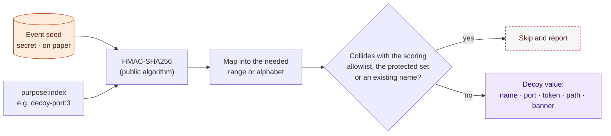

# 03. Event Seed and Deception Configuration

**Status:** Draft · reviewed 2026-09-29 · Phase: 🟪 Deceive · Priority: P1

## 1. The problem

Team-written tools must be public before use and frozen (National Collegiate Cyber Defense Competition [NCCDC], 2025, Rules 5.6.1, 5.6.2), and shared with all teams (NCCDC, 2025, Rule 5.6.3). Rivals and the Red Team can read the code. If decoy names, ports, canary tokens or trap locations are fixed in the code, the Red Team can learn to avoid them.

## 2. The idea in plain terms

The code is public. The values are not in the code. Kerckhoffs's principle says a system should stay secure even when everything except the key is known. Here the "key" is a short random value, the **event seed**, chosen by the team just before the event.

- The **algorithm** (how a seed becomes decoy names, ports and tokens) is public.
- The **seed** is secret. It is written on paper and shared only through the official chat or in person.
- Every run derives the same values from the same seed, so every team member and every host gets consistent results without a shared secrets file.

A rival who reads the repository learns how values are made, not which values this event uses.

## 3. Derivation

`value = HMAC-SHA256(seed, "purpose:index")`, then mapped into the needed range or alphabet. HMAC-SHA256 (a hash-based message authentication code using SHA-256) is a keyed hash: the same seed and label always give the same output, and the output reveals nothing about the seed.

| Purpose string | Produces |
|---|---|
| `decoy-user:N` | Honey-account names (chosen from a public word list) |
| `decoy-port:N` | Trap port numbers (from an allowed range that excludes scored ports) |
| `canary-token:N` | Canary file contents and markers |
| `decoy-path:N` | Decoy file and directory names |
| `ssh-banner:N` | Banner text variants |

Changing `purpose` or `index` gives unrelated values. Nothing derived can be reversed to the seed.

*Figure: the public algorithm combines the secret paper seed with a purpose label to produce each decoy value, and any value that collides with scoring or a protected account is skipped. Orange marks the secret, purple the resulting decoy value, and a dashed red outline a value that is skipped.*

## 4. Constraints

- **Never on a scored port.** Derived ports are checked against the scoring allowlist and skipped if they collide (NCCDC, 2025, Rule 9.3).
- **Never a real account name.** Derived names are checked against the protected set and existing users.
- **Seed strength.** At least 128 bits from a cryptographic random source, written as a short readable string with a checksum group so a typo is detected.
- **Seed handling.** The seed is never committed and never appears in shell history or logs. It is supplied by prompt at run time, held in memory and cleared after use. The paper copy is the record.
- **Agreement.** The seed is chosen shortly before the event and recorded on paper by the team captain.

## 5. Why not encrypt the values in the repository

A repository file encrypted with a shared password does not solve the problem:

- the password needs its own distribution;
- the team must have it on every host;
- the file is public ciphertext that can be attacked at leisure.

Deriving values from a paper seed removes the stored secret entirely.

## 6. What the seed does not protect

- The seed protects the *choice* of values, not their behavior. A determined attacker who lands on a decoy still sees what it is.
- If the seed leaks, generate a new one and redeploy the decoys. Design for that case: redeploying decoys must be a cheap module run.

## 7. Configuration files

`config/*.example` shows the shape (host groups, scored port list, protected set format) with placeholder values only. The real files are created at the event and never leave the control node. The public repository contains no real address, hostname or credential.

## 8. Acceptance tests

- The same seed yields identical values across two machines.
- A different seed yields different values and no overlap beyond chance.
- No derived port falls on the scoring allowlist.
- A seed with a bad checksum is rejected.
- A search of the repository for real event values finds nothing.
- The seed never appears in logs or shell history after a run.

## References

National Collegiate Cyber Defense Competition. (2025, December 10). *Rules and requirements*. Retrieved September 29, 2026, from https://www.nationalccdc.org/rules.html
