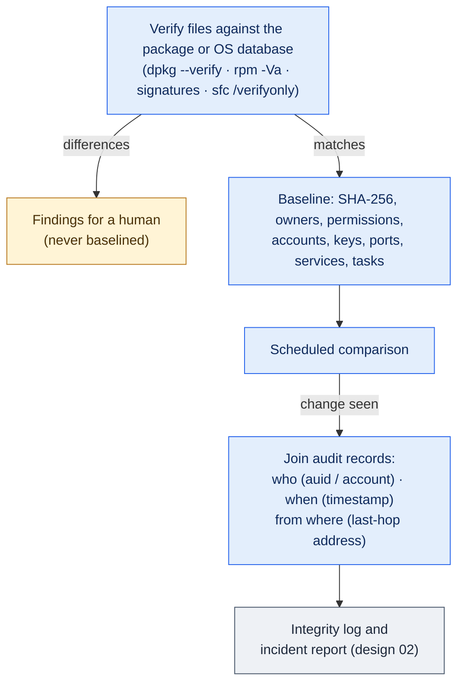

# 04. Baseline and Integrity

**Status:** Draft · reviewed 2026-10-02 · Phase: 🟦 Observe · Priority: P0 (first baseline), P1 (continuous)

## 1. Goal

Know what a host looks like, then learn quickly what changed, who changed it, when, and from where. This information feeds the incident reports (design 02) and the decoy and status systems.

## 2. The trap in "hash everything at minute zero"

A hash baseline taken after the Red Team already has a foothold records the compromised state as normal. So the first step is to verify files against a trusted source, and only then take the baseline.

| Step | Linux | Windows |
|---|---|---|
| Verify against the package or OS database | `dpkg --verify` (Debian family), `rpm -Va` (RHEL, Red Hat Enterprise Linux, family) | Authenticode signature checks; `sfc /verifyonly` (read-only, but slow and CPU-heavy, so schedule it) |
| Record unexplained differences | As findings, not as baseline | As findings, not as baseline |
| Baseline the rest | SHA-256 of critical files, permissions, owners | Same, plus registry autoruns and services |

Configuration files legitimately differ from their packages, so differences in `/etc` are reviewed by a human, not accepted automatically.

## 3. What is baselined

- Critical files: authentication configuration, SSH (Secure Shell) configuration, sudoers, cron and timer definitions, service unit files, web server configuration, startup items.
- **Boot-critical files**, watched more closely because deleting one and rebooting can leave a host unbootable: `/etc/fstab`, the bootloader configuration (`/boot/grub*`, `/etc/default/grub`), `/etc/passwd`, `/etc/shadow`, `/etc/group`, the systemd default target, and on Windows the boot configuration and the start type of core services. Each has an auditd watch or object-access audit, and a copy is kept off the host with the restore points (design 14, section 5) for the rescue runbook (design 14, section 6).
- Accounts, groups, authorized keys, listening ports, running services, scheduled tasks.
- Firewall state.
- Windows: local administrators, autoruns, services, WMI (Windows Management Instrumentation) subscriptions, scheduled tasks.

The baseline is stored under the state path (design 00). Baselines are compared, never silently overwritten.

**A copy off the host.** An attacker with root or SYSTEM on a host can edit the baseline there, hiding a change, and can edit a hash stored next to it just as easily. So right after the baseline is taken, the control node keeps a copy, or at least its SHA-256, away from the host. Every comparison first checks the host's baseline against that copy. A mismatch is itself a high-ranked finding, and the comparison then uses the control node's copy. In local mode with no control node, the operator records the hash in the team's offline record (design 05, section 2).

## 4. Who, when, from where

| Question | Linux | Windows |
|---|---|---|
| What changed | Hash mismatch, plus auditd file watches on the critical set | Event 4663 object access, Sysmon file events |
| Who | auditd `auid` (login identity that survives `sudo`) | Security event account fields |
| When | Event timestamp | Event timestamp |
| From where | Join `ses` to the `USER_START` record, which holds the source address | Join event 4663 to logon event 4624 by logon ID |

> [!IMPORTANT]
> **Caveat.** The address is the last hop the host saw. Through NAT (network address translation) or a proxy it may not be the true origin. Reports say so (design 02).

*Figure: files are first checked against the package database, only clean results become the baseline, and a later change is joined to audit records to show who changed it, when and from which address. Blue steps are automated observation, amber marks work handed to a person, and gray is where the results are stored.*

## 5. Logging that makes this possible

- **Linux:** auditd rules for the critical set, kept small to avoid log floods.
- **Windows:** object access auditing on the critical set, process creation with command line, and Sysmon if it is available inside the environment. Only tools available to all teams and within the rules may be used (National Collegiate Cyber Defense Competition [NCCDC], 2025, Rule 5.1).
- **All hosts:** every host forwards a small set of high-signal events first (designs 06 and 10).

## 6. Sealed baseline and continuous integrity

The first baseline is taken before the lockout, so it records the host as it was found, which may already include an attacker's changes. Comparing against it later would hide those changes and flag every one of ours. So, once the lockout and the persistence sweep (design 17) are finished and verified, the team **seals** the baseline:

- `labyrinth baseline --seal` takes a new baseline of the cleaned host, after package verification as in section 3, and marks it as the reference. Its hash goes into the team's offline record and a copy goes off the host, as in section 3.
- `labyrinth baseline --reseal "<reason>"` replaces the seal after a deliberate change, such as a patch (design 15) or an approved service-pack setting (design 18). The reason is required.
- Every seal and reseal is logged with its time, the operator and the reason, so a reseal that hides an attacker's change can be traced.

Then:

- Scheduled comparison, and every checkpoint (design 13), compares against the **latest seal**; results go to the `integrity` log category.
- Findings are ranked: changes to boot-critical files, authentication, SSH, sudoers, accounts and scheduled execution rank highest, and any new persistence item after the seal is high-ranked (design 17, section 7).
- A change made by Labyrinth itself is recorded in the run manifest and excluded from alerts.

## 7. Rules check

Read-only observation does not affect scored services and needs no special permission. Auditing must not disable or slow a scored service, so watch lists stay small (NCCDC, 2025, Rule 4.11).

## 8. Acceptance tests

- A file modified by hand in the lab is flagged with account, time and source address.
- A binary replaced with a trojan is caught by the package verification step, not baselined.
- A change made by a Labyrinth module does not raise an alert.
- Editing the baseline file on the host is detected by the check against the control node's copy.
- After `--seal`, a cron job planted in the lab is reported at the next checkpoint, while the changes the lockout made are not.
- `--reseal` without a reason is refused, and each seal is logged.
- Deleting `/etc/fstab` on a lab host raises a high-ranked alert before any reboot.

- Baseline comparison completes within the target time on the lab host.
- Auditing on the critical set does not measurably slow a scored service probe.

## References

National Collegiate Cyber Defense Competition. (2025, December 10). *Rules and requirements*. Retrieved October 2, 2026, from https://www.nationalccdc.org/rules.html
