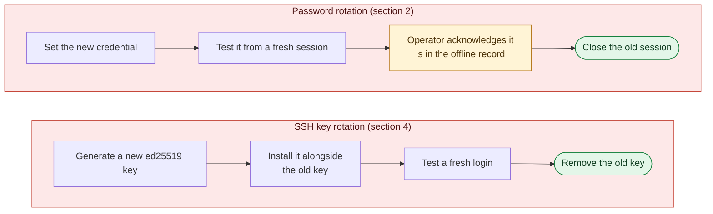

# 05. Credentials and SSH Keys

**Status:** Draft · reviewed 2026-10-05 · Phase: 🟥 Lock out · Priority: P0

## 1. Rules that shape it

| Rule | Effect |
|---|---|
| Administrator-class passwords are not used for scoring and may be changed freely; other user passwords need the notification process (Midwest Collegiate Cyber Defense Competition [MWCCDC], 2025, Rule 13) | Automation rotates admin-class credentials only. |
| Officials must get access on request (National Collegiate Cyber Defense Competition [NCCDC], 2025, Rule 4.1) | When an official asks, the captain gives them a working credential from the team's offline record or logs in for them. No standing account or key is created for this (section 5). |
| POP3 (Post Office Protocol 3) scoring uses domain users (MWCCDC, 2025, Functional Services section; *Provisional*) | Domain-wide password resets are manual-only. |
| No deliberate breakage (NCCDC, 2025, Rule 5.6.5) | Never disable accounts wholesale. |
| Scoring is based partly on controlling and preventing unauthorized access (NCCDC, 2025, Scoring section). No rule text read so far forbids locking or deleting an unauthorized account. | Unexpected accounts are locked, and deleted once a person confirms it is safe (section 6). Scored services, including SSH, are defended rather than left alone (section 4). |

## 2. Password rotation

- **Who is rotated:** root, Administrator and equivalents, and team operator accounts. Never scoring accounts.
- **Accounts something logs on with.** On Windows, a service, scheduled task or web application pool set to log on as an account stores that account's password. Changing the password breaks it at its next start, often hours later. The Tier 0 inventory lists every such logon. An admin-class account with any is not rotated automatically. It is listed in Tier 3 (design 01, section 5) with everything that stores its password; once a person approves, Labyrinth rotates it, updates the stored password on each listed service, task or pool, and runs the probes. Linux services do not store their account's login password, so this mainly concerns Windows; a password written into an application's configuration file is not always found and is a reason to check the dependency map first.
- **Generation:** a cryptographic random source, a length chosen by the profile, and a character set that survives the target's shell and login prompt.
- **Record:** shown once on the operator's screen, to be copied into the team's offline record. Labyrinth never writes it to disk, logs or shell history.
- **Kept once verified.** A rotation of a password the team holds, the removal of an unregistered key and the end of an intruder's session set `keep_on_verify: true` (design 00, section 4, rule 9). They cannot lock the team out, because the new password is already in the offline record and the break-glass path is untouched, and undoing them would give the intruder their access back and make the offline record wrong. A rotation that updates a service's configuration file is kept only once that service's probe shows it no worse.
- **The offline record** is where the team keeps the secrets Labyrinth must not store: new passwords, the break-glass credential, the event seed (design 03) and the release fingerprint (design 07). It stays out of the repository and off every competition host: on paper, or in a local file on an operator's own machine that is not synced to any cloud service, because outside storage and collaboration services are prohibited during the event (National Collegiate Cyber Defense Competition [NCCDC], 2025, Rule 5.2). Teammates share these secrets only through the official team chat or in person. Activity on that chat may be logged and released (NCCDC, 2025, Rule 5.5), so every credential shared there is rotated after the event (section 5).
- **Order:**
  1. Set the new credential.
  2. Test it from a fresh session.
  3. Acknowledge that it is recorded.
  4. Only then close the old session.
- **User-level accounts:** manual checklist only, following the notification process.
- **Crown jewels** (domain admin, KRBTGT) rotate at set checkpoints, not continuously. KRBTGT needs two resets with a replication check between them; it is an approval item that Labyrinth carries out (design 11, section 5.1).

### 2.1 Application admin credentials

Operating system passwords are not the only default credentials. Red Teams report default credentials as their most common way in, including on mail servers late in an event (*Background*), and an application's own admin login (a CMS administrator, the database root account, phpMyAdmin, a web app's admin page) is just as useful to them.

- **Inventory (Tier 0).** For each scored app in the profile, list its admin accounts, using the app's own tools where present (for example `wp user list --role=administrator`, or a read-only query of the database's user table), and the configuration files that store a password the app uses to reach its database.
- **Rotate (Tier 3, approve then act).** Each account is shown with what depends on it. Once a person approves, Labyrinth sets a new password, updates every listed configuration file that stores it (backed up first), runs the app's syntax check and probes under a revert timer, and shows the new password once for the offline record.
- **Never automatic**, because an app password can be stored in places the inventory misses, and the scoring engine may log in to the app. An account the packet names as used by scoring or employees is in the protected set and never offered. Each account is an item in category `default-app-password`, which the module lets a pre-approval rule cover: a known default password is never one the scoring engine relies on keeping. An account a rule names counts as approved, so a first-minute run rotates it without a prompt (design 01, section 6.3; Conventions, section 3.1).
- **Appliances** (firewall and router admin logins) stay in their runbooks (design 16).

### 2.2 Password and lockout policy

The rules for new passwords and for repeated failed logons are host settings. They carry different risks, so each has its own class (*Background*; the values come from the profile):

| Setting | Linux | Windows, local policy | Class |
|---|---|---|---|
| Minimum length and character classes for new passwords | `pwquality.conf`, only where `pam_pwquality` is already in the PAM stack | `MinimumPasswordLength`, `PasswordComplexity` | Automatic (Tier 2) |
| Password history (no reuse of recent passwords) | The history module's own settings, only where it is already in the PAM stack; otherwise a PAM stack change | `PasswordHistorySize` | Linux: automatic in the module's own file, approval for a stack change. Windows: automatic |
| Lockout after failed logons | `pam_faillock` (`faillock.conf`) | `LockoutBadCount`, `LockoutDuration`, `ResetLockoutCount` | Approval |
| Maximum and minimum password age | — | — | Never set |

- **Rules for new passwords** apply only when a password changes, so they cannot stop a login that works now. Labyrinth's own generated passwords always meet the profile's rules (section 2).
- **The PAM stack.** One wrong line in a PAM file can stop every login on the host, the console included. So Labyrinth never edits PAM files directly. Where a setting needs a module added to the stack, it uses the distribution's own tool (`pam-auth-update` on Debian and Ubuntu, `authselect` on the Red Hat family), in the approval class, and only for a module already installed; it never installs one. Before the change is kept, an operator account logs in from a fresh session while the old session stays open (the order in section 2), and the revert timer restores the files if that login fails.
- **Lockout.** The Red Team can lock scoring and employee accounts on purpose by guessing their passwords, and a locked scoring account is a scored service down. So lockout is never automatic. The plan names every scoring and employee account it would cover on that host, so the person approving sees the risk. A lockout always ends by itself after a set time; Labyrinth never sets one that only an administrator can clear.
- **Password age.** On Windows, a new maximum age can expire existing passwords at once, scoring accounts' included. A minimum age stops the team rotating a password again after an incident. An event is shorter than any useful maximum age, so neither is set.
- **Domain controllers.** A domain controller has no local account policy: the default domain policy applies, and changing it is a Group Policy change on the domain checklist (design 11, section 5).
- **Record and roll back.** Tier 0 reports the current settings on every host. Every change records the previous values in the run manifest (on Windows, from a `secedit` export), and `rollback` restores them.

### 2.3 Handing over a new password

A module's output goes to the run log, and its standard input is empty (Conventions, section 3), so a new password cannot be shown through either. The core library (`core/secret/`) gives modules three helpers instead:

- **Make one.** `lab_secret_new [LENGTH]` (bash) and `Get-LabRandomSecret -Length` (PowerShell) return a password from the system's cryptographic random source (`/dev/urandom`; `RandomNumberGenerator` on Windows), 20 characters unless the module asks for more (14 to 64). The characters are upper- and lower-case letters, digits and `-_.+=`, with nothing that a person copying by hand can mistake for another character (`0 O 1 l I`) and nothing a shell or login prompt treats specially. Each password has at least one character of each kind and starts with a letter, so it meets Windows complexity and the rules a module sets (section 2.2).
- **Check first.** `lab_secret_can_show` / `Test-LabSecretTerminal` succeeds only when the run has a terminal (`/dev/tty` on Linux, the console on Windows). A module calls it in `apply` *before* changing anything. Without a terminal, the module changes nothing and exits blocked (`20`), saying that a new password could not be shown. A rotation that nobody can record is never made.
- **Show it once.** `lab_secret_show LABEL SECRET` / `Show-LabSecret -Label -Secret` write the password to the terminal directly, not to standard output or standard error, so it never reaches the runner, the run log or a pipe. The operator then types `recorded` once it is in the offline record (the order in section 2). Anything else shows the prompt again. If the terminal closes first, the helper fails, and the module rolls back the change: a password nobody recorded is not kept. Once `recorded` is typed, the password is cleared from the screen, including its scrollback where the terminal allows.

A password is held only in a variable of the module's own process. It is never passed on a command line that other users can read (`/proc/<pid>/cmdline`); a module gives it to a tool on standard input (`chpasswd`) or through an API (`Set-LocalUser` with a `SecureString`). The log, the manifest and every backup hold none of it: the manifest records which account changed, not the password, and a backup of a file that stores a password is made before the new one is written. `tests/core/` checks this by running a module that rotates a test password, and searching the whole data root for it afterwards.

Remote mode (design 00, section 5) must give each host a terminal (`ssh -t`, or an interactive remoting session) for rotation modules, or run them locally; otherwise they are blocked, as above.

## 3. Username policy

Choosing our own names or random ones is a trade-off:

| Approach | Benefit | Cost |
|---|---|---|
| Random names for new operator accounts | Harder to guess | Harder for the team to remember and to type under stress |
| Role-based names (`ops-linux`, `ops-win`) | Easy to use and audit | Guessable |
| Renamed built-ins (where allowed) | Removes the default target | Can break services and scripts |

**Recommendation:**

- Keep built-in admin names unless the packet allows changes.
- Add role-based operator accounts with strong credentials.
- Rely on keys plus source restriction rather than name secrecy.
- Renames are manual-only.

## 4. SSH key design

- **Algorithm:** ed25519.
- **One key per role**, not per person and not one for all: `ops-linux`, `ops-monitor`. Losing one key limits the blast radius. There is no break-glass key (section 5).
- **Restrictions in `authorized_keys`:** `from="<control node>"`, `restrict`, and `command="<forced command>"` for automation keys.
- **Registry:** a signed list of approved public keys per host (state path). Anything else found in an authorized keys file is backed up, then removed, by the lockout module.
- **Rotation:** generate a new key, install it alongside the old one, test a fresh login, then remove the old key. Rotation is a module run, not a manual edit.
- **Private keys** stay on the control node, protected with a passphrase, never copied to managed hosts.
- **Optional:** short-lived SSH (Secure Shell) certificates from a team certificate authority if the team decides the added moving part is worth it.
- **Ubuntu 24.04:** SSH is socket activated, so changes to the listening port need the socket unit as well as the daemon configuration.
- **Hardening:** a drop-in file in `sshd_config.d`, tested with `sshd -t` before reload, with a dead-man revert (design 01).

### 4.1 Checking the SSH configuration for planted settings

An attacker who got in first may have changed SSH itself. For most settings, `sshd` uses the **first** value it reads (*Background*), so an add-on file that sorts before ours (for example `00-x.conf`) wins, and a `Match` block can override any setting for chosen users or addresses. Adding our own drop-in is therefore not enough. In the first-minute bundle (design 01, section 6.1), Labyrinth:

1. **Verifies the package files** (`dpkg --verify openssh-server` or `rpm -V openssh-server`). A changed `sshd` binary or PAM module is a high-ranked finding for a person, never fixed automatically.
2. **Quarantines unknown add-on files** in `sshd_config.d` and planted lines in the main file (`Match` blocks, `AuthorizedKeysFile`, `AuthorizedKeysCommand`, `TrustedUserCAKeys`, `PermitRootLogin yes`, `PermitEmptyPasswords yes`) that are not in the profile's known-good list (design 17, section 5).
3. **Names our file to load first** (`00-labyrinth.conf`) and confirms the result with `sshd -T`, which prints the settings `sshd` will actually use.
4. **Sweeps every key source:** `authorized_keys`, `authorized_keys2`, any path named by `AuthorizedKeysFile`, `~/.ssh/rc` and `/etc/ssh/sshrc`.
5. **Handles hosts without drop-ins.** RHEL 8 has no `Include` line by default; there the main file is backed up and edited in place.

The same pattern (verify the package, quarantine unknown add-ons, confirm the effective result) is used for `sudoers.d`, `pam.d` and `/etc/ld.so.preload`.

### 4.2 Key-only SSH, aware of scoring

SSH is often a scored service and the Red Team will attack it, so it is hardened, not left as found:

- **Where SSH is scored:** password login is turned off for every account **except** the scoring accounts and employee accounts (design 01, section 4), which keep it through a `Match User` block, because the scoring engine and simulated employees log in with a password. If the event packet does not say which accounts employees use, the exception covers every ordinary (non-admin) account until officials confirm, and key-only applies to admin-class accounts only. `AllowUsers` lists only the scoring accounts, operator accounts and accounts the packet names. `MaxAuthTries` and `LoginGraceTime` are lowered, and failed logins raise alerts (design 10).
- **Where SSH is not scored:** key-only for everyone, and the port is open only to the admin source (design 01).
- **Root** cannot log in over SSH (`PermitRootLogin no`).

The scoring accounts and their checks come from the run-time `services` file. If the file does not say whether SSH is scored on a host, the host is treated as scored.

*Figure: passwords and SSH keys rotate in the same order: the new credential is created and tested before the old one is closed or removed. Both lanes are lock-out work (red); amber is the operator's own step and green is the safe end point.*

## 5. Break-glass and official access

Break-glass is how the team gets back into a host it has locked itself out of. It is also what the captain hands over when an official asks for access. Officials run the virtualization platform, so they already have each host's console; what they may need from the team is a working login.

A break-glass path must not become a backdoor, so:

- **No new account and no key.** The break-glass credential is the rotated password of an existing admin-class account (root or the local Administrator), kept by the captain in the team's offline record (section 2). Labyrinth never creates an account or an SSH key for it.
- **Console first.** Before Labyrinth changes a host, the operator confirms by typing that the break-glass credential worked at that host's console (design 01, section 7). A script cannot reach the console, so this is asked once per host, not before every change. Where the platform allows it without blocking the team's own admin path, the credential works only at the console; on Linux, `PermitRootLogin no` in the SSH drop-in (section 4) already does this.
- **Rotated like any admin password.** Its rotation follows section 2. The new password is tested in a fresh session on the host, `su -` on Linux or `runas` on Windows, which checks the password itself without needing SSH. It is never locked or removed. Unregistered SSH keys on the account are still removed.
- **Watched.** A successful logon with it raises an alert (design 10, section 5).
- **Rotated after use** and after the event.

**Official accounts** named in the event packet are never changed without the White Team's permission. They are still watched: their logons raise an alert, and the team confirms unexpected ones with the White Team. If the White Team agrees, the captain rotates the password and hands them the new one.

## 6. Accounts: expected users, hidden admins, lock then delete

### 6.1 Who is expected

An account is **expected** if it is in the protected set (design 01, section 4), including scoring and employee accounts, is a user the event packet names, or owns or runs a scored service (from the dependency map). Locking an account an employee needs can cost points (design 01, section 2), which is why unexpected accounts *without* admin rights are locked only after a person approves.
 Every other account that can log in is **unexpected**. The Tier 0 inventory lists every account and group on each host, with its creation time where the platform records one.

### 6.2 Hidden admins

Administrator rights can hide in places a simple group listing misses. The inventory checks for:

| Platform | Signs |
|---|---|
| Linux | A second account with UID 0; an empty password field; `NOPASSWD` rules and `sudoers` include files; admin rights through a user's primary group (`sudo`, `wheel`, `adm`, `docker`, `lxd`, `disk`); a login shell on a system account |
| Windows | Local Administrators, Remote Desktop Users and Remote Management Users membership; a local account with a name ending in `$` that is not a machine account; accounts with "password never expires" or "password not required" set |
| Domain | Membership of Domain Admins, Enterprise Admins, Schema Admins, Administrators, Account Operators, Backup Operators and Server Operators; accounts protected by AdminSDHolder (`adminCount=1`) that are not in those groups any more |

### 6.3 What happens

| Account | Action | Tier |
|---|---|---|
| Unexpected *local* account with admin rights or a hidden-admin sign | Admin rights removed and the account locked, in the first-minute bundle's tier | 2, automatic |
| Other unexpected *local* account | Listed with its evidence; locked after a person approves | 3 |
| Unexpected *domain* account or group member | Printed on the domain checklist (design 11, section 5) | 3, person-run |
| Expected account | Unchanged | — |

Locking means: on Linux, `usermod -L` and an expiry date in the past, with the login shell left as it is (a design choice: Rule 5.6.5's example is setting *all* user shells to `/bin/false`, and leaving the shell alone keeps rollback simple and avoids any resemblance to it); on Windows, the account disabled. Both are recorded in the run manifest and undone by `rollback`. Re-enabling a locked account raises an alert (Windows event 4722; an auditd rule on Linux; design 10).

### 6.4 Delete once confirmed

A locked account can be unlocked again by an attacker with admin rights, so a lock is not the end state. After the next checkpoint shows every scored service passing (design 13), Labyrinth offers each locked account for deletion. A person approves each one. Before deleting, Labyrinth saves its evidence: groups, keys, creation information and an archive of the home folder, kept in the quarantine area (design 17, section 5). It then deletes the account and checks for files still owned by the old UID or SID, which are listed for a person. Domain accounts stay on the person-run checklist.

## 7. Acceptance tests

- After rotation, the new credential works from a fresh session and the old fails.
- A new password appears on the terminal only: not in the module's output, and nowhere under the data root (logs, manifest, backups). Without a terminal, nothing is rotated; if the terminal goes before `recorded` is typed, the old password is put back.
- A scoring account is unchanged.
- An unregistered key is removed and backed up; a registered key stays.
- An unregistered key removed in a run that is not kept stays removed after the revert timer fires, because its module is kept once verified (design 00, section 4); `rollback --all` puts it back.
- A key with a wrong source address cannot log in.
- A bad `sshd` configuration is rejected by the syntax test and does not reload.
- A dead-man revert restores SSH access when verify is failed on purpose.
- No account or SSH key is created for break-glass.
- The break-glass password works in a fresh `su -` or `runas` session after rotation, and root cannot log in over SSH.
- An admin-class account that a Windows service or scheduled task logs on with is not rotated automatically. It is listed for approval in Tier 3, and once approved, the service still starts with the new password.

- A logon with the break-glass credential or an official account raises an alert.
- A planted `00-x.conf` that allows root login, and a planted `Match` block, are quarantined, and `sshd -T` shows our settings in effect.
- Where SSH is scored, a scoring account still logs in with its password, and an unexpected account cannot use a password.
- A second UID 0 account and an unexpected local Administrators member are found; the account loses its admin rights and is locked.
- Re-enabling a locked account raises an alert.
- A lab web app's default admin password is listed in Tier 0; after approval it is rotated, the app's database configuration file is updated, and the probe still passes.
- After the rules for new passwords are set, a short new password for a test account is refused, and the scoring and operator accounts still log in with their current passwords.
- On a Linux host without `pam_pwquality` in its PAM stack, the length rule is reported, not applied, and no PAM file changes.
- A lockout plan names every scoring and employee account it would cover, is applied only after approval, and a locked test account unlocks by itself after the set time.
- No run changes the maximum or minimum password age.

- An account is deleted only after a person approves and a checkpoint shows every scored service passing, and its evidence is saved first.

## References

Midwest Collegiate Cyber Defense Competition. (2025). *2025 Midwest Collegiate Cyber Defense Competition qualifier team packet* [PDF]. https://brazil.minnesota.edu/ccdc/ccdc-2025/2025MWCCDCQTeamPack.pdf

National Collegiate Cyber Defense Competition. (2025, December 10). *Rules and requirements*. Retrieved October 2, 2026, from https://www.nationalccdc.org/rules.html
