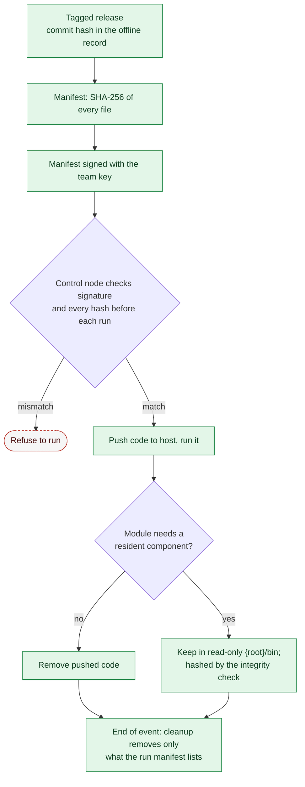

# 07. Cleanup and Tool Integrity

**Status:** Draft · reviewed 2026-09-29 · Phase: 🟩 Sustain · Priority: P1

## 1. Two goals

1. **Cleanup:** when the event ends or a module is removed, leave no stray files, timers, rules or accounts.
2. **Tool integrity:** know that the Labyrinth code on each host is the code that was released, and that nobody changed it.

## 2. Cleanup

- Every module lists its `outputs` in `module.yml` (design 00), and every `apply` writes to the run manifest.
- `cleanup` removes temporary files; `rollback` undoes changes. They are separate so the operator can clean up without reverting.
- End-of-event cleanup removes revert timers, scheduled tasks, temporary accounts and copied code from hosts, but keeps logs and reports until they are collected.
- Cleanup never deletes evidence or anything the manifest does not list.
- Cleanup only touches Labyrinth paths (design 00 standard paths).

## 3. Materials handling

Competition materials, including team-generated reports and documents, must stay in the competition area, and nothing may be removed without authorization (National Collegiate Cyber Defense Competition [NCCDC], 2025, Rules 4.4, 8.5). Collect logs for the debrief only as far as those rules and the officials allow.

## 4. Rejected: encrypted script folder with a shared password

The earlier idea was an encrypted folder, decrypted with a shared team password. It was rejected because:

- The password has to be distributed and typed on every host, which creates the leak it is meant to prevent.
- The team's own code must be public anyway (NCCDC, 2025, Rule 5.6.1), so there is nothing to hide.
- Encryption gives confidentiality, not integrity. The real risk is tampering, not reading.

## 5. Replacement: signed manifest and known commit

| Control | How |
|---|---|
| Release identity | A tagged release with a commit hash. The hash is kept in the team's offline record (design 05, section 2) and matches the declared release (NCCDC, 2025, Rule 5.6.2). |
| Manifest | A list of every file with its SHA-256, generated at release time. |
| Signature | The manifest is signed with a team key. The public key is kept in the offline record and stored on the control node. |
| Immutable location | Code sits in a root-owned, read-only directory on each host (`<root>/bin`). |
| Verify before run | The control node checks the manifest signature and file hashes before every run, and refuses to run on a mismatch. |
| Push, run, delete | Code is pushed to a host, run, and removed, unless the module needs a resident component. |

Resident components (timers, watchers) are hashed by the integrity check (design 04) like any other critical file.

*Figure: code runs only after the signed manifest and every file hash match the declared release, and cleanup later removes only what the run manifest recorded. Green is sustain work and the dashed red outline is the refusal.*

## 6. Acceptance tests

- A tampered module file makes the pre-run check fail and the run refuse to start.
- A wrong signature is rejected.
- After cleanup, a listing of Labyrinth paths, timers, tasks and rules matches the pre-run inventory except for kept logs.
- Cleanup run twice gives the same result.
- Rollback restores the changed files byte for byte.

## References

National Collegiate Cyber Defense Competition. (2025, December 10). *Rules and requirements*. Retrieved September 29, 2026, from https://www.nationalccdc.org/rules.html
