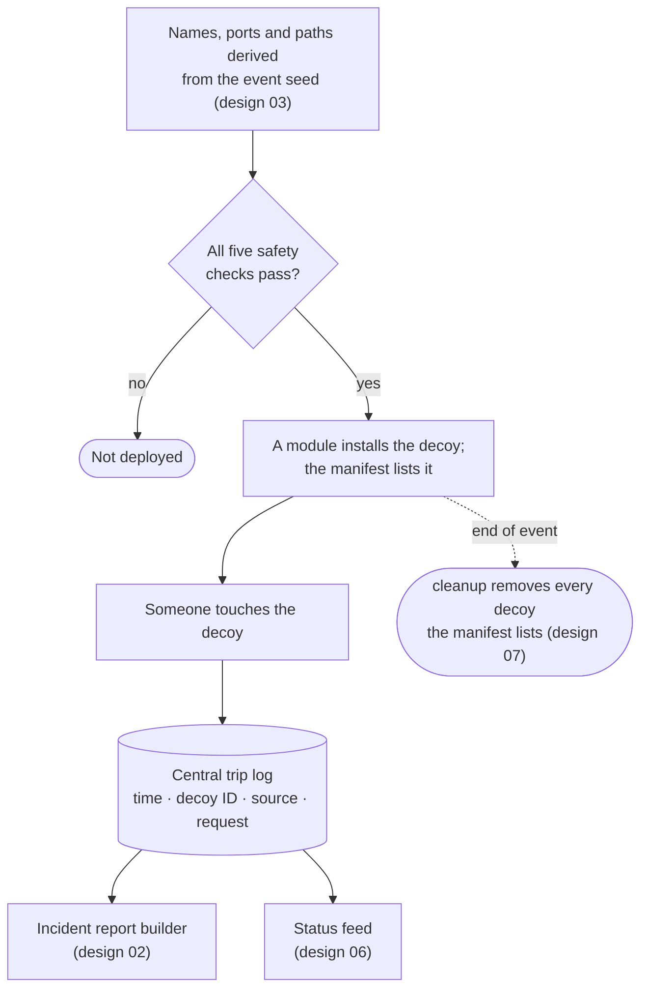

# 09. Deception Maze and CVE Decoys

**Status:** Draft · reviewed 2026-09-29 · Phase: Deceive · Priority: P2

## 1. Goal

Make Red Team activity noisy, slow and visible without endangering scoring. The maze is a set of decoys that raise high-confidence alerts, not a set of fake services that claim to be scored.

## 2. Rules that limit it

| Rule | Limit |
|---|---|
| Do not mislead the scoring engine (National Collegiate Cyber Defense Competition [NCCDC], 2025, Rule 9.3) | No decoy on a scored port. No fake response on a scored service. |
| No offensive activity against systems outside the team's network (NCCDC, 2025, Rule 4.10); active response that interferes with scoring is the team's responsibility (NCCDC, 2025, Rule 4.11) | Decoys observe and alert. They never attack back, scan back or contact outside hosts. |
| Scored services may not be migrated or containerized (NCCDC, 2025, Rule 4.14) | Decoys are lightweight processes on existing hosts, not containers holding a scored service. |
| No new devices (NCCDC, 2025, Rule 4.2) | Decoys run on existing hosts. |
| No deliberate breakage (NCCDC, 2025, Rule 5.6.5) | A decoy failure must not affect a real service. |

## 3. Decoy types

| Type | What it is | Signal quality |
|---|---|---|
| Canary files | Enticing files (`passwords.txt`, backup archives) whose access is audited | High: no legitimate reason to open |
| Honey-accounts | Accounts that never log in legitimately; any use alerts | High |
| Trap ports | Listeners on unused ports that log the connection | High if the port is unused by anything |
| Tarpits | Trap ports that respond very slowly | Medium; delays scanning |
| Banner decoys | Changed banners on *unscored* services only; a scored service's banner may be part of its check | Low; only slows fingerprinting |
| CVE-mimic decoys (CVE: Common Vulnerabilities and Exposures) | A listener whose banner or response resembles a known vulnerable service | High, with limits (section 5) |

All names, ports and paths derive from the event seed (design 03).

## 4. Trip log

Every decoy writes to one central trip log: the time, the decoy ID, the source address, and the request seen. Trips feed the incident report builder (design 02) and the status feed (design 06). The trip log is watched first, because a trip has almost no false positives.

## 5. CVE-mimic decoys and their limits

A CVE-mimic decoy imitates the visible signs of a vulnerable service, so an attacker's scanner reports it as exploitable.

- It only pretends. It contains no vulnerable code and no working exploit path.
- Names and versions are chosen from public advisories; the decoy list should be reviewed for accuracy against those advisories before release.
- **Limits:** skilled attackers verify before exploiting, so the decoy adds noise and time, not safety. It never replaces patching the real service.
- It must never sit on a scored port, and never imitate a scored service on that host.
- No claim of CVE behavior is made beyond what the public advisory describes.

## 6. Safety checks before deployment

1. The derived port is not on the scoring allowlist and not in use.
2. The derived account name does not exist and is not in the protected set.
3. The decoy runs as an unprivileged user with no write access outside its log.
4. A failing decoy cannot stop a real service (separate process, own unit, resource limits).
5. The firewall allows the trap port inbound, but nothing outbound from the decoy.

*Figure: a decoy's life from seed-derived values through the safety checks, deployment and trip logging to removal by cleanup; dashed lines happen only at the end of the event.*

## 7. Removal

Decoys are installed by a module and removed by `cleanup` (design 07). The manifest lists every decoy, so removal is complete.

## 8. Acceptance tests

- Connecting to a trap port creates a trip log entry with the right source address.
- Opening a canary file raises an integrity or audit event within the target time.
- A login to a honey-account is logged and blocked.
- A derived port that collides with the scoring allowlist is skipped and reported.
- Scored-service probes still pass with all decoys running.
- A crashed decoy leaves the real services unaffected.
- Cleanup leaves no decoy files, accounts or listeners.

## References

National Collegiate Cyber Defense Competition. (2025, December 10). *Rules and requirements*. Retrieved September 29, 2026, from https://www.nationalccdc.org/rules.html
