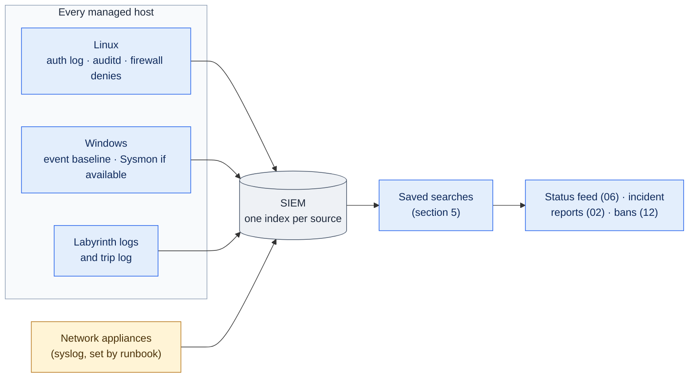

# 10. Log Forwarding and Detection

**Status:** Draft · reviewed 2026-10-05 · Phase: 🟦 Observe · Priority: P1

## 1. Goal

Get the high-signal logs off every host and into the one SIEM (Security Information and Event Management system), then run a small set of saved searches over them. Logs kept only on a host die with the host, and several other parts of Labyrinth depend on the SIEM already holding the right events:

- the status feed reads its saved searches (design 06);
- the incident report builder collects its evidence from them (design 02);
- the Windows side of the integrity check uses them to answer who, when and from where (design 04);
- every trap reports through them (design 09).

This spec turns the Blueprint's logging capability (Blueprint §3.9) and the Windows event baseline idea (design 08, section 4.3) into modules.

## 2. Rules that shape it

| Rule | Effect |
|---|---|
| Team tools may not use outside resources apart from DNS (Domain Name System) (National Collegiate Cyber Defense Competition [NCCDC], 2025, Rule 5.6.4). | Logs go only to the team's own SIEM inside the competition network. No cloud log service, no outside enrichment. |
| Only tools freely available to every team may be used (NCCDC, 2025, Rule 5.1). | A forwarder or monitoring tool is used only if it is free and reachable in the environment. |
| Anything that interferes with the scoring engine is the team's responsibility (NCCDC, 2025, Rule 4.11). | Audit rules stay small so they cannot slow a scored service; the forwarding flow is checked against the firewall plan and the scoring allowlist. |
| Tools must not deliberately break expected functionality (NCCDC, 2025, Rule 5.6.5). | Nothing here stops or restarts a scored service. Logging changes never fill a disk (section 8). |

## 3. What is collected

### 3.1 Linux

| Source | What it shows | Notes |
|---|---|---|
| Authentication log (`auth.log` or `secure`) | Logins, failed logins, `sudo` use, SSH (Secure Shell) key fingerprints | sshd at `LogLevel VERBOSE` (design 05) |
| auditd, with rule keys | Privileged commands; changes to identity files and sudoers; SSH keys; cron and systemd units; `/usr/local`; canary reads | The critical-file watch list comes from design 04; canary watches from design 09 |
| Firewall denies | Blocked connections, including hits on trap ports | Feeds dynamic bans (design 12) |
| Labyrinth's own logs | Every run, integrity finding, trip and report category (design 00, section 7) | Already structured as JSON lines |
| Trip log | Every trap hit (design 09) | Watched first: almost no false positives |

### 3.2 Windows event baseline

A short list, sized for a small SIEM. Each ID must be re-checked against Microsoft's documentation before release (*Background*).

| Event | Log | Why it matters |
|---|---|---|
| 4624, 4625 | Security | Successful and failed logons, with logon type and source address |
| 4648 | Security | A logon using explicitly supplied credentials |
| 4672 | Security | Special privileges assigned at logon (an admin-level logon) |
| 4688 | Security | Process creation; turn on command-line capture so the full command is recorded |
| 4697, 7045 | Security, System | A new service was installed |
| 4698 | Security | A scheduled task was created |
| 4720, 4722, 4724 | Security | Account created, enabled, password reset |
| 4728, 4732, 4756 | Security | A member was added to a security-enabled group (global, local, universal) |
| 4740 | Security | An account was locked out |
| 4663 | Security | Object access on an audited file (canaries and critical files, designs 04 and 09) |
| 1102 | Security | The audit log was cleared: treat as a confirmed intrusion unless the team did it |
| 4104 | Microsoft-Windows-PowerShell/Operational | PowerShell script block logging: the text of each script as it runs, after any decoding, so an encoded or downloaded script can be read |
| 4768, 4769, 4771 | Security, domain controller only | Kerberos ticket requests and failed pre-authentication. Service ticket requests using the older RC4 encryption are a common sign of Kerberoasting; many 4771 events from one source suggest password spraying. |
| 4776 | Security, domain controller only | NTLM credential validation, including failures; shows password guessing against domain accounts |
| 5827, 5828, 5830, 5831 | System, domain controller only | Netlogon: a vulnerable secure-channel connection denied (5827 machine account, 5828 trust account) or allowed only because the allow list names it (5830, 5831). Any of them is a ZeroLogon attempt or an allow-list entry to check (design 11, section 3.1) |

Script block logging is turned on by `observe.win_audit` (section 6). The PowerShell log's maximum size is raised, within the disk check in section 8, so its events are not overwritten before they are forwarded. Labyrinth never puts a secret in a script's text (design 05, section 2), so its own logged script blocks hold none. The old PowerShell 2.0 engine does not log script blocks, so an attacker can use it to avoid this log. Microsoft removed it from Windows 11 24H2 and Windows Server 2025 in 2025; on older builds Tier 0 reports whether it is installed (design 11, section 3.3).

The domain controller events are the noisiest on this list. They are forwarded only from the domain controller, and the saved searches look for patterns (many failures, unusual encryption) rather than every event.

If Sysmon is available in the environment, also forward process creation (Sysmon event 1), network connections (3), file creation (11) and registry value changes (13), using a small configuration written by the team (design 08).

### 3.3 Network appliances

Routers and firewalls send their logs to the SIEM by syslog. The appliance runbook (design 16) covers the setting. Labyrinth does not log in to an appliance to configure it.

## 4. How logs are shipped

| Platform | Preferred | Fallback |
|---|---|---|
| Linux | The host's own syslog daemon (rsyslog or syslog-ng) forwarding to a SIEM input. It is already installed on most distributions, so nothing is added. | A Splunk universal forwarder, only if it is already present in the environment |
| Windows | The Splunk universal forwarder if it is already installed; otherwise a PowerShell script posting to Splunk's HTTP Event Collector (below) | Leave events on the host and collect them with the report collector (design 08, section 4.4) |

**Windows shipping, decided in the 2026-10-05 review.** `observe.forward_windows` picks the first of these that applies on each host:

1. **The Splunk universal forwarder, if the host already has it.** The module adds an inputs file for the event baseline in its own app folder, beside the forwarder's own settings, and changes nothing else. If the forwarder already sends to the SIEM address in the run-time configuration, that is all. If it sends somewhere else, or nowhere, pointing it at the SIEM is an approval item, because someone else may rely on the current destination.
2. **Otherwise, a PowerShell script posting to Splunk's HTTP Event Collector (HEC).** It uses only Windows PowerShell 5.1, so nothing is installed. A scheduled task running as SYSTEM every minute reads the baseline channels with `Get-WinEvent` from a bookmark kept in `<root>\state`, so a restart neither loses nor repeats events, and posts them in batches over HTTPS. The HEC address, token and the SIEM certificate's thumbprint come from run-time configuration, never the repository. The token file is readable by Administrators and SYSTEM only. The script trusts only the certificate with that thumbprint, never any certificate. The task and the script are recorded in the run manifest, and rollback removes them.
3. **Otherwise, the fallback in the table above.**

Windows Event Forwarding is not used: it needs a collector host and a Group Policy change, which is on the person-run list (design 11).

- **Vendoring.** A third-party forwarder or Sysmon may be placed in `vendor/` only after its license is confirmed to allow redistribution in a public repository. Until then, the module uses a copy that is already in the environment or is skipped.
- **Order.** Forwarding starts before deception is deployed (Blueprint §1), so traps have somewhere to report.
- **Cross-segment flows.** Only the one forwarding flow to the SIEM is opened, and only after it is checked against the scoring allowlist and the firewall plan (design 06, section 3).
- **The SIEM input.** Logs are sent over TCP, so a dropped connection is noticed and lines are not silently lost. The SIEM accepts its input only from the managed hosts in the `hosts` file, so an attacker cannot flood it or plant false events from elsewhere.

*Figure: every managed host sends its high-signal logs to the one SIEM, appliances send theirs by syslog, and a few saved searches turn those logs into what the status feed, the incident reports and the ban logic use. Blue is automated observation, gray is the SIEM and amber marks the appliance setting a person applies from its runbook.*

## 5. Detection content: a few saved searches

A few high-value searches beat a hundred noisy dashboards (Blueprint §3.9). The first release ships these, as templates with no event values:

| Search | Confidence |
|---|---|
| Any trip-log entry | Near-certain |
| Any logon attempt, failed or successful, on a honey-account (design 09) | Near-certain |
| Kerberos service tickets requested with RC4, or many 4771 or 4776 failures from one source | High |
| Canary file read (auditd `canary_read` key or event 4663 on a canary) | Near-certain |
| Audit log cleared (1102) or auditd rules changed | Near-certain |
| Successful logon to an account Labyrinth locked | High |
| Successful logon with the break-glass account or an official account | Low on its own; confirm with the captain or the White Team |
| New member of an admin group (4728, 4732, 4756; sudoers or `wheel`/`sudo` group change) | High |
| New service or scheduled task (4697, 7045, 4698; new systemd unit or cron entry) | Medium |
| Many failed logons from one source | Medium |
| Integrity finding from design 04 | Medium to high, by file rank |
| A locked account re-enabled (4722; auditd rule on `usermod` and `/etc/shadow`) | High |
| WDigest turned back on, or a protocol setting from design 11 reverted | High |
| A tool often abused for persistence or download is started: `nc`, `ncat`, `socat`, a compiler (`gcc`, `cc`), `certutil -urlcache`, `bitsadmin /transfer`, `mshta`, `regsvr32` with a URL | Medium; high when run by a web server or database account |
| A PowerShell script block that decodes or downloads code and runs it (event 4104 with, for example, `FromBase64String`, `DownloadString`, `Invoke-Expression` or `-EncodedCommand`) | Medium; high when run by a web server, database or service account |
| A remote-access or tunnel tool is installed or started, for example AnyDesk, TeamViewer, ScreenConnect, Splashtop, ngrok, chisel, frp, rclone or plink. The list is a data file in the release. | High, unless the profile lists the tool as one the company uses |
| A change on the SIEM itself: a new user or role, a new app, a scripted input or alert action, or a search deleted (Splunk `_audit` index) | High |
| A change to a boot-critical file (design 04, section 3) | Near-certain |
| ZeroLogon signs: a vulnerable Netlogon connection denied (events 5827, 5828) or allowed by the allow list (5830, 5831), checked against Microsoft's CVE-2020-1472 guidance (Microsoft, n.d.); or the domain controller's machine account password changed by an anonymous logon (event 4742; *Background*) | High |
| DCSync signs: directory replication rights used (event 4662 with the replication GUIDs) by an account that is not a domain controller (*Background*). Event 4662 is recorded only when directory service access auditing is on, which `observe.win_audit` turns on for the domain controller only. Any hit puts the KRBTGT reset and admin rotation on the domain checklist (design 11, section 5) | Near-certain |
| Unusual outbound traffic: NTP to a server not in the run-time configuration, DNS to a resolver not in it, or a host's outbound volume far above its own normal, from the outbound log rule below | Medium; high from a scored service's account |

**Outbound logging.** To feed the outbound search, each host gets a log-only firewall rule for new outbound connections, rate-limited so it cannot flood the log (Tier 2). It blocks nothing. Red Teams have hidden command-and-control traffic in NTP and rotated their callback addresses (*Background*), which inbound default-deny does not stop. **Filtering** a host's outbound traffic is part of the first-minute bundle (Tier 2, design 01, section 6.1): default-deny outbound, allowing what the services file and the run-time `outbound-allow` list name. The log rule stays on, so a blocked callback still shows up in the search.

**Watch by default, block per host.** The tools in the "abused tool" row have legitimate uses, and an administrator or a scored service may rely on one. So by default they are watched through process-creation logging, not removed or blocked. This is a design choice, not a rule: Rule 5.6.5 forbids deliberately breaking expected functionality (NCCDC, 2025), and blocking a tool on a host where nothing uses it breaks nothing. So, on Windows, Labyrinth offers a per-host Tier 3 item: an outbound Windows Firewall block rule for one abused tool's program path (for example `certutil.exe` or `bitsadmin.exe`, which Red Teams use to download second-stage tools), on a host where the inventory and the dependency map show no scheduled task, service or scored app using it. The rule is recorded in the run manifest and removed by `rollback`. The tool is never deleted or renamed, and a block never covers every host at once. The same goes for remote-access tools, which a company may use for support: the persistence sweep lists one for approval rather than removing it (design 17, section 4). The one exception is scheduling: `cron.allow` and `at.allow` are limited after the persistence sweep (design 17, section 6).

**Sigma rules.** More searches can be converted from Sigma, the vendor-neutral rule format, *before* the release, never at the event. Each converted rule keeps its original author, license and rule ID in `vendor/` with a NOTICE file, and is tested against sample logs in the lab (design 08).

## 6. Modules

| Module | Tier | What it does |
|---|---|---|
| `observe.auditd` | Tier 1 | Installs the Labyrinth audit rule file as a drop-in; the base rules are untouched |
| `observe.win_audit` | Tier 1 | Sets the audit policy, command-line capture and PowerShell script block logging needed for the event baseline |
| `observe.forward_linux` | Tier 1 | Adds a syslog forwarding drop-in pointing at the SIEM address from run-time configuration |
| `observe.forward_windows` | Tier 1 | Ships Windows events by the method in section 4: the forwarder already on the host, or the HEC script. Repointing an existing forwarder is an approval item |
| `observe.sysmon` | Tier 2, optional | Installs Sysmon with the team's configuration, only if a permitted copy exists |
| `observe.searches` | Tier 1, run against the SIEM | Loads the saved-search templates |

Opening the forwarding port in a host firewall follows design 01 (Tier 2, with a revert timer).

## 7. Hardening the SIEM host

The SIEM is usually already installed on its own host, so Labyrinth does not install it; it hardens it. An attacker who controls the SIEM can blind the team or use it to run code: Splunk often runs as root or SYSTEM, and its scripted inputs and alert actions run commands (*Background*). The free edition of Splunk has no login at all (*Background*), so its web and management ports must be closed to everyone but the team.

| Step | Tier |
|---|---|
| Rotate the SIEM's own admin password, shown once like any other (design 05, section 2) | 1 |
| List SIEM users and roles; lock unexpected ones, as for host accounts (design 05, section 6) | 0, then 2 |
| Firewall: the web interface (8000) and management port (8089) only from the admin source, plus the scoring engine if the SIEM is scored; the log inputs (9997 and syslog 514) only from the managed hosts | 2 |
| Quarantine unknown apps, scripted inputs and alert actions that are not in the profile's known-good list; unexplained ones go to approval (design 17) | 2 or 3 |
| Back up the SIEM's configuration folder (Splunk `etc`) before any change (design 14) | 1 |
| Load the SIEM-change search on its `_audit` index (section 5) | 1 |

The SIEM host also gets its platform's normal lockout (design 01). Ports, paths and role names come from the profile, so another SIEM product can be supported by a new profile.

## 8. Safety

- **Disk.** Before enabling a noisy source, check free space. Local logs rotate with a size cap, so logging can never fill a disk and stop a service.
- **Volume.** Audit rules stay small (design 04, section 7). A rule that floods the log is removed, not tuned during the event.
- **auditd settings that cannot be undone.** Labyrinth never sets `-e 2`, which locks the audit rules until the next reboot, so they could not be rolled back. It never sets `-f 2` either, which makes the kernel panic, stopping the whole host, when auditing fails. If a host already has `-e 2`, the rules cannot be loaded; `observe.auditd` reports exit code 20 (blocked) rather than reboot.
- **Tampering.** Forwarding is the defense against a wiped host: once an event is in the SIEM, clearing the local log does not remove it. Clearing is itself alerted on (section 5).
- **Trust path.** The SIEM receives logs only. It holds no keys to any host (design 06).

## 9. Verify and roll back

- **Verify:** each module writes a unique marker event on each host (for example, a `logger` line or a custom Windows event carrying the run ID) and confirms that the SIEM returns it within the target time. This is the "confirm events are arriving" check (Blueprint §8).
- **Roll back:** remove the drop-in files and restore the previous audit policy from the run manifest.

## 10. Acceptance tests

- A marker event from every lab host arrives in the SIEM.
- On a host with no forwarder, the HEC script ships the marker event; stopping and restarting the task neither loses nor repeats an event; a SIEM certificate whose thumbprint does not match is refused.
- On a host whose forwarder already sends elsewhere, the module adds its inputs and lists the destination change for approval without making it.
- A planted Netlogon allow-list entry and a connection it allows raise the ZeroLogon search.
- A failed SSH login, a new local admin and a canary read each raise the matching saved search.
- Clearing the Windows Security log raises the 1102 search, and the earlier events are still in the SIEM.
- With the SIEM stopped, hosts keep running, local logs stay under their size cap, and nothing scored is affected.
- No module opens any network flow other than the one to the SIEM.
- The SIEM refuses log input from an address that is not a managed host.
- On a host already set to `-e 2`, `observe.auditd` exits 20 and changes nothing.
- A planted honey-account logon attempt and an RC4 service ticket request each raise their saved search.
- The repository contains no SIEM address or event value, only templates.
- After hardening, the SIEM's web and management ports refuse a connection from a non-admin address, and a planted scripted input is quarantined.
- Starting `socat` as the web server's account raises the abused-tool search at high confidence.
- On a lab Windows host where nothing uses `certutil.exe`, an approved block stops it from connecting out, every probe still passes, and `rollback` removes the rule.
- In the lab, NTP queries to an unlisted server raise the outbound search; the outbound log rule blocks nothing.
- A simulated DCSync from a non-domain-controller account raises its search.
- An encoded PowerShell command that downloads a file raises the script-block search, and the forwarded 4104 event shows the decoded text.
- Starting a lab copy of a tunnel tool raises the remote-access search; a tool the profile lists as the company's own does not.

## References

Microsoft. (n.d.). *How to manage the changes in Netlogon secure channel connections associated with CVE-2020-1472*. Retrieved October 5, 2026, from https://support.microsoft.com/en-us/topic/how-to-manage-the-changes-in-netlogon-secure-channel-connections-associated-with-cve-2020-1472-f7e8cc17-0309-1d6a-304e-5ba73cd1a11e

National Collegiate Cyber Defense Competition. (2025, December 10). *Rules and requirements*. Retrieved October 2, 2026, from https://www.nationalccdc.org/rules.html
