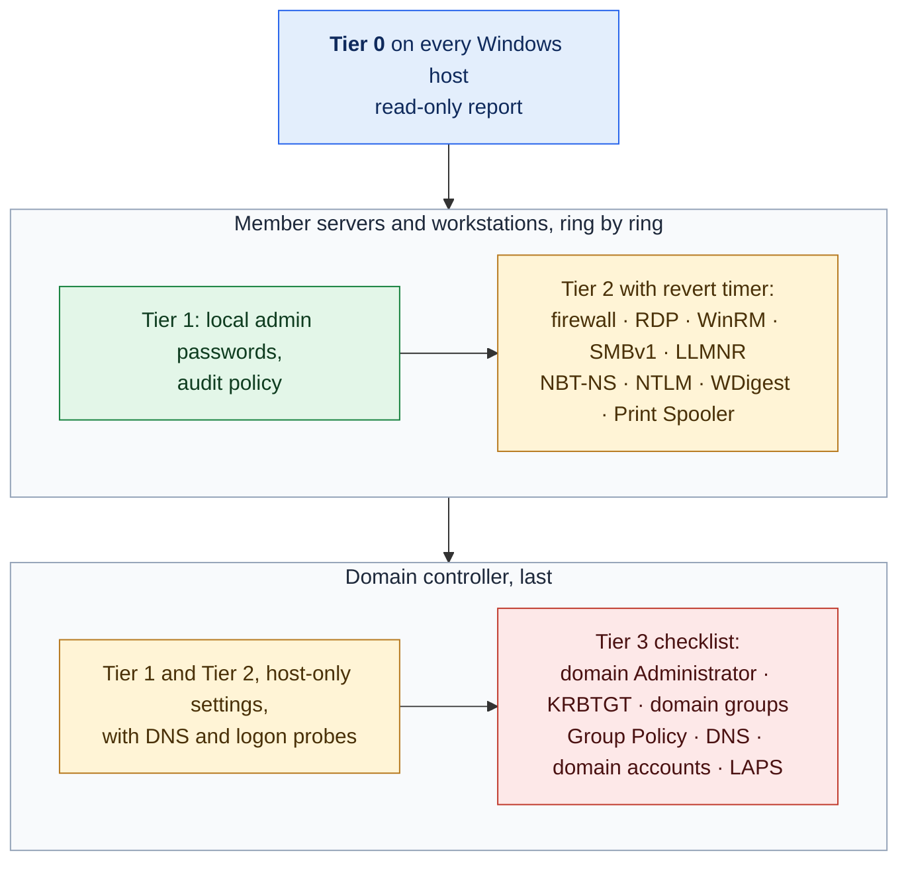

# 11. Windows and Active Directory Hardening

**Status:** Draft · reviewed 2026-10-05 · Phase: 🟥 Lock out · Priority: P0 (credentials, firewall), P1 (the rest)

## 1. Goal

Give the `windows-member` and `windows-dc` profiles (Blueprint §6.3) the same guarded treatment the Linux profiles get. Windows hosts and the AD (Active Directory) domain controller carry some of the highest-impact weaknesses in a typical competition network, and the domain controller is also the most dangerous host to change: a mistake there can break every logon and every DNS (Domain Name System) lookup at once.

So this spec splits the work by blast radius. A change that affects one host is automated with the panic button's guard rails (design 01). A change that affects the whole domain is a printed checklist.

## 2. Rules that shape it

| Rule | Effect |
|---|---|
| Administrator-class passwords are not used for scoring and may be changed freely; other user passwords follow the notification process (Midwest Collegiate Cyber Defense Competition [MWCCDC], 2025, Rule 13; *Provisional*). | Automation rotates only the built-in and administrator-class accounts. |
| Scored services have used AD users, for example for POP3 (Post Office Protocol 3) mail logins (MWCCDC, 2025, Functional Services section; *Provisional*). | Domain-wide resets, domain account changes and domain policy changes are done by a person from a checklist (section 5). |
| Tools must not deliberately break expected functionality (National Collegiate Cyber Defense Competition [NCCDC], 2025, Rule 5.6.5). | Every change comes from an explicit list and skips the protected set. |
| Officials must be given access on request (NCCDC, 2025, Rule 4.1). | When an official asks, the captain gives them a working login (design 05, section 5). Remote Desktop and firewall restrictions still allow the admin source and any official sources named in the event packet. |
| Scoring is based partly on controlling and preventing unauthorized access (NCCDC, 2025, Scoring section), and scored services are a primary Red Team target. | Where RDP or WinRM is itself scored, the restriction also allows the scoring engine, and the service is hardened rather than closed (section 3). |
| Anything that interferes with the scoring engine is the team's responsibility (NCCDC, 2025, Rule 4.11). | DNS on the domain controller is treated as scored and changed by hand only (Blueprint §4.6). |

## 3. Blast radius decides the tier

| Tier | Member servers and workstations | Domain controller |
|---|---|---|
| **0. Observe** | Local admins, services, scheduled tasks, autoruns, listeners (design 04); SMBv1, LLMNR, NBT-NS, RDP and WinRM state; the state of every setting in the tables below; password and lockout policy (design 05, section 2.2); whether the PowerShell 2.0 engine is installed, because it bypasses script block logging (design 10) | All of the left, plus: privileged group membership (Domain Admins, Enterprise Admins, Schema Admins, Administrators), accounts with a service principal name, linked Group Policy objects, Print Spooler state, and the domain read-only checks (section 3.2) |
| **1. Safe and reversible** | Rotate the built-in Administrator and other local admin-class passwords that nothing logs on with (design 05, section 2); turn on the audit policy and script block logging (design 10) | Audit policy and script block logging (design 10); logging of unsigned LDAP binds (section 3.1). No password is rotated automatically: every account on a domain controller is a domain account (section 7) |
| **2. Service-affecting, per host with a revert timer** | Default-deny inbound firewall (design 01); require NLA (Network Level Authentication) for RDP; allow RDP and WinRM only from the admin source, plus the scoring engine where either is scored; turn off SMBv1 server; turn off LLMNR and NBT-NS in local policy; the protocol settings below; rules for new passwords and password history (design 05, section 2.2); stop and disable Print Spooler where nothing prints; remove unexpected local Administrators members that nothing depends on (design 05, section 6) | Firewall as on the left, applied last, after the member servers pass, and always allowing domain traffic from member hosts (below); RDP, WinRM and the protocol settings as on the left; Netlogon secure-channel enforcement (section 3.1); stop and disable Print Spooler if printing is not scored |
| **3. Approve, then act** | Labyrinth acts after approval: removing a local Administrators member that might be a service dependency; protocol settings in the approval class (below); lockout settings (design 05, section 2.2); ending a process that runs as SYSTEM (below) | Labyrinth acts after approval: requiring LDAP signing (section 3.1); ending a process that runs as SYSTEM (below). A person acts, from the checklist in section 5: rotating the domain Administrator password; KRBTGT reset (twice, with a replication wait); creating domain honey-accounts (design 09); removing members from domain admin groups; domain password resets; disabling and deleting domain accounts; fixing the domain read-only findings (section 3.2); any Group Policy change, including the domain password and lockout policy; service account resets; LAPS (Local Administrator Password Solution) roll-out; any DNS change on the domain controller, including zone settings |

**Protocol and credential settings** (*Background*; each per host, in the registry, under the revert timer):

| Setting | Why | Class |
|---|---|---|
| NTLMv2 only; LM and NTLMv1 refused (`LmCompatibilityLevel` 5); no LM hashes stored (`NoLMHash`) | Older hash formats are cracked or relayed easily | Automatic |
| WDigest off (`UseLogonCredential` 0) | Otherwise plain-text passwords sit in memory for tools such as Mimikatz to read. Turning it back on raises an alert (design 10). | Automatic |
| No anonymous listing of accounts and shares (`RestrictAnonymous`, `RestrictAnonymousSAM`; `EveryoneIncludesAnonymous` 0) | Stops attackers listing users without a password | Automatic |
| Turn off automatic proxy discovery (WPAD) | Lets an attacker on the network pose as a proxy and collect hashes | Automatic |
| Require SMB signing on the server side | Stops relayed logons to file shares | Automatic where SMB is not scored; approval where it is, because an old scoring client may not sign |
| LSA protection (`RunAsPPL`), set without the UEFI lock so that rollback can remove it | Stops tools such as Mimikatz from reading credentials out of the LSASS process. It takes effect only at the next reboot, which Labyrinth never does, so probes cannot test it; at that reboot, an LSA plug-in that is not signed for protected mode fails to load and can break logons. | Approval; the plan says it waits for the next reboot a person makes |
| Automatic logon off (`AutoAdminLogon` 0) and the stored logon password removed (`DefaultPassword` deleted from the Winlogon key) | `DefaultPassword` holds a plain-text password in the registry. The account it names is treated as exposed and listed for rotation (design 05, section 2). The password is not copied to the run manifest, because Labyrinth never writes one to disk; rollback restores `AutoAdminLogon` only. | Approval, because a scored app may rely on a session that logs on by itself |
| UAC (User Account Control) on (`EnableLUA` 1), and remote UAC filtering for local accounts on (`LocalAccountTokenFilterPolicy` 0 or absent) | With UAC off, every administrator process runs with full rights. With remote filtering off, any local administrator's password hash can run commands over the network (pass-the-hash), and attackers turn it off for that reason. `EnableLUA` takes effect at the next reboot. | Approval: remote management or a scoring check may log on as a local administrator |

**Domain traffic to the domain controller.** Its default-deny firewall always allows, from the member hosts' addresses: DNS (53), Kerberos (88, 464), time (123/UDP), RPC (135 and the dynamic range), LDAP (389, 636, 3268 and 3269) and SMB (445). Without these, every logon in the domain fails.

**Ending a process that runs as SYSTEM.** An administrator cannot always end a process running as SYSTEM, and Red Teams use this to keep implants alive (*Background*). When a person approves it, Labyrinth ends the process through a one-time scheduled task that runs as SYSTEM, then deletes the task. The approval names the process ID and the hash of its executable; if either no longer matches when the task runs, nothing is ended. The process's persistence (its service, scheduled task or autorun) is quarantined first (design 17), so it does not come straight back, and the executable is kept as evidence (design 02). It is never offered for a process the dependency map ties to a scored service.

- **Why Group Policy is manual.** One Group Policy change reaches every machine in the domain at once. That is the "indiscriminate" pattern the rules warn about (NCCDC, 2025, Rule 5.6.5), so it stays with a person who can watch the effect.
- **Why Print Spooler.** The print spooler has had several serious remote vulnerabilities, and a domain controller rarely needs to print (*Background*). It is turned off only when printing is not a scored service on that host.
- **Why local policy for LLMNR and NBT-NS.** Both let an attacker on the network answer name lookups and collect password hashes (*Background*). The per-host setting keeps the blast radius to one host; the domain-wide setting is a Group Policy change and therefore Tier 3.

*Figure: every Windows host is observed first, member servers and workstations are changed ring by ring, and the domain controller comes last, with its domain-wide changes left to a person. Colors follow the risk tiers of design 01: blue is read-only, green safe, amber service-affecting and red a person's checklist.*

### 3.1 Domain controller settings

These are registry settings on the domain controller, but they change what every client in the domain may do. Each is followed by the probes in section 4 (*Background*; each value is re-checked against Microsoft's documentation before release):

| Setting | Why | Class |
|---|---|---|
| Netlogon secure-channel enforcement (`FullSecureChannelProtection` 1) | Closes ZeroLogon (CVE-2020-1472) on a patched domain controller. On an unpatched one it does nothing; patching handles that (design 15). | Automatic, Tier 2, with the section 4 probes |
| Netlogon allow list (`VulnerableChannelAllowList`) | Lets the machines it names keep using the weak channel, so an attacker who adds it reopens ZeroLogon for themselves. Tier 0 reports it whenever it is present. | Set by Group Policy: domain checklist (section 5). Set in the local registry: approval, then removed |
| Log unsigned LDAP binds (`16 LDAP Interface Events` diagnostic level 2, which records event 2889 with each client's address) | Shows which clients would break if LDAP signing were required. It only adds logging. | Automatic, Tier 1 |
| Require LDAP signing (`LDAPServerIntegrity` 2) | Stops relayed and tampered LDAP binds. A client that binds without signing or TLS fails at once; this is often a Linux mail or web app that checks logins against the directory. The plan lists every client seen in events 2887 and 2889 since logging started, and a scored service among them blocks the change. | Approval |

### 3.2 Domain read-only checks

Tier 0 on the domain controller also looks for the weaknesses and planted access that attackers use against a domain (*Background*). It changes nothing: each finding goes on the domain checklist (section 5) with its evidence. The queries use the ActiveDirectory module where it is present and the built-in directory searcher where it is not; Labyrinth never installs RSAT (Remote Server Administration Tools).

- Accounts with Kerberos pre-authentication turned off (open to AS-REP roasting), and accounts with a service principal name (open to Kerberoasting), with the age of each password.
- Unconstrained delegation on any account, or on a computer that is not a domain controller; constrained or resource-based delegation (`msDS-AllowedToActOnBehalfOfOtherIdentity`) set on any object.
- `SIDHistory` on any account.
- Accounts with "password not required" or reversible password encryption set.
- Directory replication rights (the rights DCSync uses) held by anything other than the domain controllers and the built-in groups that hold them by default.
- Members of DnsAdmins, who can make the DNS service load a DLL as SYSTEM.
- The age of the KRBTGT password.
- Files in SYSVOL and NETLOGON: logon scripts, and Group Policy Preferences files with a `cpassword` attribute, which any domain user can decrypt.
- Description and info fields that look like they hold a password.
- DNS zones that accept non-secure dynamic updates or allow a zone transfer to any server.

The report names the account, file or field and why it was flagged. It never prints a value that may be a secret: a password-like description and a `cpassword` are reported by location only.

## 4. Domain controller probes

A domain controller serves more than its scored ports. After each change on it, verify:

- a DNS query for a known record returns the expected answer (design 01, section 9);
- an operator account can authenticate to the domain from a member server;
- a member server can still find the domain controller.

Scoring accounts are never used to test logons (design 01, section 4).

## 5. The domain checklist

Domain-wide changes reach every machine at once, so they stay with a person even under "confirm, then act" (design 01, section 3). The `windows-dc` profile prints this checklist, filled with the run's host names, for the team to work through with the captain's approval:

1. **Domain Administrator.** Check the Tier 0 report for services and scheduled tasks that log on with it (design 05, section 2). Rotate it, update each of those, then re-run the logon probes. The new password goes in the team's offline record.
2. **Privileged groups.** Compare the Tier 0 report with the expected members. Remove unknown members by hand, one at a time, and re-run the logon probes after each.
3. **KRBTGT.** Reset the KRBTGT password, wait for replication, then reset it again (Blueprint §3.1). This invalidates forged Kerberos tickets. After any DCSync or ZeroLogon sign (design 10), do this at once and rotate every domain admin account too, because the attacker may hold every domain password hash.
4. **Service accounts.** Reset only after their dependencies are known.
5. **Unexpected domain accounts.** Disable them only after confirming they are not scoring or official accounts; re-enabling raises an alert (event 4722; design 10). Once a checkpoint shows every scored service passing (design 13), delete them, after saving their group membership and creation details for the incident record (design 02).
6. **Group Policy.** Apply domain-wide settings (for example, turning off LLMNR everywhere) one at a time, with a scoring-style probe after each.
7. **Domain password and lockout policy.** This is a Group Policy change, to the default domain policy. Raise the minimum length and turn on complexity and history if they are low. Set a lockout threshold only after the captain agrees: the Red Team can lock scoring and employee domain accounts on purpose by guessing their passwords, and a locked scoring account is a scored service down (design 05, section 2.2). Never set a maximum password age, which can expire existing passwords at once, scoring accounts' included.
8. **DNS.** Any change on the domain controller, including a sinkhole entry (Blueprint §4.6), is tested with a query before and after. Settings on an Active Directory-integrated zone replicate to every domain controller, which is why they are here and not in the Windows DNS pack (design 18). From the Tier 0 report: limit zone transfers to the listed secondaries, and set secure-only dynamic updates on Active Directory-integrated zones; a client outside the domain that registers its own name stops being able to.
9. **Domain read-only findings** (section 3.2). Turn Kerberos pre-authentication back on; remove delegation and `SIDHistory` that nobody can explain; remove unexpected replication rights and DnsAdmins members; rotate any password found in a description field or a Group Policy Preferences file, then delete the file after recording it for the incident report (design 02). Re-run the logon probes after each.
10. **Netlogon allow list.** If Group Policy sets one (section 3.1), remove each entry that is not a known, unpatched device the event needs.
11. **Domain honey-accounts.** If the team uses them (design 09), create each one by hand with the name the module prints, disabled or with no usable password, and confirm it does not collide with a scoring or official account.

## 6. Roll back

Every Tier 1 and Tier 2 change is recorded in the run manifest with its previous value: the registry value, service start type, firewall rule or audit setting. Rollback restores that value. Tier 2 changes are also covered by the one-time scheduled task that serves as the Windows revert timer (design 01, section 8).

## 7. What it will never do

- Change Group Policy, DNS on a domain controller, or a domain account itself, with or without approval. These stay on the checklist in section 5.
- Reboot a host so that a setting takes effect. A setting that needs a reboot is staged and reported.
- Print or store a value that may be a secret, such as a password found in a description field, a Group Policy Preferences file or the Winlogon key.
- Touch an account in the protected set.
- Remove the break-glass path or the officials' access.
- Install software from outside the environment.
- End a process as SYSTEM without approval, or one whose process ID or executable hash has changed since approval.

## 8. Acceptance tests

- After the run, the protected accounts, the scoring accounts and every scored-service probe are unchanged.
- An operator can still log on to the domain from every member server.
- A deliberately failed verify on the domain controller is reverted by the scheduled task.
- The Tier 0 report lists a planted extra member of Domain Admins.
- No Group Policy object changes during an automated run.
- Where RDP is scored, the scoring engine's address can still connect after the firewall and RDP changes.
- After default-deny on the domain controller, a member server still logs on to the domain and resolves names.
- After the protocol settings, an NTLMv1 logon is refused, WDigest is off, and anonymous user listing fails; turning WDigest back on raises an alert.
- An approved SYSTEM process in the lab is ended by the one-time task, the task is deleted afterwards, and a process whose executable hash changed is left running.
- A simulated DCSync marks the KRBTGT step as urgent on the printed checklist.
- The Tier 0 report lists each planted weakness: an account with pre-authentication off, unconstrained delegation on a member server, `SIDHistory`, replication rights granted to an ordinary account, a DnsAdmins member, a Group Policy Preferences file with a `cpassword`, and a password in a description field. Neither password appears in the report, the log or the manifest.
- After Netlogon enforcement, every member server still logs on to the domain, and a planted allow-list entry is reported.
- With unsigned-bind logging on, a lab client's unsigned LDAP bind is listed in the LDAP signing plan; when that client is a scored service, the change is blocked.
- After an approved automatic-logon change, `AutoAdminLogon` is 0, `DefaultPassword` is gone, the manifest holds no password, and the named account is listed for rotation.
- The LSA protection plan says the setting waits for a reboot; no host reboots, and rollback removes the setting.
- With `LocalAccountTokenFilterPolicy` set to 1, the Tier 0 report flags it, and after approval a local administrator's remote logon over the network gets no administrator rights.
- No DNS setting on the domain controller changes during an automated run.

## References

Midwest Collegiate Cyber Defense Competition. (2025). *2025 Midwest Collegiate Cyber Defense Competition qualifier team packet* [PDF]. https://brazil.minnesota.edu/ccdc/ccdc-2025/2025MWCCDCQTeamPack.pdf

National Collegiate Cyber Defense Competition. (2025, December 10). *Rules and requirements*. Retrieved October 2, 2026, from https://www.nationalccdc.org/rules.html
