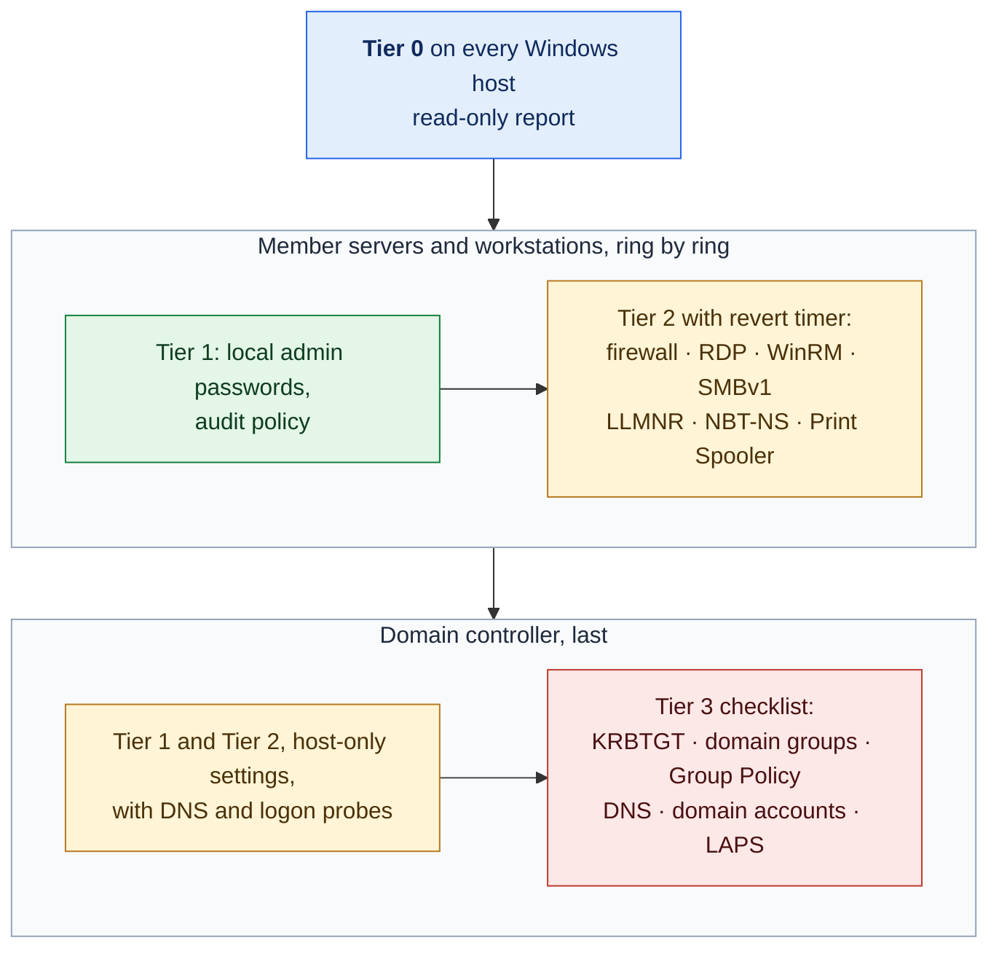

# 11. Windows and Active Directory Hardening

**Status:** Draft · reviewed 2026-09-29 · Phase: 🟥 Lock out · Priority: P0 (credentials, firewall), P1 (the rest)

## 1. Goal

Give the `windows-member` and `windows-dc` profiles (Blueprint §6.3) the same guarded treatment the Linux profiles get. Windows hosts and the AD (Active Directory) domain controller carry some of the highest-impact weaknesses in a typical competition network, and the domain controller is also the most dangerous host to change: a mistake there can break every logon and every DNS (Domain Name System) lookup at once.

So this spec splits the work by blast radius. A change that affects one host is automated with the panic button's guard rails (design 01). A change that affects the whole domain is a printed checklist.

## 2. Rules that shape it

| Rule | Effect |
|---|---|
| Administrator-class passwords are not used for scoring and may be changed freely; other user passwords follow the notification process (Midwest Collegiate Cyber Defense Competition [MWCCDC], 2025, Rule 13; *Provisional*). | Automation rotates only the built-in and administrator-class accounts. |
| Scored services have used AD users, for example for POP3 (Post Office Protocol 3) mail logins (MWCCDC, 2025, Functional Services section; *Provisional*). | Domain-wide resets, domain account locks and domain policy changes are manual-only. |
| Tools must not deliberately break expected functionality (National Collegiate Cyber Defense Competition [NCCDC], 2025, Rule 5.6.5). | Every change comes from an explicit list and skips the protected set. |
| Officials must be given access on request (NCCDC, 2025, Rule 4.1). | Remote Desktop restrictions keep the break-glass path and the officials' access working. |
| Anything that interferes with the scoring engine is the team's responsibility (NCCDC, 2025, Rule 4.11). | DNS on the domain controller is treated as scored and changed by hand only (Blueprint §4.6). |

## 3. Blast radius decides the tier

| Tier | Member servers and workstations | Domain controller |
|---|---|---|
| **0. Observe** | Local admins, services, scheduled tasks, autoruns, listeners (design 04); SMBv1, LLMNR, NBT-NS, RDP and WinRM state | All of the left, plus: privileged group membership (Domain Admins, Enterprise Admins, Schema Admins, Administrators), accounts with a service principal name, linked Group Policy objects, Print Spooler state |
| **1. Safe and reversible** | Rotate the built-in Administrator and other local admin-class passwords (design 05); turn on the audit policy (design 10) | Rotate the domain's built-in Administrator only if it is not in the protected set; audit policy (design 10) |
| **2. Service-affecting, per host with a revert timer** | Default-deny inbound firewall (design 01); require NLA (Network Level Authentication) for RDP and allow RDP only from the admin source; restrict WinRM to the admin source; turn off SMBv1 server; turn off LLMNR and NBT-NS in local policy; stop and disable Print Spooler where nothing prints | Firewall and RDP as on the left, applied last, after the member servers pass; stop and disable Print Spooler if printing is not scored |
| **3. Manual only** | Removing a member from local Administrators when it might be a service dependency | KRBTGT reset (twice, with a replication wait); removing members from domain admin groups; domain password resets; disabling domain accounts; any Group Policy change; service account resets; LAPS (Local Administrator Password Solution) roll-out; any DNS server change |

- **Why Group Policy is manual.** One Group Policy change reaches every machine in the domain at once. That is the "indiscriminate" pattern the rules warn about (NCCDC, 2025, Rule 5.6.5), so it stays with a person who can watch the effect.
- **Why Print Spooler.** The print spooler has had several serious remote vulnerabilities, and a domain controller rarely needs to print (*Background*). It is turned off only when printing is not a scored service on that host.
- **Why local policy for LLMNR and NBT-NS.** Both let an attacker on the network answer name lookups and collect password hashes (*Background*). The per-host setting keeps the blast radius to one host; the domain-wide setting is a Group Policy change and therefore Tier 3.

*Figure: every Windows host is observed first, member servers and workstations are changed ring by ring, and the domain controller comes last, with its domain-wide changes left to a person. Colors follow the risk tiers of design 01: blue is read-only, green safe, amber service-affecting and red manual-only.*

## 4. Domain controller probes

A domain controller serves more than its scored ports. After each change on it, verify:

- a DNS query for a known record returns the expected answer (design 01, section 9);
- an operator account can authenticate to the domain from a member server;
- a member server can still find the domain controller.

Scoring accounts are never used to test logons (design 01, section 4).

## 5. The Tier 3 checklist

The `windows-dc` profile prints this checklist, filled with the run's host names, for the team to work through with the captain's approval:

1. **Privileged groups.** Compare the Tier 0 report with the expected members. Remove unknown members by hand, one at a time, and re-run the logon probes after each.
2. **KRBTGT.** Reset the KRBTGT password, wait for replication, then reset it again (Blueprint §3.1). This invalidates forged Kerberos tickets.
3. **Service accounts.** Reset only after their dependencies are known.
4. **Unused domain accounts.** Disable, never delete, only after confirming they are not scoring or official accounts.
5. **Group Policy.** Apply domain-wide settings (for example, turning off LLMNR everywhere) one at a time, with a scoring-style probe after each.
6. **DNS.** Any change, including a sinkhole entry (Blueprint §4.6), is tested with a query before and after.

## 6. Roll back

Every Tier 1 and Tier 2 change is recorded in the run manifest with its previous value: the registry value, service start type, firewall rule or audit setting. Rollback restores that value. Tier 2 changes are also covered by the one-time scheduled task that serves as the Windows revert timer (design 01, section 8).

## 7. What it will never do

- Change Group Policy, DNS or a domain account automatically.
- Touch an account in the protected set.
- Remove the break-glass path or the officials' access.
- Install software from outside the environment.

## 8. Acceptance tests

- After the run, the protected accounts, the scoring accounts and every scored-service probe are unchanged.
- An operator can still log on to the domain from every member server.
- A deliberately failed verify on the domain controller is reverted by the scheduled task.
- The Tier 0 report lists a planted extra member of Domain Admins.
- No Group Policy object changes during an automated run.

## References

Midwest Collegiate Cyber Defense Competition. (2025). *2025 Midwest Collegiate Cyber Defense Competition qualifier team packet* [PDF]. https://brazil.minnesota.edu/ccdc/ccdc-2025/2025MWCCDCQTeamPack.pdf

National Collegiate Cyber Defense Competition. (2025, December 10). *Rules and requirements*. Retrieved September 29, 2026, from https://www.nationalccdc.org/rules.html
