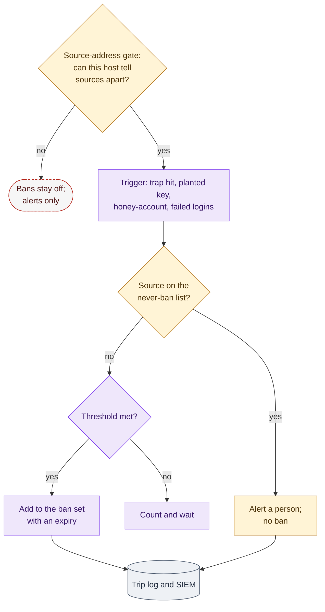

# 12. Dynamic Bans

**Status:** Draft · reviewed 2026-09-29 · Phase: 🟪 Deceive · Priority: P2

## 1. Goal

Turn repeated hostile touches into automatic, expiring blocks, and keep the blocking fast when there are thousands of them (Blueprint §3.5). Most ban triggers are trap hits from the deception layer (design 09), so bans are deployed with it, after logging is in place (design 10).

## 2. Rules that shape it

| Rule | Effect |
|---|---|
| No offensive activity against systems outside the team's network (National Collegiate Cyber Defense Competition [NCCDC], 2025, Rule 4.10). | A ban blocks inbound traffic on the team's own host. It never scans, probes or contacts the source. |
| Anything that interferes with the scoring engine is the team's responsibility (NCCDC, 2025, Rule 4.11). | The scoring engine can never be banned (section 4), and bans are refused when the host cannot tell sources apart (section 5). |
| Tools must not deliberately break expected functionality; ending all outbound connections is given as an example (NCCDC, 2025, Rule 5.6.5). | Bans are per address, inbound only and expiring. There is no "block everything" mode. |
| Team tools may not use outside resources apart from DNS (NCCDC, 2025, Rule 5.6.4). | Offenders are never reported to or checked against an outside reputation service. |

## 3. Triggers

| Trigger | Source | Default action |
|---|---|---|
| Any packet to a trap port | Firewall deny log (Blueprint §4.1) | Ban at once |
| Use of the planted SSH key | sshd fingerprint log (Blueprint §4.4) | Ban at once |
| Login to a honey-account | Trip log (design 09) | Ban at once and raise an incident (design 02) |
| Repeated failed logins | Authentication log | Ban after a threshold within a time window |
| Repeat offender | Ban history | Longer ban |

Thresholds, windows and ban lengths are **configuration**, not code, so the operator can tune them during the event without changing the frozen release (NCCDC, 2025, Rule 5.6.2). `config/bans.example` shows their shape.

## 4. The never-ban list

Loaded from run-time configuration before any ban is possible. If it is missing or empty, bans stay off.

- the scoring engine's addresses;
- the officials' addresses, where known;
- the control node and the operators' admin sources;
- the SIEM (Security Information and Event Management system) and any log collector;
- the host's own gateway and its own addresses.

A trigger from an address on this list is **alerted, never banned**. A trap hit from the scoring engine's address points to a misconfiguration and is investigated by a person.

## 5. Source-address gate

> [!WARNING]
> If outside traffic reaches a host through NAT (network address translation) on a router, the scoring engine and the Red Team can appear to come from the same last-hop address (Blueprint §3.5). Banning that address blocks scoring.

Before enabling bans on a host, the module's `check` step reads recent connection logs and refuses to enable bans if:

- the scoring engine's configured address is not seen as a distinct source; or
- one address accounts for most inbound sources, which suggests the host only sees a translating router.

The refusal is exit code 20 (blocked by a safety gate, design 00) with a message naming the address. The operator can still use trap alerts; only automatic banning stays off.

## 6. How bans are enforced

**Linux.**

- One kernel address set (ipset, or an nftables set) holds the banned addresses, with a timeout on each entry, and one rule per chain matches the whole set. Thousands of bans stay as fast as one (Blueprint §5.3).
- The rule sits on the `INPUT` chain and, on hosts running Docker, also on `DOCKER-USER`, because published container ports bypass `INPUT` (Blueprint §3.3).
- The watcher is the host's `fail2ban` if it is installed. Otherwise it is a small native Labyrinth watcher that tails the same logs and adds addresses to the set. Vendoring fail2ban is **pinned** until its license and interpreter needs are checked (design 08, section 2).

**Windows.** Optional and off by default. A scheduled task reads the relevant events and adds a single, grouped inbound block rule whose address list expires entries. Blocking is often better done at the perimeter (Blueprint §3.5), through the appliance runbook (design 16).

*Figure: bans are enabled only when the host can tell its traffic sources apart, a source on the never-ban list is only alerted, and every other trigger that meets its threshold becomes an expiring ban recorded in the trip log. Purple is the ban logic, amber a safety check or a hand-off to a person, gray the log and the dashed red outline the case where bans stay off.*

## 7. Tier, verify and roll back

- **Tier 2** (design 01): a wrong ban can cut off a real client, so bans are enabled per ring with the scoring-style probes before and after.
- **Verify** (Blueprint §8): send a packet to a trap port from a lab address that is not on the never-ban list and expect a ban; send one from a never-ban address and expect an alert only.
- **Roll back:** stop the watcher, flush the set and remove the match rules. Each is recorded in the run manifest.

## 8. Acceptance tests

- A trap-port hit from a lab attacker bans that address within seconds, and the ban expires on time.
- A trap-port hit from the lab scoring engine's address raises an alert and no ban.
- On a lab host behind a translating router, the source-address gate refuses to enable bans.
- Ten thousand bans do not measurably slow a scored-service probe.
- On a Docker host, a banned address cannot reach a published container port.
- With the never-ban list empty, the module refuses to start.

## References

National Collegiate Cyber Defense Competition. (2025, December 10). *Rules and requirements*. Retrieved September 29, 2026, from https://www.nationalccdc.org/rules.html
