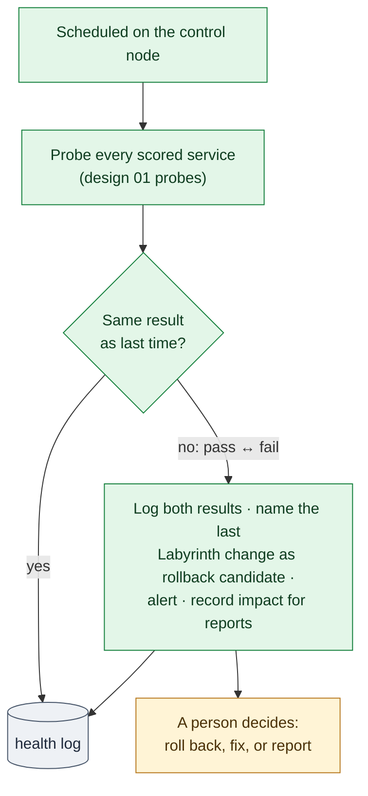

# 13. Health Monitor and Checkpoints

**Status:** Draft · reviewed 2026-10-02 · Phase: 🟩 Sustain · Priority: P1

## 1. Goal

Two jobs for the long middle of an event, after the lockout:

1. **Health monitor:** notice within minutes when a scored service stops answering, whoever caused it.
2. **Checkpoint:** one read-only command that sums up the whole network's state, so a team can review it at regular intervals.

Today the scoring-style probes (design 01, section 9) run only when a module finishes. Nothing re-checks a service an hour later, after the Red Team, a teammate or a slow failure has changed it.

## 2. Rules that shape it

| Rule | Effect |
|---|---|
| Anything that interferes with the scoring engine is the team's responsibility (National Collegiate Cyber Defense Competition [NCCDC], 2025, Rule 4.11). | Probes are light: one per service per interval, with short timeouts. |
| Do not mislead the scoring engine (NCCDC, 2025, Rule 11.3). | The monitor never fakes a response or changes what a service returns. |
| Tools must not deliberately break expected functionality (NCCDC, 2025, Rule 5.6.5). | The monitor changes nothing except re-applying sealed firewall rules, a verified state, under a revert timer (section 4.1). Rollback is a person's decision (section 4). |

## 3. The health monitor

- **Where it runs:** on the control node, as a scheduled job.
- **What it probes:** every service in the run-time service list, using the same probes as the panic button (design 01, section 9). Scoring accounts are never used to log in (design 01, section 4).
- **How often:** an interval set in configuration. The timing belongs to the team's own plan, not to this public document.
- **Where results go:** the `health` log category (design 00, section 7), forwarded to the SIEM (design 10), and a one-line summary per host in the status feed (design 06).

> [!IMPORTANT]
> **Answering is not logging in.** The probes check that a service answers, not that a user can log in to it, because scoring accounts are never used. A mail service can pass every probe while its logins are broken, and still fail scoring. To narrow this gap, the team may create a test mailbox or user by hand that is *not* a scoring account and add it to the service list with a login probe. A scheduled job cannot hold that password without storing it in a file, so the login probe runs only when an operator starts it, for example with `labyrinth checkpoint` (section 5). The password is typed in and kept only in memory, like the event seed (design 03).

> [!IMPORTANT]
> **Inside is not outside.** The control node probes from inside the network. The scoring engine checks from wherever it sits, often outside, through the edge firewall and NAT. A pass from inside does not prove the scoring engine sees a pass. Where possible, add one probe from the same side as the scoring engine, and trust the official scoreboard over the monitor.

## 4. When a probe changes state

When a service goes from pass to fail, or back, the monitor:

1. writes the change, with both probe results, to the `health` log;
2. looks up the last Labyrinth change on that host in the run manifest and names it as a **rollback candidate**;
3. raises an alert in the status feed and the SIEM;
4. records the outage time for the incident report's "impact on scored services" field (design 02).

It does **not** roll back on its own. During a run, a failed verify triggers automatic rollback (design 00), because the cause is almost certainly the change just made. An hour later, the cause could be the Red Team, a teammate or the scoring side. Blindly reverting could undo a security fix, so a person decides. To restore a damaged service, the person runs `labyrinth restore` (design 14, section 6).

### 4.1 Firewall drift

Red Teams have been seen dropping a team's firewall rules. So each interval, the monitor also compares every host's firewall rules with the set recorded in the sealed baseline (design 04, section 6). When they differ, it:

1. logs and alerts on the difference, as a high-ranked integrity finding for the incident record (design 02);
2. **re-applies the sealed rule set automatically**, with the same before-and-after probes and revert timer as the original change (design 01, section 8).

This is the one change the monitor makes on its own, because it puts back a state that was already verified and sealed, rather than guessing at a cause. If the team changed the firewall on purpose, it reseals first (design 04, section 6). If re-applying fails its probes, the timer reverts it and a person decides. Repeated drift on one host is flagged as a sign that the attacker still has admin rights there.

*Figure: the control node probes every scored service on a schedule, and when a result changes it logs both results, names the likely cause and alerts, but leaves the rollback decision to a person. Green is sustain work, amber the person's decision and gray the log.*

## 5. The checkpoint command

`labyrinth checkpoint` is read-only and prints one short summary, also saved to the `report` log category:

| Section | Source |
|---|---|
| Scored services: current state and any outage since the last checkpoint | Health log (this spec) |
| Integrity: changes since the latest sealed baseline | Baseline comparison against the seal (design 04, section 6) |
| Persistence: new items, and items still waiting for approval | Persistence sweep in report mode (design 17, section 7) |
| Locked accounts ready to offer for deletion, once every scored service passes | Account module (design 05, section 6.4) |
| Known flaws: open findings by rank, mitigated findings still waiting for a patch, accepted findings with their reasons, and any mitigation that has drifted | Vulnerability tracker (design 21, section 4) |
| Inventory drift: new accounts, listeners, services, tasks | Inventory module (design 08, section 4.1) |
| Open incidents and reports not yet submitted | Report tracker (design 02) |
| Trap trips and active bans | Trip log and ban set (designs 09, 12) |
| Time since the last backup of each scored service | Backup record (design 14) |
| Revert timers still armed | Safety core (design 01) |
| Firewall drift found and re-applied since the last checkpoint | Section 4.1 |
| Services with no restore point copied off the host | Backup record (design 14, section 5) |
| Tool integrity: signature and hashes still match | Design 07 |

The command takes no action. It exists so that a regular review is quick and every review covers the same ground.

## 6. Failure behavior

- If the monitor stops, the status feed marks its data stale (design 06), so silence is never mistaken for health.
- A probe that times out counts as a fail, never as a pass.
- The monitor never blocks a login or a Labyrinth run.

## 7. Acceptance tests

- Stopping a scored service in the lab raises an alert within one interval, naming the last Labyrinth change on that host.
- Restarting it logs the recovery and the outage length.
- The monitor never runs a rollback, a restart or any other change, except re-applying the sealed firewall rules (section 4.1).
- Flushing a lab host's firewall is detected within one interval, the sealed rules are re-applied, and every probe still passes.
- `labyrinth checkpoint` completes on the full lab network within the target time and changes nothing (the inventory before and after is identical).
- Killing the monitor marks the status feed stale.
- Probe traffic is under the target rate per service.
- With a test mailbox configured, breaking mail logins in the lab makes the checkpoint's login probe fail even though the banner probe still passes.

## References

National Collegiate Cyber Defense Competition. (2025, December 10). *Rules and requirements*. Retrieved October 2, 2026, from https://www.nationalccdc.org/rules.html
