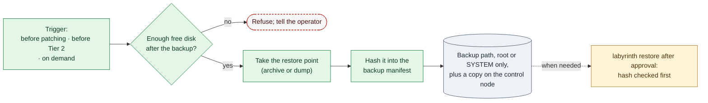

# 14. Backup and Recovery

**Status:** Draft · reviewed 2026-10-02 · Phase: 🟩 Sustain · Priority: P1

## 1. Goal

Make every scored service restorable, not just every change reversible.

The module contract already backs up each file before a module changes it (design 00), which lets `rollback` undo Labyrinth's own changes. It does not help when the damage comes from somewhere else: a defaced web root, a dropped database table, a corrupted zone file or a wrecked domain controller. Recovery from those is slow and error-prone by hand, so this spec adds **service restore points** (Blueprint §3.11).

Red Teams plan for exactly this. Public Red Team accounts describe mid-event takedowns that delete configuration files after copying them, stop services, rename files and hide the zipped web folder, followed later by destructive actions such as deleting `/etc/fstab` and rebooting (*Background*). Restores therefore have to be fast, and the restore points have to survive an attacker with root on the host.

## 2. Rules that shape it

| Rule | Effect |
|---|---|
| Tools must not deliberately break expected functionality (National Collegiate Cyber Defense Competition [NCCDC], 2025, Rule 5.6.5). | A backup must never fill a disk or lock a database long enough to fail a check (section 5). |
| Scored services may not be migrated or containerized (NCCDC, 2025, Rule 4.14). | A restore puts data back in place on the same host. It never moves a service. |
| Competition materials stay in the competition area (NCCDC, 2025, Rules 4.4, 8.5). | Backups never leave the event network. |
| Team tools may not use outside resources apart from DNS (NCCDC, 2025, Rule 5.6.4). | No cloud or remote backup target. |

## 3. What is backed up

| Service type | Restore point | Tool (*Background*) |
|---|---|---|
| Any scored service | Its configuration directory | Archive with owners and permissions kept |
| Web | The web root and the web server configuration | Archive |
| Database behind a scored service | A logical dump | The database's own dump tool, with its consistent-snapshot option so tables are not locked |
| Mail | Server configuration; mailboxes only if space allows | Archive |
| DNS | Zone files, or an export of each zone on Windows | Archive or the DNS server's export command |
| Domain controller | System state, which includes the AD (Active Directory) database | Windows Server Backup, only if the feature is already installed |

The list of what to back up comes from the profile. Paths are templates filled from run-time configuration.

## 4. When

- **Before patching** a service (design 15).
- **Before the first Tier 2 change** on a host (design 01).
- **On demand** through `labyrinth backup <service>`, and as a prompt in the checkpoint summary, which shows the time since each service's last backup (design 13).

How often to take further restore points is for the team's own plan.

*Figure: a restore point is taken only when the disk has room, is hashed into a manifest, stored where only an administrator can read it and copied off the host, and a restore checks that hash before Labyrinth carries it out with a person's approval. Green is sustain work, amber the approved restore, gray the storage and the dashed red outline a refusal.*

## 5. Safety

- **Disk space.** Estimate the size first. Refuse if the backup would leave less than the configured free-space margin. A full disk stops services.
- **Load.** Dumps use the consistent-snapshot option and run at low priority. The health probes (design 13) run before and after.
- **Secrets.** Backups contain password hashes and application data. They are readable only by root or SYSTEM, are never copied into the repository or off the event network, and are listed in the run manifest so cleanup can remove them at the end of the event (design 07).
- **Tampering.** Each restore point's SHA-256 is recorded in a backup manifest when it is taken. A restore checks the hash first, so a backup an attacker has altered is never restored silently.
- **Copy off the host (required).** An attacker with root or SYSTEM can delete backups stored on the host, and destructive actions are expected later in an event. So every restore point is copied to the control node over the existing admin path (design 06) as soon as it is taken, with its hash checked on arrival. A restore point counts as complete only once its copy is confirmed. In local mode with no control node, the checkpoint lists every service without an off-host copy as a top finding (design 13, section 5), so the team knows its exposure.

## 6. Restoring

| What | How | Tier |
|---|---|---|
| A file Labyrinth changed | The module's own `rollback` (design 00) | Automatic |
| Service configuration or web root | `labyrinth restore <service>`: check the hash, back up the current (damaged) state as evidence, stop the service if needed, restore, start it, run the probes | 3, approve then act |
| Database | `labyrinth restore <service> --database`: check the hash, dump the current state as evidence, restore the dump into the running database, run the probes | 3, approve then act |
| A stopped or disabled service | `labyrinth restore <service> --start`: set the start type recorded in the sealed baseline and start it, then run the probes | 3, approve then act |
| Domain controller | A documented recovery path following Microsoft's procedure for the installed version, practiced in the lab | 3, person-run |
| An unbootable Linux host (for example, a deleted `/etc/fstab`) | A printed rescue runbook for the virtualization platform's console: boot to a rescue or single-user shell, restore the boot-critical files from the off-host copy, check them against the sealed baseline, reboot, run the probes. Compare the time this takes with the official recovery service, which costs points (National Collegiate Cyber Defense Competition [NCCDC], 2025, Scoring section) | 3, person-run |

`labyrinth restore` overwrites live data, so it never runs on its own. It shows which restore point it will use and when that point was taken, and a person confirms that the point is from before the damage. Labyrinth then carries out the restore (design 01, section 3) and records it in the run manifest. The damaged state it saved first is evidence for the incident report (design 02).

## 7. Acceptance tests

- A defaced lab web root is restored by `labyrinth restore` after approval, the damaged copy is kept as evidence, and the probe passes.
- `labyrinth restore` refuses to run without approval, and refuses a restore point whose hash does not match.
- A restore point is not reported complete until its off-host copy's hash matches.
- In the lab, a host with `/etc/fstab` deleted is brought back with the rescue runbook within the target time.

- A database dump is taken while the probe runs every few seconds, and no probe fails.
- A backup that would breach the free-space margin is refused.
- An altered backup file is detected by its hash and not restored.
- Backup files are unreadable by a non-admin account.
- End-of-event cleanup removes every backup the manifest lists and nothing else.

## References

National Collegiate Cyber Defense Competition. (2025, December 10). *Rules and requirements*. Retrieved October 2, 2026, from https://www.nationalccdc.org/rules.html
