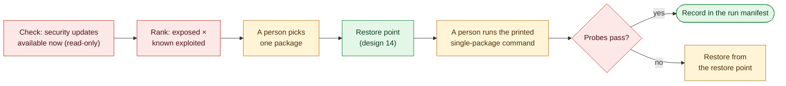

# 15. Patching and Service Reduction

**Status:** Draft · reviewed 2026-10-02 · Phase: 🟥 Lock out · Priority: P1

## 1. Goal

Fewer listeners and fewer known-exploited packages (Blueprint §3.6), without breaking a scored service. The two parts are handled differently:

- **Service reduction** can be undone in seconds (start the service again), so it is automated as a Tier 2 action (design 01).
- **Patching** often cannot be undone cleanly, because an older package version may not be available to reinstall. So Labyrinth plans, backs up and verifies each patch, but a person runs it.

## 2. Rules that shape it

| Rule | Effect |
|---|---|
| Tools must not deliberately break expected functionality (National Collegiate Cyber Defense Competition [NCCDC], 2025, Rule 5.6.5). | Services are disabled only from a per-profile candidate list; nothing scored is on it. No blind full upgrade. |
| Anything that interferes with the scoring engine is the team's responsibility (NCCDC, 2025, Rule 4.11). | Every change is followed by the scoring-style probes. |
| Scored services may not be migrated or containerized (NCCDC, 2025, Rule 4.14). | Patching updates a package in place. No major-version upgrade, no replacement service. |
| Team tools may not use outside resources apart from DNS (NCCDC, 2025, Rule 5.6.4). | Labyrinth itself downloads nothing. See the pinned question in section 5. |

## 3. Service reduction

**The candidate list.** Each profile carries a list of services that may be turned off. Each entry states:

| Field | Meaning |
|---|---|
| `name` | Service or unit name, per platform |
| `reason` | Why it is a risk (for example, "remote print service with a history of exploits") |
| `unless` | Conditions that keep it on, for example "scored on this host" or "a scored service depends on it" |
| `verify` | The probe that must still pass afterwards |

**How it runs.**

1. `check` lists running services and listeners, and marks those on the candidate list that are not scored and not depended on.
2. `plan` shows exactly which will be stopped.
3. `apply` stops and disables each one (on Linux, `systemctl disable --now`; on Windows, set the start type to Disabled and stop it), records the previous state in the run manifest, and runs under a revert timer (design 01).
4. `verify` runs the probes.

Services are disabled, never removed. Rollback starts them again with their previous start type.

## 4. Patching

**Check (read-only).** List updates that fix security issues and are available now (Blueprint §3.6; *Background*):

| Platform | Source |
|---|---|
| Debian | `debsecan`, if installed |
| Ubuntu | `pro fix` or the security pocket in `apt list --upgradable` |
| RHEL family (Red Hat Enterprise Linux) | `dnf updateinfo list --security` |
| Windows | Installed updates and the OS build, listed for a person; ranked by exposure only (below) |

**Rank.** A patch matters most when the package is both exposed and known to be exploited:

- **Exposed:** it serves a listening port, especially a scored or internet-facing one.
- **Known exploited:** it appears in a vendored snapshot of a public known-exploited-vulnerabilities catalog, taken at release time and dated. The snapshot is never refreshed at the event.

An unpatched, unexploited package on a closed port ranks last (Blueprint §3.6).

**Windows ranks by exposure only.** The known-exploited catalog names vulnerabilities, not Windows updates. Matching one to the other needs Microsoft's update data, which is not in the release and cannot be fetched at the event. So on Windows the check lists the installed updates and ranks hosts and roles by exposure, and a person judges which known-exploited issues apply.

**Plan and apply.** The operator picks from the ranked list. For each pick, Labyrinth:

1. takes a restore point of the service (design 14);
2. prints the single-package command (for example, upgrading only that package, never the whole system);
3. waits while a person runs it and restarts the service if needed;
4. runs the probes and records the result in the run manifest.

If a probe fails, the printed restore steps from design 14 are the way back.

*Figure: Labyrinth finds and ranks the security updates, takes a restore point and checks the result, while a person chooses each package and runs the command. Red is lock-out work done by Labyrinth, amber is work done by a person and green is the restore point and the recorded finish.*

## 5. Pinned questions

- **Package sources and Rule 5.6.4.** A package manager fetches from the distribution's mirrors or a local mirror. Whether a human running the host's own package manager counts as a team tool using an outside resource is not settled by the rules text read so far. Until it is, patching stays manual (Tier 3) and Labyrinth never calls the package manager to install anything.
- **Windows updates.** Individual updates usually come from Microsoft's download sites, which may not be reachable. Windows patching is a manual checklist.

## 6. What it will never do

- Run a full system upgrade or a distribution upgrade.
- Upgrade a scored service to a new major version.
- Remove a package or a service.
- Disable a service that is not on the candidate list, or one whose `unless` condition holds.

## 7. Acceptance tests

- On a lab host, only the candidate services not marked scored are stopped, and every probe still passes.
- Rollback restores each stopped service to its previous start type.
- The patch check lists the known-vulnerable package planted in the lab, ranked above an unexposed one.
- No Labyrinth command installs or downloads a package.
- A patch whose probe fails is restored from its restore point.

## References

National Collegiate Cyber Defense Competition. (2025, December 10). *Rules and requirements*. Retrieved September 29, 2026, from https://www.nationalccdc.org/rules.html
