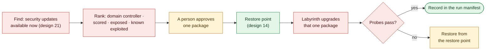

# 15. Patching and Service Reduction

**Status:** Draft · reviewed 2026-10-09 · Phase: 🟥 Lock out · Priority: P1

## 1. Goal

Fewer listeners and fewer known-exploited packages (Blueprint §3.6), without breaking a scored service. Which flaws need closing, and in what order, comes from the vulnerability tracker (design 21). The two parts are handled differently:

- **Service reduction** can be undone in seconds (start the service again), so it is automated as a Tier 2 action (design 01).
- **Patching** often cannot be undone cleanly, because an older package version may not be available to reinstall. So each patch needs a person's approval (Tier 3), and Labyrinth then takes a restore point, applies that one package and verifies it.

## 2. Rules that shape it

| Rule | Effect |
|---|---|
| Tools must not deliberately break expected functionality (National Collegiate Cyber Defense Competition [NCCDC], 2025, Rule 5.6.5). | Services are disabled only from a per-profile candidate list; nothing scored is on it. No blind full upgrade. |
| Anything that interferes with the scoring engine is the team's responsibility (NCCDC, 2025, Rule 4.11). | Every change is followed by the scoring-style probes. |
| Scored services may not be migrated or containerized (NCCDC, 2025, Rule 4.14). | Patching updates a package in place. No major-version upgrade, no replacement service. |
| Team tools may not use outside resources apart from DNS; the example is cloud services and cloud processing (NCCDC, 2025, Rule 5.6.4). | Updates come from the host's own package manager and its public repositories, or an event mirror, never a private source (design 20). |

## 3. Service reduction

**The candidate list.** Each profile carries a list of services that may be turned off. Each entry states:

| Field | Meaning |
|---|---|
| `name` | Service or unit name, per platform |
| `reason` | Why it is a risk (for example, "remote print service with a history of exploits") |
| `unless` | Conditions that keep it on, for example "scored on this host" or "a scored service depends on it" |
| `verify` | The probe that must still pass afterwards |

**How it runs.**

1. `check` lists running services and listeners, and marks those on the candidate list that are not scored and not depended on.
2. `plan` shows exactly which will be stopped.
3. `apply` stops and disables each one (on Linux, `systemctl disable --now`; on Windows, set the start type to Disabled and stop it), records the previous state in the run manifest, and runs under a revert timer (design 01).
4. `verify` runs the probes.

Services are disabled, never removed. Rollback starts them again with their previous start type.

**Old plain-text services.** Every Linux profile's candidate list includes telnet, rsh, rlogin, rexec and plain FTP servers, because they send passwords in the clear and are common Red Team entry points (*Background*). Their `unless` condition is "scored on this host". A scored FTP server is not disabled; it is hardened by its service pack instead (design 18).

## 4. Patching

**Finding and ranking** are in design 21. It lists the security updates available now, the scored web apps and plugins with their versions, and the Windows updates missing, and ranks each flaw: domain controller flaws first, then flaws in scored services, then exposed and known-exploited ones. This section covers closing a finding by patching.

**Scored services are patched, not turned off.** A flaw in a scored service is never closed by stopping or disabling the service (design 21, section 5.1). Where the mitigation catalog has a setting that closes the flaw with the service still running, that goes in first. Patching then replaces the flawed version, and the tracker records the finding as `patched` once a later check confirms it.

**Plan and apply.** The operator approves picks from the ranked list (Tier 3). In a first-minute run, a security update for a scored package that the profile lists as pre-approved counts as approved (design 01, section 6.3). The pre-approval names the package, not a version, because the version available at the event is not known when the profile is reviewed. It covers only an update from the host's own release stream that passes the simulation check (design 20, section 4); a new major version, or an update that would remove or replace a package, still waits for a person. The restore point comes first, and a failed probe after the update raises an alert and offers the restore at once. For each approved pick, Labyrinth:

1. takes a restore point of the service (design 14);
2. upgrades only that package with the host's package manager, never the whole system, after the same simulation check as an install (design 20, section 4);
3. restarts the service if the package needs it;
4. runs the probes and records the result in the run manifest, and the tracker marks the finding `patched` after the next check (design 21, section 4).

If a probe fails, `labyrinth restore` puts the service back from that restore point once a person approves (design 14, section 6).

*Figure: the tracker finds and ranks the security updates (design 21), a person approves each package or the profile pre-approved it, and Labyrinth takes a restore point, upgrades that one package and checks the result. Red is lock-out work done by Labyrinth, amber is a person's decision and green is the restore point and the recorded finish.*

## 5. Pinned questions

- **Package sources and Rule 5.6.4.** Resolved (2026-10-09): the rule's example is cloud services and cloud processing, and Rules 5.1 and 5.2 allow public sources of software. Labyrinth applies approved updates through the host's package manager (design 20). The install feature is named in the tool's declaration, so officials can rule on it before the event.
- **Windows updates.** Individual updates usually come from Microsoft's download sites, which may not be reachable. Windows patching is a manual checklist, ranked by the missing updates WES-NG finds (design 21, section 3.1).

## 6. What it will never do

- Run a full system upgrade or a distribution upgrade.
- Upgrade a scored service to a new major version.
- Remove a package or a service.
- Disable a service that is not on the candidate list, or one whose `unless` condition holds.
- Stop or disable a scored service to close a flaw.

## 7. Acceptance tests

- On a lab host, only the candidate services not marked scored are stopped, and every probe still passes.
- Rollback restores each stopped service to its previous start type.
- An approved update upgrades only its own package, and an update whose simulation would remove a package is refused.
- A patch whose probe fails is restored from its restore point.
- A pre-approved update for a scored package is applied in a first-minute run without a prompt, after a restore point.
- A scored service with a known-exploited flaw is never stopped; it is patched in place.

## References

National Collegiate Cyber Defense Competition. (2025, December 10). *Rules and requirements*. Retrieved October 2, 2026, from https://www.nationalccdc.org/rules.html
