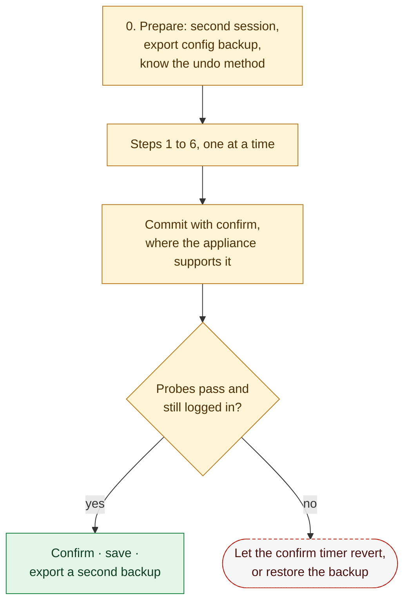

# 16. Network Appliance Runbooks

**Status:** Draft · reviewed 2026-09-29 · Phase: 🟥 Lock out · Priority: P0 (credentials, management plane), P1 (the rest)

## 1. Goal

Routers and firewall appliances (for example VyOS, Palo Alto Networks PAN-OS and Cisco FTD (Firepower Threat Defense)) sit in front of every other host. A mistake on one can cut routing or scoring for the whole network at once. Labyrinth therefore does not change appliances itself: they are Tier 3, manual only (design 01). What it does provide is a **runbook** for each appliance type, a tested, step-by-step procedure that a person follows, filled in with the run's own values (Blueprint §6.3).

## 2. Why manual

- Each vendor has its own command language and its own way of saving and undoing changes.
- An error can drop routing for every host behind the appliance, including the scoring engine's path (National Collegiate Cyber Defense Competition [NCCDC], 2025, Rule 4.11).
- Some safety features behave unexpectedly. VyOS, for example, reboots by default when a commit is not confirmed (design 01, section 8).

## 3. Where runbooks live

```
platform/appliance/<vendor>/
├── runbook.md           # the steps below, in that vendor's commands
├── templates/           # config fragments with placeholders only
└── verify.md            # how to check each step
```

The `appliance` profile's modules are all `manual-only` (design 00). Running them prints the vendor's runbook with the placeholders filled from run-time configuration: addresses, the scored-service list and the SIEM address. Nothing is sent to the appliance.

Every vendor command in a runbook must be checked against the vendor's documentation for the installed version and rehearsed in the lab before release.

## 4. The runbook steps

Every vendor runbook follows the same order. Each step says what to do, how to check it, and how to undo it.

| # | Step | Why |
|---|---|---|
| 0 | **Prepare.** Open a second session (or the console). Export the running configuration as a backup. Learn how this appliance undoes an unconfirmed change, and on VyOS set the confirm action to `reload` first (design 01). | So any mistake can be reversed |
| 1 | **Credentials.** Change the admin, web, SSH (Secure Shell) and API passwords. Change or disable SNMP (Simple Network Management Protocol) community strings (Blueprint §3.1). | Appliances often ship with well-known defaults |
| 2 | **Management plane.** Allow management only on an inside interface and only from the admin source. Turn off management services that are not needed, such as plain HTTP or Telnet (Blueprint §3.2). | No administration from the outside |
| 3 | **Scoring allowlist first.** Add the rules that allow the scoring engine to reach each scored service, before any deny rule (Blueprint §3.3). | Scoring must never be blocked |
| 4 | **Default-deny from outside.** Allow only the scored services, then deny and log everything else. | Shrink the surface |
| 5 | **NAT review.** Record which address the inside hosts see for outside traffic. | Feeds the source-address gate for bans (design 12) |
| 6 | **Logging.** Send the appliance's logs to the SIEM by syslog (design 10). | Edge denies are visible centrally |
| 7 | **Save and verify.** Commit or save, confirm, export the new configuration as a second backup, and run the scoring-style probes from inside and, where possible, from the scoring engine's side (design 13). | Prove nothing scored broke |



*Figure: a person works through the runbook one step at a time, each change is committed so it can revert on its own, and it is kept only after the probes pass. Amber is work done by a person, green the confirmed finish and the dashed red outline the revert.*

## 5. Optional read-only check

A later module may read an appliance's running configuration over SSH and compare it with the runbook's expected state, for example "management reachable only on the inside interface". It is read-only, off by default, and uses the operator's own credentials. It never writes to the appliance.

## 6. Acceptance tests

- Each vendor runbook is followed end to end on a lab appliance, with the time for each step recorded.
- A deliberate mistake in step 4 is reverted by the confirm timer or the backup, and the second session stays connected throughout.
- After the runbook, the appliance's logs arrive in the lab SIEM.
- The printed runbook contains the run-time values, and the repository copy contains placeholders only.

## References

National Collegiate Cyber Defense Competition. (2025, December 10). *Rules and requirements*. Retrieved September 29, 2026, from https://www.nationalccdc.org/rules.html
