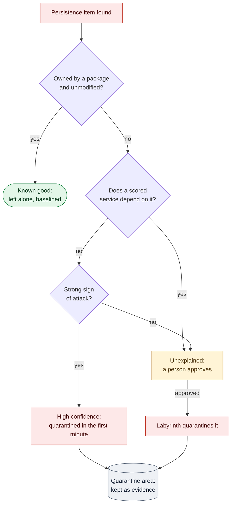

# 17. Persistence Sweep

**Status:** Draft · reviewed 2026-10-02 · Phase: 🟥 Lock out · Priority: P0

## 1. Goal

Assume the attacker is already inside when the event starts. Someone who got in early leaves ways back: scheduled jobs, services, startup items, keys, sudo rules and login hooks. Rotating passwords and ending sessions (design 01) does not remove any of them, so the attacker simply returns.

This spec finds those footholds and removes them as early as is safe, without breaking a scored service. Scored services are a primary Red Team target, and successful penetrations cost points (National Collegiate Cyber Defense Competition [NCCDC], 2025, Scoring section), so the sweep covers them too.

## 2. Rules that shape it

| Rule | Effect |
|---|---|
| Scoring is based partly on controlling and preventing unauthorized access (NCCDC, 2025, Scoring section). No rule forbids removing an attacker's foothold. | Removal is part of the job, not an optional extra. |
| Tools must not deliberately break expected functionality (NCCDC, 2025, Rule 5.6.5). | Never a blanket action such as removing every cron job. Each item is judged on its own and quarantined, never deleted. |
| Anything that interferes with the scoring engine is the team's responsibility (NCCDC, 2025, Rule 4.11). | An item a scored service depends on is never removed automatically. Probes run before and after, under a revert timer. |
| Reports must say what happened and what was affected (NCCDC, 2025, Rule 9.4). | Quarantine keeps every item, so it can be shown as evidence in the report (design 02). |

## 3. Where it looks

| Platform | Persistence points |
|---|---|
| Linux | System and per-user crontabs, `cron.d`, anacron, `at` jobs; systemd units and timers (system and per-user); `rc.local` and init scripts; shell startup files (`/etc/profile.d`, system and user `bashrc` and `profile`); `sudoers` and `sudoers.d`; PAM configuration; `ld.so.preload`; SSH configuration and every key source (design 05, section 4); setuid files and kernel modules not owned by a package |
| Windows | Services; scheduled tasks; Run and RunOnce registry keys; startup folders; WMI event subscriptions; Winlogon `Userinit` and `Shell` values; Image File Execution Options debuggers; replaced accessibility programs (`sethc.exe`, `utilman.exe`); members of the local Administrators group |
| SIEM host | Splunk apps, scripted inputs and alert actions (design 10, section 7) |
| Scored apps | Files in a web root or application folder that look like web shells (flagged only; section 4) |

## 4. Classes

Each item found is checked three ways:

- **Owned by a package?** On Linux, `dpkg -S` or `rpm -qf`, then a verify of that package's files. On Windows, signed by Microsoft, or listed in the profile's known-good list.
- **Does a scored service depend on it?** Checked through the service's unit dependencies, its process tree, its files and its run-as account (design 05, section 2).
- **Does it show a strong sign of attack?** See the list below.

| Class | Which items | What happens |
|---|---|---|
| **Known good** | Owned by a package and unmodified, or on the profile's known-good list | Left alone; baselined (design 04) |
| **High confidence** | Not owned by a package, **and** nothing scored depends on it, **and** at least one strong sign | Quarantined automatically in the first-minute bundle (design 01, section 6). Tier 2, with probes and a revert timer. |
| **Unexplained** | Any other item not owned by a package, a package file that fails verification, or an item belonging to a protected account | Listed in the plan with the reason. A person approves each item, or a whole category on one host; Labyrinth then quarantines them (Tier 3, design 01). |
| **Scored-app content** | Files inside a scored app's own folders that look like web shells | Listed with the reason. A person confirms each one, because a false positive takes the site down. Labyrinth then quarantines it. |

**Strong signs** (any one is enough):

- it runs from `/tmp`, `/var/tmp`, `/dev/shm`, a hidden folder, or a user's temporary folder on Windows;
- it opens a shell to the network (`/dev/tcp/`, `nc -e`, `socat exec:`, `bash -i` redirected to a socket);
- it decodes and runs code (`base64 -d | sh`, `powershell -enc`, `FromBase64String` piped to `Invoke-Expression`);
- it downloads and runs something (`curl … | sh`, `wget -O- … | sh`, `DownloadString`, `certutil -urlcache`, `bitsadmin /transfer`);
- it is a replaced Windows accessibility program, or an Image File Execution Options debugger on one.

The list lives in a data file in the release, so it is reviewed and tested like code.

*Figure: every item found is sorted by package ownership, scored-service dependency and signs of attack; only clear, unshared attacker footholds are quarantined automatically, and everything else waits for a person's approval. Red is lock-out work, amber a person's decision, green an item left alone and gray the quarantine area.*

## 5. Quarantine, never delete

Quarantine disables the item and moves it aside, recording what is needed to put it back. The run manifest lists every step, so `rollback` restores the item exactly.

| Item | Quarantine |
|---|---|
| A file (script, unit file, startup file, web shell) | Moved to `<root>/backup/quarantine/<run>/`, keeping its original path, owner, mode and SHA-256 |
| A cron line | Commented out with a Labyrinth marker; the original line is kept in the manifest |
| A systemd unit or timer | Disabled and stopped, its file quarantined, then `systemctl daemon-reload` |
| A Windows scheduled task | Exported to XML, then disabled |
| A Windows service | Start type recorded, set to Disabled and stopped |
| A registry value or WMI subscription | Exported, then removed |
| A process the item started | Ended once the item is quarantined, so it cannot simply restart |

The quarantine area is readable only by root or SYSTEM (design 00, section 7). It is kept until the end of the event as evidence, and each item feeds the incident record (design 02).

## 6. Limiting who can schedule jobs

After the sweep, `cron.allow` and `at.allow` are set to root plus any account the dependency map shows using them. Other accounts then cannot add jobs. This is Tier 2, with probes and a revert timer.

Watching tools often abused for persistence, rather than blocking them, is covered in design 10, section 5.

## 7. When it runs

- **First minute:** the high-confidence class runs inside the first-minute bundle, right after sessions are ended (design 01, section 6).
- **Right after the bundle:** the full list of unexplained items is shown for approval.
- **At every checkpoint** (design 13): the sweep runs again in report mode. After the baseline is sealed (design 04, section 6), any new persistence item is a high-ranked integrity finding.

## 8. What it will never do

- Delete an item. Everything is quarantined and can be restored.
- Remove an item a scored service depends on without a person's approval.
- Touch a protected account's items without a person's approval.
- Act on a whole category across every host in one step.

## 9. Acceptance tests

- A planted cron job that opens a reverse shell from `/tmp` is quarantined automatically, its process is ended, and every scored probe still passes.
- An unpackaged cron job that a scored app uses is listed for approval, not quarantined.
- A planted web shell in a web root is listed with its reason and is quarantined only after approval.
- `rollback` restores every quarantined item byte for byte.
- A replaced `sethc.exe` on a lab Windows host is detected and quarantined.
- Each quarantined item appears in the incident record with its hash and original path.
- No item is ever deleted.

## References

National Collegiate Cyber Defense Competition. (2025, December 10). *Rules and requirements*. Retrieved October 2, 2026, from https://www.nationalccdc.org/rules.html
