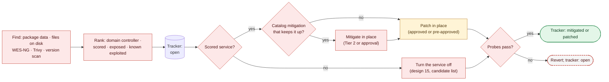

# 21. Vulnerability Tracker and Mitigations

**Status:** Draft · reviewed 2026-10-09 · Phase: 🟥 Lock out · Priority: P0

## 1. Goal

A Red Team's first step is to find what is vulnerable and attack it (*Background*). Labyrinth does the same thing in reverse, from the inside and first. It finds every known flaw the team's hosts expose, closes the dangerous ones quickly, and keeps each finding on a list until it is closed.

Three parts:

- **Find** (section 3): from package data, files on disk and a version scan of the team's own services.
- **Track** (section 4): one record for each flaw on each host, with a state, kept until the flaw is closed.
- **Close** (section 5): by the fastest safe means, which for a scored service is never turning it off.

This spec only finds, ranks and tracks. Each change it calls for is made by the module that owns that setting (designs 11, 15, 17 and 18). So every change has one implementation, with that module's backups, manifest entries and rollback.

## 2. Rules that shape it

| Rule | Effect |
|---|---|
| No offensive activity against systems outside the team's network (National Collegiate Cyber Defense Competition [NCCDC], 2025, Rule 4.10). | The version scan (section 3.2) covers only the team's own hosts from the inventory. It reads banners and versions, and never runs an exploit or a brute-force script. |
| Team-written tools that use resources outside the competition environment, other than simple DNS lookups, are prohibited; the rule's own example is cloud services and cloud processing (NCCDC, 2025, Rule 5.6.4). | All matching is done on the team's own hosts, against data in the release or fetched as a public download (design 20). No host data, version string or address is ever sent out for lookup. So the nmap `vulners` script and online vulnerability APIs are never used. |
| Tools must not deliberately break expected functionality (NCCDC, 2025, Rule 5.6.5). | A scored service is never stopped, disabled or firewalled off to close a flaw (section 5.1). |
| Changing a system to make the scoring engine think a service is up when it is not is penalized (NCCDC, 2025, Rule 11.3); anything that interferes with scoring is the team's responsibility (NCCDC, 2025, Rule 4.11). | Every mitigation and patch runs under a revert timer with probes before and after. A mitigation never changes what a scoring check sees. |
| Scored services may not be migrated or containerized (NCCDC, 2025, Rule 4.14). | A flawed scored service is patched in place, never replaced or moved. |

## 3. Find

### 3.1 Sources

| Source | Finds | Platform |
|---|---|---|
| The host's own security data: `debsecan`, `pro fix` or the security pocket, `dnf updateinfo list --security` | Packages with a security update available now | Linux |
| Scored web apps on disk: WordPress `readme.txt` and plugin headers, `composer.lock`, Drupal and Joomla manifests | Web app, plugin, module and theme versions, which package managers do not track | Linux, Windows |
| WES-NG with a definitions file pinned in the release (design 20) | Missing Windows updates, from `systeminfo`, matched offline to the vulnerabilities they fix | Windows |
| Trivy, where installed (design 20) | Flawed libraries bundled inside apps (Java archives, `node_modules`, Composer and Python packages) that no package manager tracks | Linux |
| The version scan (section 3.2) | What the network shows, including software installed by hand | All hosts, from the control node |
| The domain checks (design 11, section 3) | Domain controller flaws such as ZeroLogon (CVE-2020-1472) | Windows domain |

The check is read-only (Tier 0). Every source is optional: a source that is missing is reported, and the others still run.

### 3.2 The version scan

The Red Team starts by reading versions from banners. Labyrinth does the same from the control node, against the team's own hosts only. Without the scan, software installed by hand, outside any package manager, would go unseen.

- **Targets:** only the hosts in the run-time inventory. Never a range, the scoring engine or an address outside it.
- **Method:** nmap service and version detection (`-sV`) on each target's listening ports, at a low rate, with no scripts. The nmap package comes from the host's repositories (design 20).
- **Fallback:** without nmap, the per-host inventory of listeners and their processes (design 08, section 4.1) and each binary's own version output give a smaller picture, which is reported as such.
- **When:** after the first-minute bundle, once each host's inbound rules allow the admin path. Then again at every checkpoint (design 13).

### 3.3 Rank

The known-exploited list is a dated snapshot of the public CISA catalog, taken at release time and never refreshed at the event. Findings are ranked in this order:

1. **Domain controller flaws** in the known-exploited snapshot. One of these hands over every domain password at once; Red Teams report it as the source of most of their admin shells at recent state qualifiers (*Background*). Each comes with the domain checklist's follow-up steps (design 11, section 5).
2. **Scored and known-exploited:** a flaw in software that serves a scored service. The Red Team aims at scored services, and they cannot be turned off (section 5.1).
3. **Exposed and known-exploited:** a flaw in software that listens on a port reachable from the network.
4. **Exposed:** listening, with no known exploitation.
5. **Everything else**, including flaws that only a local user could exploit. Exception: a local privilege-escalation flaw in the known-exploited snapshot, such as PwnKit, ranks with group 3. It turns any foothold into root.

## 4. Track

Each finding is one record in Labyrinth's state path on the host. The control node keeps a copy that merges every host.

| Field | Meaning |
|---|---|
| `id` | The CVE number, or the catalog entry for a flaw with no CVE |
| `host`, `software`, `version` | What is affected, as found |
| `source` | Which source in section 3.1 found it |
| `rank` | Its group in section 3.3 |
| `state` | `open`, `mitigated`, `patched` or `accepted` |
| `by`, `at`, `how` | Who or which module changed the state, when, and the catalog entry, setting or package version used |

- **`mitigated`:** a catalog mitigation (section 5.2) is in place, so the door is closed but the flawed software is still there. A mitigated finding stays on the list until it is patched.
- **`patched`:** a later check found a version that is not affected.
- **`accepted`:** a person decided to leave it, for example because the only fix would break a scored service. The reason is recorded. The finding still appears at every checkpoint, under its own heading.

Every state change is written to the run manifest. At every checkpoint, the check runs again. A mitigation that has drifted (a setting reverted, a plugin re-enabled) or a version that has come back puts the finding back to `open` and raises an alert. The checkpoint shows open findings by rank, plus mitigated findings still waiting for a patch (design 13, section 5). The records also give an incident report the version, the flaw and the time it was closed (design 02).

## 5. Close

### 5.1 Scored services stay up

A scored service with a flaw is closed with the service still running. The steps below are tried in order, and the first that applies is used:

1. **Mitigate in place** (section 5.2): a catalog mitigation that leaves the service working and does not change what a scoring check sees. For example, a configuration setting, a web application firewall rule for the flawed path, or a setuid bit removed from a helper the service never uses.
2. **Patch in place** (design 15, section 4): the security update from the host's own release stream, after a restore point. This is a Tier 3 item, ranked at the top of the approval list. A security update for a scored package that is on the profile's pre-approved list counts as approved in a first-minute run (design 01, section 6.3), and is applied behind the lockdown (design 01, section 6, step 6).
3. **Turn off only the flawed part,** if scoring does not use it: a plugin, a module or a feature, never the service. This is a Tier 3 item. An unused plugin is quarantined (design 17).
4. **Accept and watch:** a person accepts the finding, and the matching detection search (design 10, section 5) is turned on for that host and port, where one exists.

A scored service is never stopped, disabled, removed or firewalled off from its clients to close a flaw. A web app update outside the package manager (for example WordPress core) is printed as steps for a person, ranked with the packages. Where the app's own command-line updater is already on the host, the update is a Tier 3 item that Labyrinth carries out after a restore point.

**Unscored services** with a flaw are turned off instead, when they are on the profile's candidate list (design 15, section 3). That is the fastest close, and it can be undone in seconds.

### 5.2 The mitigation catalog

The release carries one catalog entry for each flaw that Red Teams commonly use at CCDC events. The entries are chosen from the known-exploited snapshot and public Red Team accounts (*Background*). Each entry states:

| Field | Meaning |
|---|---|
| `id` | CVE numbers covered |
| `detect` | How to tell the host is affected: package and versions, file, registry value or banner |
| `mitigation` | The setting that closes it, named by its owning design and setting |
| `class` | `automatic`, `approval` or `runbook`, as for the service packs (design 18, section 4) |
| `undo` | How the mitigation is reversed; it must be possible |
| `probe` | The probe that must still pass afterwards |
| `tested` | The versions it was tested on in the lab |

Examples (*Background*; each is confirmed in the lab before release):

| Flaw | Mitigation without a patch | Owner | Class |
|---|---|---|---|
| PwnKit, polkit `pkexec` (CVE-2021-4034) | Remove the setuid bit from `pkexec` | 18, section 6 | Automatic |
| EternalBlue, SMBv1 (CVE-2017-0144) | Turn off the SMBv1 server | 11 | Automatic (Tier 2) |
| PrintNightmare (CVE-2021-34527) | Stop and disable Print Spooler where printing is not scored | 11 | Automatic (Tier 2) |
| ZeroLogon (CVE-2020-1472) | Netlogon enforcement | 11, section 3.1 | Domain checklist |
| vsftpd 2.3.4 backdoor (CVE-2011-2523) | Install the fixed package from the host's repositories; it is a planted build, so no setting closes it | 15 | Patch, approval |
| ProFTPD `mod_copy` (CVE-2015-3306) | Turn off `mod_copy` | 18 | Approval |
| Shellshock (CVE-2014-6271) | Turn off CGI where nothing scored uses it; otherwise a web application firewall rule | 18 | Approval |
| Log4Shell (CVE-2021-44228) | Turn off message lookups in the app's settings, and add a web application firewall rule | 18 | Approval |
| A known-exploited WordPress plugin | Quarantine it if unused; otherwise a web application firewall rule for its flawed path | 17, 18 | Approval |

In the lockout phase, every **automatic** catalog mitigation that matches a finding in rank groups 1 to 3 is applied as Tier 2, behind the first-minute bundle (design 01, section 6, step 6). It runs under the host's revert timer, with probes before and after. Approval entries become Tier 3 items, and runbook entries go on the person-run checklist.

*Figure: Labyrinth finds and ranks each flaw and records it as open. An unscored service is turned off. A scored service stays up: it is mitigated in place where the catalog allows, and patched in place once a person approves (or the profile pre-approved the update). The probes decide whether the change is kept. Red is lock-out work done by Labyrinth, amber a person's approval, green the recorded close and the dashed outline a revert.*

## 6. Pinned questions

- **Trivy's vulnerability database** changes daily, so it cannot be pinned by hash like other downloads (design 20, section 3). It is a public download of data, never run, and the matching is local. Whether the event allows it to be fetched at run time is a question for the officials, asked in the tool's declaration (*Provisional*). Without it, Trivy is skipped and the other sources still run.

## 7. What it will never do

- Stop, disable, remove or firewall off a scored service to close a flaw.
- Send a version, a host name or an address to any outside service for lookup.
- Scan an address that is not in the team's inventory, or run an nmap script.
- Run an exploit, even against the team's own hosts, to confirm a finding.
- Mark a finding `patched` without a later check showing a version that is not affected.

## 8. Acceptance tests

- On the lab network, a known-exploited flaw in a scored service ranks above the same flaw in an unscored one, and a domain controller flaw ranks above both.
- A vulnerable service installed by hand, outside the package manager, is found by the version scan.
- A known-vulnerable package planted in the lab ranks above the same package on a host where it does not listen.
- A known-exploited WordPress plugin version planted in the lab web app is listed and ranked.
- The version scan touches only inventory hosts: a packet capture shows no traffic to any other address.
- With no network access at all, the check still completes from the host's own data and the release's snapshot.
- PwnKit on a lab host is mitigated automatically in the lockout phase, the finding becomes `mitigated`, and every probe still passes.
- A flawed scored FTP server is never stopped; it is offered as a patch, and once approved and patched, the finding becomes `patched` at the next check.
- A pre-approved security update for a scored package is applied in a first-minute run without a prompt, after a restore point.
- Reverting a mitigation by hand puts the finding back to `open` at the next checkpoint and raises an alert.
- An accepted finding appears at every checkpoint with its reason.
- On a lab Windows host missing a known update, WES-NG reports the matching CVE with no network access.

## References

Cybersecurity and Infrastructure Security Agency. (n.d.). *Known exploited vulnerabilities catalog*. Retrieved October 9, 2026, from https://www.cisa.gov/known-exploited-vulnerabilities-catalog

National Collegiate Cyber Defense Competition. (2025, December 10). *Rules and requirements*. Retrieved October 9, 2026, from https://www.nationalccdc.org/rules.html
